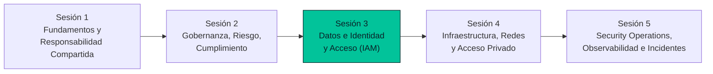

# Sesión 3 — Seguridad de Datos e Identidad y Acceso (IAM)

**Especialización en Ciberseguridad · Seguridad en la Nube**
Escuela de Comunicaciones Militares (ESCOM) — Ejército Nacional de Colombia
Instructor: Manuel Alejandro Vargas Rojas · manuelvargasrojas@cedoc.edu.co

Este README es la puerta de entrada a todo el material de la Sesión 3. Desde aquí se navega a la presentación teórica, la guía de laboratorio y la rúbrica de evaluación.

---

## 1. Descripción general

La Sesión 3 baja el gobierno y el riesgo formalizados en la Sesión 2 a los dos activos que, bajo el modelo de responsabilidad compartida, siempre son responsabilidad del cliente en la nube: **las identidades** y **los datos**. Cubre el ciclo completo de Cloud IAM (RBAC/ABAC/PBAC, MFA), los protocolos de federación de identidades (SAML, OAuth 2.0, OIDC, JWT), la protección de datos mediante cifrado y gestión de llaves (KMS, HSM, CMK), y el cierre del ciclo con clasificación de datos y DLP.

**Duración:** 4 horas (2 h teoría + 2 h laboratorio) · **Evaluación:** 20 % de la nota final del módulo.

---

## 2. Resultado de aprendizaje evaluado

Al finalizar la sesión, el estudiante es capaz de **implementar controles de identidad, acceso y protección de datos en un entorno cloud real** (Microsoft Azure), aplicando el principio de mínimo privilegio y documentando cada control con evidencia verificable.

---

## 3. Estructura del repositorio

```
sesion-3-iam-datos/
├── README.md                                      ← este archivo
├── presentacion/
│   └── Sesion3_Seguridad_Datos_IAM.pptx            ← presentación teórica (37 diapositivas)
└── laboratorio/                                    ← guía de laboratorio (11 archivos)
    ├── README.md                                   ← punto de partida del laboratorio
    ├── RUBRICA-EVALUACION.md                       ← rúbrica de calificación
    ├── 00-preparacion-entorno.md
    ├── 01-entra-id-rbac.md
    ├── 02-cifrado-storage.md
    ├── 03-cifrado-vms.md
    ├── 04-integracion-saml.md
    ├── 05-integracion-oidc.md
    ├── 06-consolidacion-informe.md
    ├── 07-limpieza-recursos.md
    └── 08-solucion-problemas.md
```

---

## 4. Navegación rápida

| Material | Qué contiene | Enlace |
|---|---|---|
| 📊 Presentación teórica | 37 diapositivas: Cloud IAM, federación (SAML/OAuth/OIDC/JWT), protección de datos (cifrado, KMS, HSM, CMK), clasificación y DLP | [`presentacion/Sesion3_Seguridad_Datos_IAM.pptx`](./presentacion/Sesion3_Seguridad_Datos_IAM.pptx) |
| 🧪 Guía de laboratorio | Entra ID + RBAC → cifrado de Storage → cifrado de VM's → integración SAML → integración OIDC, paso a paso sobre Azure Free Tier | [`laboratorio/README.md`](./laboratorio/README.md) |
| 📋 Rúbrica de evaluación | Criterios de calificación, niveles de desempeño y penalizaciones | [`laboratorio/RUBRICA-EVALUACION.md`](./laboratorio/RUBRICA-EVALUACION.md) |

---

## 5. El camino del curso



**Viene de la Sesión 2:** la gobernanza y el mínimo privilegio ya establecidos se aplican ahora en la práctica a identidades y datos concretos.
**Prepara la Sesión 4:** el Key Vault configurado con acceso público en esta sesión se protegerá con un **Private Endpoint** en la Sesión 4, eliminando su exposición a internet.

---

## 6. Bloques temáticos de la sesión

| Bloque | Tema | Cubierto en |
|---|---|---|
| 1 | Cloud IAM — RBAC, ABAC, PBAC, MFA | Presentación · Laboratorio Sección 1 |
| 2 | Federación de identidades — SAML, OAuth 2.0, OIDC, JWT | Presentación · Laboratorio Secciones 4 y 5 |
| 3 | Protección de datos — cifrado, TLS, KMS, HSM, CMK, gestión de llaves | Presentación · Laboratorio Secciones 2 y 3 |
| 4 | Clasificación de datos y DLP | Presentación |

---

## 7. Cómo usar este material

1. **Estudia la presentación** (`presentacion/Sesion3_Seguridad_Datos_IAM.pptx`) — cubre toda la base teórica que el laboratorio da por conocida.
2. **Realiza el laboratorio** siguiendo el orden exacto indicado en su [README](./laboratorio/README.md): preparación del entorno → Entra ID/RBAC → cifrado de Storage → cifrado de VM's → SAML → OIDC → consolidación del informe → limpieza de recursos.
3. **Revisa la rúbrica** antes de entregar, para verificar que tu informe cumple cada criterio.

---

## 8. Formato de entrega — recordatorio

> ⚠️ La entrega del laboratorio se realiza **únicamente en un único archivo PDF, cargado en Google Classroom**. El detalle completo está en [`06-consolidacion-informe.md`](./laboratorio/06-consolidacion-informe.md) del laboratorio, y los criterios exactos de calificación en la [rúbrica](./laboratorio/RUBRICA-EVALUACION.md).

---

## 9. Referencias bibliográficas principales

- Edwards, J. *Cloud Security Fundamentals*.
- Thompson, G. *Certificate of Cloud Security Knowledge (CCSK v5) Official Study Guide*.
- Messier, R. *Learning Cloud Security: Cloud Computing and Security Architecture Essentials*.
- Dotson, C. *Practical Cloud Security: A Guide for Secure Design and Deployment*, 2nd Ed.
- Cloud Security Alliance. *Top Threats to Cloud Computing 2024*.
- Microsoft Learn — [Entra ID](https://learn.microsoft.com/entra/), [Key Vault](https://learn.microsoft.com/azure/key-vault/), [Disk Encryption](https://learn.microsoft.com/azure/virtual-machines/disk-encryption).
