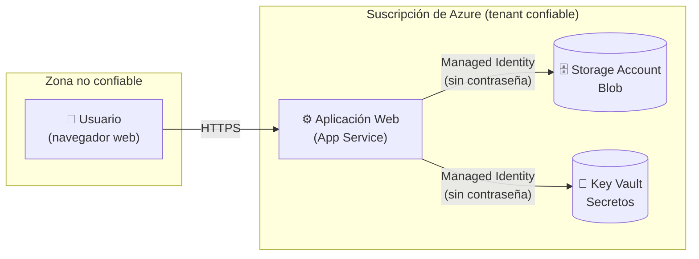

[⬅ Volver al índice](../README.md)

# Sección 1 — Threat Modeling con OWASP Threat Dragon

**Tiempo estimado:** 25–30 minutos

## 🎯 Objetivo de esta sección

Construir un modelo de amenazas con la metodología **STRIDE** sobre el mismo escenario cloud que vas a desplegar en la [Sección 6](../06-managed-identity/README.md): una aplicación web que necesita leer datos de un almacenamiento y un secreto, sin usar contraseñas embebidas en el código.

Hacer el modelo de amenazas **antes** de construir la arquitectura es intencional: en la teoría vimos que el threat modeling vive en la fase *Plan/Design*, antes de escribir código o desplegar infraestructura (*shift-left*). Al final del laboratorio (Sección 6) volverás a este modelo para comprobar que las mitigaciones que planteaste aquí realmente quedaron implementadas.

---

## 📐 El escenario a modelar

Vamos a modelar esta arquitectura simple:



- **Usuario**: cualquier persona que abre la aplicación web desde su navegador. Es una *entidad externa* — está fuera de nuestro control.
- **Aplicación Web (App Service)**: el *proceso* que recibe las peticiones del usuario y necesita leer un archivo del Storage Account y un secreto del Key Vault.
- **Storage Account** y **Key Vault**: son *almacenes de datos*.
- La línea entre "Internet" y "Azure" es una **frontera de confianza (trust boundary)**: todo lo que la cruza debe ser tratado con sospecha y verificado.

> 💡 Este es exactamente el mismo diagrama que construirás con recursos reales en la Sección 6. Modelar la amenaza primero te permite decidir, con criterio, *por qué* usaremos una Managed Identity en lugar de una contraseña.

---

## Paso 1 — Instalar OWASP Threat Dragon (versión de escritorio)

Usaremos la **versión de escritorio**, que no requiere ninguna cuenta ni inicio de sesión: todo se guarda en tu computador.

### ✅ 1.1 Descargar el instalador

1. Abre tu navegador y ve a: **https://github.com/OWASP/threat-dragon/releases**
2. Busca la versión más reciente (aparece primero en la lista, marcada como `Latest`).
3. En la sección **Assets** de esa versión, descarga el archivo según tu sistema operativo:
   - **Windows:** archivo que termina en `.exe` (ej. `OWASP-Threat-Dragon-Setup-X.X.X.exe`)
   - **macOS:** archivo que termina en `.dmg`
   - **Linux:** archivo `.AppImage` (funciona en casi cualquier distribución) o el paquete `.deb`/`.rpm` correspondiente a tu distribución

### ✅ 1.2 Instalar

**En Windows:**
1. Haz doble clic sobre el archivo `.exe` descargado.
2. Si Windows muestra una advertencia de "Windows protegió tu PC" (SmartScreen), haz clic en **Más información** y luego en **Ejecutar de todas formas**. Esto ocurre porque el instalador no está firmado con un certificado comercial, no porque sea inseguro (proviene del repositorio oficial de OWASP en GitHub).
3. Sigue el asistente de instalación (Siguiente → Siguiente → Instalar).
4. Al finalizar, abre la aplicación desde el acceso directo creado en el Escritorio o el Menú Inicio.

**En macOS:**
1. Haz doble clic sobre el archivo `.dmg` descargado.
2. Arrastra el ícono **OWASP Threat Dragon** a la carpeta **Applications**.
3. Abre **Launchpad** o **Finder → Applications** y haz doble clic en OWASP Threat Dragon.
4. Si macOS bloquea la apertura ("no se puede verificar el desarrollador"), ve a **Preferencias del Sistema → Privacidad y Seguridad** y haz clic en **Abrir de todas formas** junto al mensaje sobre Threat Dragon.

**En Linux (AppImage):**
1. Abre una terminal en la carpeta donde descargaste el archivo.
2. Dale permisos de ejecución:
   ```bash
   chmod +x OWASP-Threat-Dragon-*.AppImage
   ```
3. Ejecuta el archivo:
   ```bash
   ./OWASP-Threat-Dragon-*.AppImage
   ```

### 🧪 Checkpoint

Deberías ver la pantalla de bienvenida de OWASP Threat Dragon con las opciones **New Threat Model** (nuevo modelo) y **Open Existing Threat Model** (abrir modelo existente).

---

## Paso 2 — Crear un nuevo modelo de amenazas

### ✅ 2.1

1. Haz clic en **New Threat Model**.
2. En **Threat model title**, escribe: `Laboratorio Sesion 1 - App Web con Managed Identity`
3. En **Threat model description / owner**, escribe tu nombre y la fecha.
4. Haz clic en **Create**.

### ✅ 2.2 Crear el diagrama

1. Dentro del modelo recién creado, busca la opción **Add New Diagram** (o el botón **+**).
2. Selecciona el tipo **New Diagram** con la plantilla **STRIDE** (es la que aparece por defecto).
3. Nombra el diagrama: `Flujo App Web - Storage - Key Vault`

Se abrirá un lienzo en blanco con una barra de herramientas a la izquierda con estos elementos:

| Ícono | Elemento | Lo usamos para |
|---|---|---|
| Rectángulo redondeado | **Actor / Entidad externa** | El Usuario |
| Círculo | **Proceso** | La Aplicación Web (App Service) |
| Dos líneas horizontales | **Almacén de datos (Data Store)** | Storage Account y Key Vault |
| Línea discontinua | **Trust boundary** | El límite entre Internet y Azure |
| Flecha | **Data flow** | Las conexiones entre los elementos |

---

## Paso 3 — Diagramar el DFD (Data Flow Diagram)

Reproduce el diagrama mostrado al inicio de esta sección dentro de Threat Dragon:

### ✅ 3.1 Agregar los elementos

1. Arrastra un **Actor** al lienzo, en la parte izquierda. Haz doble clic y nómbralo `Usuario`.
2. Arrastra un **Process** al centro del lienzo. Nómbralo `App Service`.
3. Arrastra dos **Data Store** a la derecha. Nómbralos `Storage Account` y `Key Vault`.

### ✅ 3.2 Agregar la frontera de confianza

1. Selecciona la herramienta **Trust Boundary** (línea discontinua).
2. Dibuja una línea vertical **entre** el elemento `Usuario` y el elemento `App Service`.
3. Haz doble clic sobre la línea y nómbrala: `Internet <-> Azure`.

### ✅ 3.3 Conectar los flujos de datos

1. Dibuja una flecha desde `Usuario` hacia `App Service`. Nómbrala `HTTPS request`.
2. Dibuja una flecha desde `App Service` hacia `Storage Account`. Nómbrala `Lectura de blob (Managed Identity)`.
3. Dibuja una flecha desde `App Service` hacia `Key Vault`. Nómbrala `Lectura de secreto (Managed Identity)`.

### 🧪 Checkpoint

Tu lienzo debe tener 4 elementos (1 actor, 1 proceso, 2 almacenes), 1 frontera de confianza y 3 flechas de flujo de datos — igual al diagrama Mermaid del inicio de esta sección.

### 📸 Evidencia recomendada

Toma una captura de pantalla de tu diagrama completo en Threat Dragon. La necesitarás para tu entrega.

---

## Paso 4 — Aplicar STRIDE a cada elemento

Threat Dragon permite hacer clic derecho (o doble clic) sobre cualquier elemento o flujo y seleccionar **Add Threat** para registrar una amenaza. Al crear una amenaza nueva, Threat Dragon te pedirá elegir su **tipo** (que corresponde a una letra de STRIDE), un **título**, una **descripción**, la **severidad** (High / Medium / Low) y, opcionalmente, la **mitigación**.

Registra las siguientes 6 amenazas — una por cada letra de STRIDE — distribuidas sobre los elementos del diagrama:

| # | Elemento / Flujo | Tipo STRIDE | Título de la amenaza | Severidad | Mitigación a registrar |
|---|---|---|---|---|---|
| 1 | Flujo `HTTPS request` (Usuario → App Service) | **S**poofing | Suplantación del usuario mediante robo de sesión | Media | Forzar HTTPS/TLS y expiración de sesión |
| 2 | Flujo `HTTPS request` | **T**ampering | Manipulación de parámetros en la petición | Media | Validación de entrada del lado del servidor |
| 3 | Proceso `App Service` | **R**epudiation | El proceso no registra quién accedió a qué recurso | Baja | Habilitar logging de acceso (App Service logs) |
| 4 | Flujo `App Service → Storage Account` | **I**nformation Disclosure | Credenciales de acceso al Storage expuestas en el código | **Alta** | **Usar Managed Identity en lugar de una cadena de conexión con clave** |
| 5 | Flujo `App Service → Key Vault` | **I**nformation Disclosure | Secreto expuesto si se filtra una clave de acceso estática | **Alta** | **Usar Managed Identity + rol RBAC de solo lectura (Key Vault Secrets User)** |
| 6 | Proceso `App Service` | **E**levation of Privilege | La identidad de la aplicación tiene más permisos de los necesarios | Media | Asignar roles RBAC mínimos (Least Privilege), nunca `Contributor` u `Owner` |

> 💡 Fíjate en las amenazas #4 y #5: son exactamente el problema que la Managed Identity de la Sección 6 va a resolver. Estás modelando la amenaza *antes* de construir la mitigación — así es como debe funcionar el threat modeling en un flujo real de trabajo.

### ✅ 4.1 Registrar cada amenaza

Para cada fila de la tabla:

1. Haz clic derecho sobre el elemento o flecha indicado en la columna "Elemento / Flujo".
2. Selecciona **Add Threat**.
3. Completa **Title**, **Type** (la letra STRIDE correspondiente), **Description** (puedes usar el texto de la columna "Título de la amenaza" y ampliarlo con tus palabras), **Severity**, y en el campo **Mitigation**, copia el texto sugerido.
4. Guarda la amenaza (botón **Save** o **OK** según la versión).

### 🧪 Checkpoint

Al finalizar, cada uno de los 4 elementos/flujos con amenazas debe mostrar un contador o ícono indicando que tiene al menos una amenaza registrada. En total deberías tener 6 amenazas documentadas cubriendo las 6 letras de STRIDE.

---

## Paso 5 — Priorizar y guardar el modelo

### ✅ 5.1 Revisar prioridades

1. Abre la lista de amenazas del modelo (usualmente disponible en una pestaña o panel lateral **Threats**).
2. Verifica que las amenazas #4 y #5 (Information Disclosure) estén marcadas como **High** — son las de mayor impacto porque exponen credenciales que darían acceso directo a datos.

### ✅ 5.2 Guardar el modelo

1. Ve al menú **File → Save Model** (o el ícono de guardar).
2. Guarda el archivo con el nombre `threat-model-lab1.json` dentro de la carpeta `assets/` de este repositorio (`lab-sesion1-fundamentos-cloud/assets/threat-model-lab1.json`).

> 💡 Al ser un archivo `.json` de texto plano, este modelo se puede subir a tu repositorio de GitHub junto con el resto de la guía — es una buena práctica versionar los modelos de amenazas igual que el código.

### 📸 Evidencia recomendada

Captura de pantalla de la lista completa de amenazas (las 6, con su tipo y severidad visibles).

---

## ✅ Checklist de la Sección 1

- [ ] OWASP Threat Dragon (escritorio) instalado y funcionando
- [ ] Diagrama DFD creado con 1 actor, 1 proceso, 2 almacenes de datos y 1 trust boundary
- [ ] 6 amenazas registradas, una por cada letra de STRIDE
- [ ] Amenazas de Information Disclosure marcadas como severidad Alta
- [ ] Modelo guardado como `assets/threat-model-lab1.json`
- [ ] Captura de pantalla del diagrama y de la lista de amenazas guardada como evidencia

---

## 🧠 Preguntas de repaso

1. ¿Por qué el flujo `App Service → Storage Account` es más crítico (severidad Alta) que el flujo `Usuario → App Service`?
2. ¿Qué principio de seguridad de la Sesión 1 (Least Privilege, Defense in Depth o Zero Trust) se aplica directamente al registrar el rol RBAC mínimo como mitigación de la amenaza de Elevation of Privilege?
3. Si este fuera un sistema real en producción, ¿qué otro elemento agregarías al DFD para reflejar dónde vive el código fuente de la aplicación?

---

➡️ Continúa con la [Sección 2 — Alta en Azure Free Tier](../02-alta-azure-free-tier/README.md)
