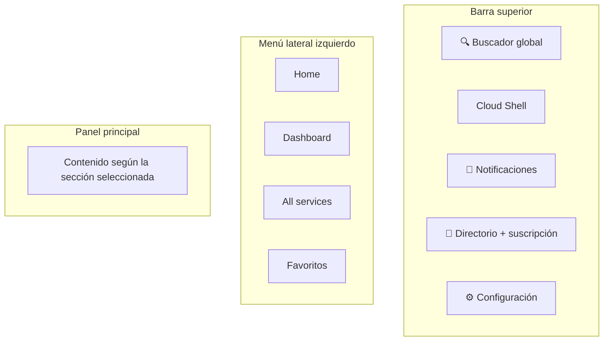

[⬅ Volver al índice](../README.md)

# Sección 3 — Exploración del Portal de Azure

**Tiempo estimado:** 15 minutos

## 🎯 Objetivo de esta sección

Familiarizarte con la interfaz del **Azure Portal** (`portal.azure.com`) antes de crear recursos. Entender dónde está cada cosa te ahorrará tiempo — y confusión — en las secciones siguientes.

---

## Paso 1 — Anatomía general del portal

Abre **https://portal.azure.com** (si no tienes la sesión iniciada, usa la misma cuenta de la Sección 2).



### ✅ 1.1 Identifica cada zona

Recorre visualmente el portal e identifica:

1. **Barra superior:** contiene el buscador global (campo de texto largo en el centro), el ícono de **Cloud Shell** (una terminal `>_`), el ícono de **notificaciones** (una campana), el selector de **directorio y suscripción** (un ícono de engranaje o tu organización), y el ícono de **configuración** (⚙️).
2. **Menú lateral izquierdo (hamburguesa ☰):** contiene **Home**, **Dashboard**, **All services** y tus **Favoritos**.
3. **Panel principal:** cambia según la sección donde estés. Al entrar, normalmente muestra **Home**, con accesos directos a los servicios más usados y un resumen de tu suscripción.

### 💡 El buscador es tu mejor amigo

En vez de navegar por menús, la forma más rápida de llegar a cualquier servicio es escribir su nombre en el **buscador global** de la barra superior. Lo usaremos constantemente a partir de aquí.

---

## Paso 2 — Personalizar tu Dashboard

### ✅ 2.1

1. En el menú lateral, haz clic en **Dashboard**.
2. Haz clic en **+ New dashboard** (Nuevo panel) o **Edit** si ya existe uno por defecto.
3. Arrastra un par de "tiles" (mosaicos) desde el panel de la izquierda hacia el lienzo — por ejemplo, **Clock** (reloj) o **Markdown** (texto). No es indispensable que quede perfecto; el objetivo es que veas cómo funciona la personalización.
4. Haz clic en **Save** (Guardar) o **Done customizing**.

> 💡 Los dashboards son útiles en un trabajo real para tener a la vista, de un vistazo, el estado de los recursos que administras. No los usaremos más en este laboratorio, pero ya sabes que existen.

---

## Paso 3 — Explorar "All services" y marcar Favoritos

### ✅ 3.1

1. Haz clic en **All services** en el menú lateral.
2. Verás una lista larga de categorías (Compute, Storage, Networking, Security, Identity, etc.). Esto es prácticamente el catálogo completo de servicios de Azure.
3. Usa el campo de búsqueda dentro de esta pantalla para escribir `Storage accounts`. Verifica que aparece en los resultados.

### ✅ 3.2 Marcar como favoritos los servicios que usaremos

Para cada uno de los siguientes servicios, búscalo en el buscador global superior, ábrelo, y haz clic en la **estrella (☆)** que aparece junto a su nombre para agregarlo a tus **Favoritos** (la estrella se pondrá amarilla/dorada):

- `Resource groups`
- `App Services`
- `Storage accounts`
- `Key vaults`
- `Cost Management + Billing`
- `Microsoft Entra ID`

### 🧪 Checkpoint

En el menú lateral izquierdo, debajo de **Dashboard**, ahora debe aparecer una sección con los 6 servicios que marcaste, para acceso rápido durante el resto del laboratorio.

### 📸 Evidencia recomendada

Captura de pantalla del menú lateral mostrando tus favoritos.

---

## Paso 4 — Conocer Azure Cloud Shell (sin usarlo todavía)

Azure Cloud Shell es una terminal (línea de comandos) accesible desde el navegador, sin necesidad de instalar nada en tu computador.

### ✅ 4.1

1. Haz clic en el ícono **Cloud Shell** (`>_`) en la barra superior.
2. Si es la primera vez que lo abres, Azure te pedirá crear un **File share** (almacenamiento persistente para guardar tus scripts). Puedes hacer clic en **Show advanced settings** para ver que usa una Storage Account pequeña, o simplemente aceptar la configuración por defecto.
3. Elige el tipo de shell: **Bash** (recomendado para esta guía).
4. Espera a que aprovisione el entorno (puede tardar 1–2 minutos la primera vez).
5. Una vez que veas el prompt de comandos, escribe:
   ```bash
   az account show
   ```
6. Deberías ver un bloque de texto en formato JSON con los datos de tu suscripción (nombre, ID, tenant, etc.).
7. Cierra el panel de Cloud Shell haciendo clic nuevamente en el ícono `>_` o en la **X**.

> ⚠️ Cloud Shell crea automáticamente una pequeña Storage Account para guardar tus archivos. Esto está dentro del nivel gratuito para el uso mínimo de este laboratorio, pero es bueno saber que existe — la usaremos brevemente en la Sección 6 para verificar la Managed Identity.

### 🧪 Checkpoint

El comando `az account show` debe devolver información sin errores, confirmando que Cloud Shell está conectado a tu suscripción.

---

## Paso 5 — Revisar Cost Management + Billing

Regresemos a validar que el crédito gratuito sigue disponible.

### ✅ 5.1

1. Busca y abre **Cost Management + Billing** (ya debería estar en tus favoritos).
2. En el menú lateral, selecciona **Cost analysis**.
3. Observa el gráfico de costo acumulado — debería mostrar **USD 0** o un valor muy cercano a cero, ya que aún no hemos creado recursos que generen costo.
4. Si tu suscripción es de tipo Free Trial, busca también la sección o indicador de **crédito restante** (remaining credit), normalmente visible en el resumen de la suscripción.

### 🧪 Checkpoint

Confirmas que el gasto acumulado es prácticamente cero y que el presupuesto `presupuesto-lab1` de la Sección 2 sigue activo.

---

## Paso 6 — Suscripciones y Microsoft Entra ID

### ✅ 6.1

1. Busca y abre **Microsoft Entra ID** (anteriormente llamado Azure Active Directory).
2. En la vista de **Overview**, observa el nombre de tu **tenant** (organización) — Azure crea uno automáticamente al registrarte.
3. En el menú lateral de Entra ID, haz clic en **Users** (Usuarios). Deberías ver tu propio usuario listado.

> 💡 Este es el mismo Microsoft Entra ID donde, más adelante en el curso (Sesión 3), configurarás roles, grupos y autenticación federada. Por ahora solo necesitas saber que existe y que **es donde vivirán las identidades** — incluida la Managed Identity que crearás en la Sección 6.

### 🧪 Checkpoint

Puedes ver el nombre de tu tenant y tu propio usuario listado en Entra ID.

---

## ✅ Checklist de la Sección 3

- [ ] Identificaste las 4 zonas principales del portal (barra superior, menú lateral, panel principal, buscador)
- [ ] Personalizaste (o al menos abriste) un Dashboard
- [ ] Marcaste como favoritos los 6 servicios que usarás en el resto del laboratorio
- [ ] Abriste Cloud Shell y ejecutaste `az account show` exitosamente
- [ ] Verificaste que el gasto acumulado es USD 0 en Cost Management
- [ ] Ubicaste tu tenant y tu usuario en Microsoft Entra ID

---

## 🧠 Preguntas de repaso

1. ¿Por qué es más eficiente usar el buscador global que navegar por "All services" cada vez?
2. ¿Qué relación tiene Microsoft Entra ID con las identidades que gestionaste en la teoría (Zero Trust, Least Privilege)?
3. ¿Qué harías si, en un trabajo real, el gráfico de Cost Analysis mostrara un gasto inesperado apenas un día después de crear la cuenta?

---

➡️ Continúa con la [Sección 4 — Azure Resource Manager / Resource Groups](../04-arm-resource-groups/README.md)
