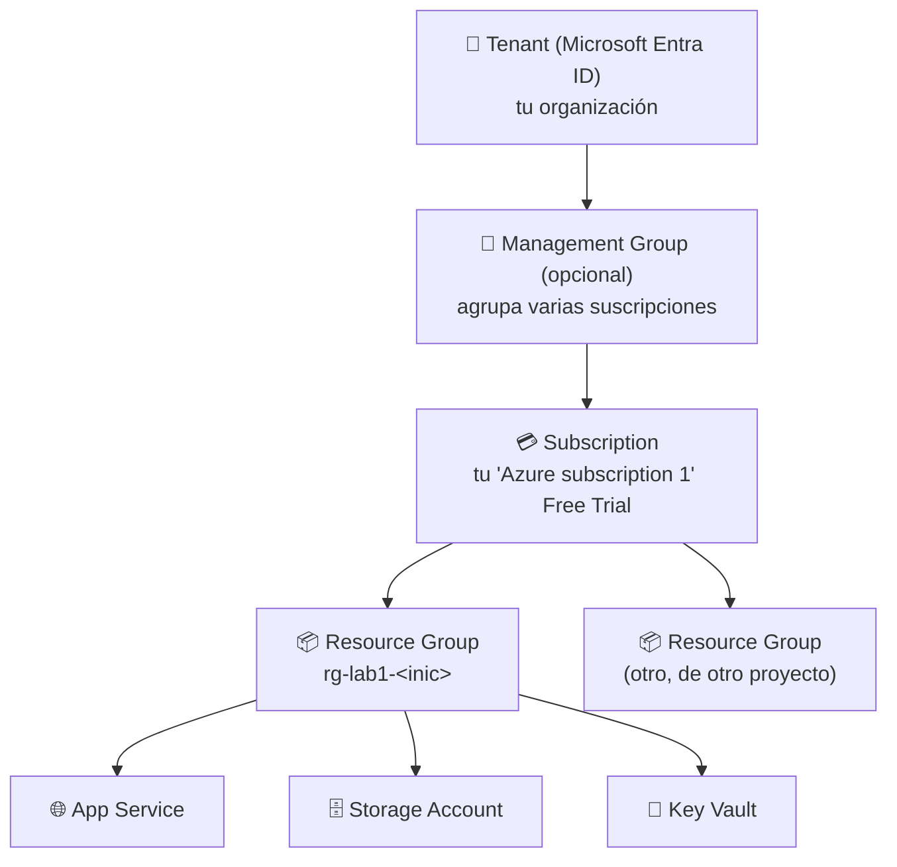

[⬅ Volver al índice](../README.md)

# Sección 4 — Azure Resource Manager (ARM) / Resource Groups

**Tiempo estimado:** 15 minutos

## 🎯 Objetivo de esta sección

Entender qué es Azure Resource Manager y crear el **Resource Group** que va a contener todos los recursos de este laboratorio (Storage Account, Key Vault y App Service), para poder organizarlos y — al final — eliminarlos de una sola vez.

---

## Paso 1 — ¿Qué es Azure Resource Manager (ARM)?

**Azure Resource Manager** es la capa de gestión de Azure: es la única puerta de entrada por la que pasa **cualquier** operación que hagas sobre tus recursos, sin importar si la haces desde el Portal, desde la línea de comandos (`az`), desde una plantilla (`Bicep`/`ARM template`), o desde cualquier SDK. Cuando creas un recurso en el Portal, en realidad el Portal está enviando una petición a la API de ARM.

Esto importa para la seguridad porque significa que **todo control de acceso, política y auditoría que apliques sobre ARM aplica sin importar cómo alguien intente crear o modificar un recurso** — no hay una "puerta trasera" que evite ARM.

### Jerarquía de organización en Azure

| Nivel | Qué es | Ejemplo en este laboratorio |
|---|---|---|
| **Tenant** | Tu organización en Microsoft Entra ID | El tenant que Azure creó automáticamente para tu cuenta |
| **Management Group** | Agrupa varias suscripciones (uso empresarial avanzado) | No lo usaremos en este laboratorio |
| **Subscription** | Unidad de facturación y de aislamiento | Tu "Azure subscription 1" (Free Trial) |
| **Resource Group (RG)** | Contenedor lógico de recursos relacionados, con el mismo ciclo de vida | `rg-lab1-<inic>` |
| **Resource** | El recurso individual (VM, App Service, Storage, etc.) | App Service, Storage Account, Key Vault |

### 💡 ¿Qué es (y qué NO es) un Resource Group?

- **SÍ es:** un contenedor lógico para organizar, aplicar permisos (IAM), etiquetar y — muy importante para nosotros — **eliminar en bloque** un conjunto de recursos relacionados.
- **NO es:** un límite de red ni de seguridad por sí solo. Dos recursos en el mismo Resource Group no se "ven" automáticamente entre sí en la red — eso se controla con otros mecanismos que verás en la Sesión 4 del curso (redes, NSG, private endpoints).
- Todos los recursos de un mismo Resource Group **no tienen que estar en la misma región**, aunque por simplicidad y latencia normalmente se agrupan recursos de la misma región.

---

## Paso 2 — Crear el Resource Group del laboratorio

### ✅ 2.1

1. En el buscador global del portal, escribe `Resource groups` y haz clic en el resultado (o selecciónalo desde tus Favoritos de la Sección 3).
2. Haz clic en **+ Create** (Crear).

### ✅ 2.2 Completar el formulario

1. **Subscription:** verifica que esté seleccionada tu suscripción Free Trial.
2. **Resource group name:** escribe el nombre según la convención definida en el [README principal](../README.md#🏷️-convención-de-nombres-que-usaremos), por ejemplo `rg-lab1-jsr` (reemplaza `jsr` por tus iniciales).
3. **Region:** selecciona la región más cercana a tu ubicación. Algunas opciones comunes: `East US`, `East US 2`, `West Europe`, `Brazil South`. Cualquiera de estas regiones tiene disponibilidad del nivel gratuito.

> 💡 **¿Por qué importa la región?** Determina en qué centro de datos físico vivirán tus recursos, lo cual afecta la latencia (velocidad de respuesta) y, en proyectos reales, temas legales de residencia de datos. Para este laboratorio, elige la más cercana a ti y **usa la misma región para todos los recursos** que crearás en la Sección 6 — mantener todo en una sola región simplifica la administración y reduce (o elimina) costos de transferencia de datos entre regiones.

4. Haz clic en **Review + create**.
5. Verifica que no aparezca ningún error de validación.
6. Haz clic en **Create**.

### 🧪 Checkpoint

Espera a que aparezca la notificación **"Your deployment is complete"**. Haz clic en **Go to resource group**.

### 📸 Evidencia recomendada

Captura de pantalla del Resource Group recién creado, mostrando su nombre y región.

---

## Paso 3 — Explorar el Resource Group creado

Ahora que existe, recorre sus secciones principales — las volverás a usar constantemente en la Sección 6.

### ✅ 3.1 Overview

1. En el menú lateral del Resource Group, confirma que estás en **Overview**.
2. Observa que la lista de recursos está vacía (todavía no hemos creado nada dentro de él).
3. Anota el campo **Resource group ID** — es la ruta completa que identifica a este contenedor dentro de ARM.

### ✅ 3.2 Activity log

1. Haz clic en **Activity log** en el menú lateral.
2. Deberías ver al menos una entrada: la operación de **creación** del propio Resource Group, con tu usuario como responsable y la marca de tiempo.

> 💡 El Activity Log es, en esencia, un registro de auditoría: todo lo que se crea, modifica o elimina dentro de este Resource Group quedará aquí. Es la base de la trazabilidad que en la Sesión 5 del curso ampliarás con SIEM y detección de amenazas.

### ✅ 3.3 Access control (IAM)

1. Haz clic en **Access control (IAM)**.
2. Haz clic en la pestaña **Role assignments** (Asignaciones de roles).
3. Deberías verte a ti mismo listado, normalmente con el rol **Owner** (Propietario) — heredado de ser quien creó la suscripción.

> 💡 Aquí es exactamente donde, en la Sección 6, asignaremos un rol de **solo lectura** a la Managed Identity del App Service — mucho más restringido que el rol de Owner que tú tienes.

### ✅ 3.4 Tags (Etiquetas)

1. Haz clic en **Tags** en el menú lateral.
2. Agrega dos etiquetas:
   - **Name:** `curso` — **Value:** `seguridad-en-la-nube`
   - **Name:** `sesion` — **Value:** `1`
3. Haz clic en **Apply** (Aplicar) o **Save**.

> 💡 Las etiquetas (tags) permiten clasificar recursos para reportes de costos, automatización y gobierno — por ejemplo, saber cuánto gasta cada curso o proyecto dentro de una organización con decenas de Resource Groups.

### 🧪 Checkpoint

El Resource Group ahora muestra 2 etiquetas y tú apareces como **Owner** en Access control (IAM).

---

## ✅ Checklist de la Sección 4

- [ ] Entiendes la jerarquía Tenant → Subscription → Resource Group → Recurso
- [ ] Resource Group `rg-lab1-<inic>` creado en una región válida
- [ ] Revisaste Activity log y viste el registro de creación
- [ ] Revisaste Access control (IAM) y te identificaste como Owner
- [ ] Agregaste las etiquetas `curso` y `sesion`

---

## 🧠 Preguntas de repaso

1. Si accidentalmente creas un recurso en la región equivocada, ¿basta con moverlo a otro Resource Group para "corregir" la región? *(Pista: piensa en qué define la región de un recurso.)*
2. ¿Por qué eliminar un Resource Group es una forma segura y completa de limpiar todos los recursos de un laboratorio?
3. ¿Qué diferencia hay entre estar registrado en el Activity log y tener un permiso de Access Control (IAM)?

---

➡️ Continúa con la [Sección 5 — Mapeo de responsabilidades por servicio](../05-mapeo-responsabilidades/README.md)
