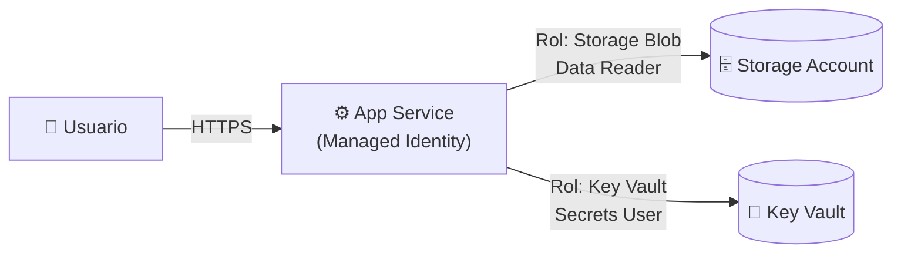

[⬅ Volver al índice](../README.md)

# Sección 6 — Managed Identity: App Service → Storage Account + Key Vault (sin credenciales)

**Tiempo estimado:** 30–40 minutos

## 🎯 Objetivo de esta sección

Construir la arquitectura que modelaste en la [Sección 1](../01-threat-modeling/README.md) y resolver, con una **Managed Identity**, las amenazas de *Information Disclosure* que registraste allí: el App Service accederá a un Storage Account y a un Key Vault **sin que exista ninguna contraseña, cadena de conexión con clave, ni secreto embebido en el código o en la configuración**.



---

## ⚠️ Antes de empezar

- Todos los recursos de esta sección deben crearse **dentro del Resource Group `rg-lab1-<inic>`** que creaste en la Sección 4.
- Usa siempre la **misma región** que elegiste para el Resource Group.
- Usa siempre los niveles de precio marcados explícitamente como gratuitos o de menor costo (`F1 Free`, `Standard LRS`).
- Al final de esta sección, **eliminarás todo el Resource Group** — es el paso de limpieza obligatorio.

---

## Paso 1 — Crear el App Service (nivel gratuito F1)

### ✅ 1.1

1. En el buscador global, escribe `App Services` y ábrelo.
2. Haz clic en **+ Create → Web App**.

### ✅ 1.2 Pestaña "Basics"

Completa cada campo así:

| Campo | Valor |
|---|---|
| Subscription | Tu suscripción Free Trial |
| Resource Group | `rg-lab1-<inic>` (selecciónalo del desplegable, **no crees uno nuevo**) |
| Name | `app-lab1-<inic><num>` (ej. `app-lab1-jsr2026`) — recuerda que debe ser único en todo Azure; si Azure marca el nombre como no disponible, agrega un número adicional |
| Publish | `Code` |
| Runtime stack | `Node 20 LTS` (o la versión LTS más reciente disponible) |
| Operating System | `Linux` |
| Region | La misma región de tu Resource Group |

### ✅ 1.3 Pricing plan (¡el paso más importante de esta pantalla!)

1. Junto a **Linux Plan**, haz clic en **Create new** (si no existe uno) y nómbralo `plan-lab1-<inic>`.
2. Haz clic en **Explore pricing plans** o en el enlace para cambiar el **Pricing plan / Sku and size**.
3. Busca y selecciona explícitamente el plan **`F1` (Free)**, bajo la categoría **Dev / Test**.
4. Confirma la selección.

> ⚠️ **Este es el paso donde más frecuentemente ocurren costos accidentales.** Azure a veces preselecciona un plan de pago (`B1`, `P1V2`, etc.) por defecto. Verifica explícitamente que el plan seleccionado diga **F1 Free** antes de continuar. Si no ves la opción F1 disponible en tu región, cambia de región (algunas regiones tienen cupos limitados del nivel gratuito).

### ✅ 1.4 Resto de pestañas

- **Database:** deja `Skip for now` (no necesitamos base de datos).
- **Deployment:** deja los valores por defecto (Continuous deployment: Disable).
- **Networking:** deja los valores por defecto (no habilites Private Endpoint — eso corresponde a la Sesión 4 del curso).
- **Monitoring:** puedes dejar **Enable Application Insights** en `No` para simplificar (opcional habilitarlo si quieres explorarlo).
- **Tags:** agrega `curso` = `seguridad-en-la-nube` y `sesion` = `1`, igual que hiciste con el Resource Group.

### ✅ 1.5 Crear

1. Haz clic en **Review + create**.
2. Verifica en el resumen que el **Pricing plan diga Free F1**.
3. Haz clic en **Create**.
4. Espera la notificación **"Your deployment is complete"** (puede tardar 1–3 minutos).
5. Haz clic en **Go to resource**.

### 🧪 Checkpoint

1. En la página **Overview** del App Service, copia el valor de **Default domain** o **URL** (algo como `https://app-lab1-jsr2026.azurewebsites.net`).
2. Ábrelo en una nueva pestaña del navegador. Deberías ver la página de bienvenida por defecto de Azure App Service (un mensaje indicando que la app está en funcionamiento, a la espera de que despliegues tu código).

### 📸 Evidencia recomendada

Captura de pantalla de la página Overview del App Service mostrando el Pricing plan `F1` y la URL funcionando en el navegador.

---

## Paso 2 — Crear la Storage Account

### ✅ 2.1

1. En el buscador global, escribe `Storage accounts` y ábrelo.
2. Haz clic en **+ Create**.

### ✅ 2.2 Pestaña "Basics"

| Campo | Valor |
|---|---|
| Subscription | Tu suscripción Free Trial |
| Resource Group | `rg-lab1-<inic>` |
| Storage account name | `stlab1<inic><num>` — **todo en minúsculas, sin guiones ni espacios**, entre 3 y 24 caracteres (ej. `stlab1jsr2026`) |
| Region | La misma región de tu Resource Group |
| Performance | `Standard` |
| Redundancy | `Locally-redundant storage (LRS)` (la opción más económica) |

### ✅ 2.3 Pestaña "Advanced"

- Deja los valores por defecto. Verifica que **Hierarchical namespace** esté **deshabilitado** (no lo necesitamos).

### ✅ 2.4 Pestaña "Networking"

- Deja **Enable public access from all networks** (valor por defecto). En un entorno de producción restringirías esto con Private Endpoints (tema de la Sesión 4), pero para este laboratorio lo dejamos simple — la protección real aquí vendrá de la identidad y los permisos, no de la red.

### ✅ 2.5 Crear

1. Haz clic en **Review + create**, verifica que no haya errores, y haz clic en **Create**.
2. Espera la confirmación y haz clic en **Go to resource**.

### 🧪 Checkpoint

Estás en la página Overview de tu nueva Storage Account.

---

## Paso 3 — Crear un contenedor y subir un archivo de prueba

### ✅ 3.1 Crear el contenedor

1. En el menú lateral de la Storage Account, dentro de **Data storage**, haz clic en **Containers**.
2. Haz clic en **+ Container**.
3. **Name:** `datos-lab`
4. **Anonymous access level:** `Private (no anonymous access)` — **muy importante**, no debe ser público.
5. Haz clic en **Create**.

### ✅ 3.2 Subir un archivo de prueba

1. Haz clic sobre el contenedor `datos-lab` recién creado.
2. Haz clic en **Upload**.
3. Crea rápidamente un archivo de texto en tu computador llamado `saludo.txt` con el contenido: `Hola desde Blob Storage - acceso via Managed Identity`
4. Selecciona ese archivo y haz clic en **Upload**.

### 🧪 Checkpoint

El archivo `saludo.txt` aparece listado dentro del contenedor `datos-lab`.

### 📸 Evidencia recomendada

Captura de pantalla del contenedor con el archivo subido, mostrando el nivel de acceso `Private`.

---

## Paso 4 — Crear el Key Vault

### ✅ 4.1

1. En el buscador global, escribe `Key vaults` y ábrelo.
2. Haz clic en **+ Create**.

### ✅ 4.2 Pestaña "Basics"

| Campo | Valor |
|---|---|
| Subscription | Tu suscripción Free Trial |
| Resource Group | `rg-lab1-<inic>` |
| Key vault name | `kv-lab1-<inic><num>` — único en todo Azure, 3 a 24 caracteres (ej. `kv-lab1-jsr2026`) |
| Region | La misma región de tu Resource Group |
| Pricing tier | `Standard` |

### ✅ 4.3 Pestaña "Access configuration" (paso clave)

1. En **Permission model**, selecciona **Azure role-based access control (RBAC)** — **no** dejes seleccionado "Vault access policy" (el modelo antiguo). RBAC es el modelo recomendado y es el mismo mecanismo de roles (Least Privilege) que usamos en toda la guía.

### ✅ 4.4 Crear

1. Deja el resto de pestañas con sus valores por defecto.
2. Haz clic en **Review + create → Create**.
3. Espera la confirmación y haz clic en **Go to resource**.

### ✅ 4.5 Crear un secreto de prueba

1. En el menú lateral del Key Vault, dentro de **Objects**, haz clic en **Secrets**.
2. Haz clic en **+ Generate/Import**.
3. **Name:** `SecretoDemo`
4. **Value:** `ValorSecretoDePrueba123`
5. Haz clic en **Create**.

> ⚠️ Como acabas de habilitar el modelo de permisos RBAC, es posible que **tú mismo** necesites un rol para poder ver o crear secretos desde el Portal (por ejemplo, `Key Vault Administrator` o `Key Vault Secrets Officer`) si no te lo asigna automáticamente al ser el creador. Si el Portal te muestra un error de "Access Denied" al intentar crear el secreto, ve a **Access control (IAM)** del Key Vault → **+ Add role assignment** → rol `Key Vault Administrator` → **Assign access to:** `User, group, or service principal` → selecciona tu propio usuario → **Review + assign**. Espera 1–2 minutos y vuelve a intentar crear el secreto.

### 🧪 Checkpoint

El secreto `SecretoDemo` aparece listado en **Secrets**, con un estado **Enabled**.

### 📸 Evidencia recomendada

Captura de pantalla de la lista de secretos del Key Vault.

---

## Paso 5 — Habilitar la Managed Identity en el App Service

Este es el paso central del laboratorio.

### ✅ 5.1

1. Ve a tu **App Service** (`app-lab1-<inic><num>`).
2. En el menú lateral, dentro de **Settings**, haz clic en **Identity**.
3. Estás en la pestaña **System assigned**.
4. Cambia el interruptor **Status** de `Off` a **`On`**.
5. Haz clic en **Save**.
6. Aparecerá un cuadro de confirmación preguntando si deseas registrar esta app con Microsoft Entra ID — haz clic en **Yes**.

### 🧪 Checkpoint

Después de guardar, la pantalla mostrará un **Object (principal) ID** — un identificador único (parecido a `a1b2c3d4-...`) que representa la identidad recién creada. **Cópialo y guárdalo** en tu editor de texto; lo usarás como referencia.

> 💡 Lo que acaba de pasar: Azure creó automáticamente, dentro de tu Microsoft Entra ID, una identidad cuyo **ciclo de vida está atado al del propio App Service** — si eliminas el App Service, esta identidad se elimina automáticamente con él. No tiene contraseña que tú debas gestionar, rotar o proteger: Azure la gestiona internamente y la renueva sola.

### 📸 Evidencia recomendada

Captura de pantalla de la pestaña Identity con **Status: On** y el Object ID visible.

---

## Paso 6 — Asignar permisos RBAC mínimos (Least Privilege)

Ahora vamos a decirle explícitamente a Azure: "esta identidad puede **leer** datos del Storage y **leer** secretos del Key Vault — nada más". Ni escritura, ni eliminación, ni administración.

### ✅ 6.1 Rol sobre la Storage Account

1. Ve a tu **Storage Account** (`stlab1<inic><num>`).
2. En el menú lateral, haz clic en **Access control (IAM)**.
3. Haz clic en **+ Add → Add role assignment**.
4. En el campo de búsqueda de roles, escribe: `Storage Blob Data Reader`
5. Selecciona ese rol (**no** selecciones `Storage Blob Data Contributor` ni `Owner` — queremos el mínimo necesario, que en este caso es solo lectura) y haz clic en **Next**.
6. En **Assign access to**, selecciona **Managed identity**.
7. Haz clic en **+ Select members**.
8. En el panel que se abre: **Managed identity** → selecciona `App Service`. En la lista de abajo debería aparecer tu App Service (`app-lab1-<inic><num>`).
9. Selecciónalo y haz clic en **Select**.
10. Haz clic en **Review + assign** y confirma en **Review + assign** nuevamente.

### ✅ 6.2 Rol sobre el Key Vault

1. Ve a tu **Key Vault** (`kv-lab1-<inic><num>`).
2. En el menú lateral, haz clic en **Access control (IAM)**.
3. Haz clic en **+ Add → Add role assignment**.
4. En el campo de búsqueda de roles, escribe: `Key Vault Secrets User`
5. Selecciona ese rol (**no** `Key Vault Administrator` ni `Contributor` — solo necesita **leer** el secreto) y haz clic en **Next**.
6. En **Assign access to**, selecciona **Managed identity**.
7. Haz clic en **+ Select members** → **Managed identity** → `App Service` → selecciona tu App Service → **Select**.
8. Haz clic en **Review + assign** y confirma.

> 💡 **Esto es Least Privilege en la práctica.** Comparado con lo que haría un desarrollador apurado (usar una cuenta con permisos de `Owner` o `Contributor` "para que funcione todo"), aquí la identidad del App Service solo puede **leer**. Aunque un atacante lograra ejecutar código dentro del App Service, no podría eliminar, modificar ni administrar nada en el Storage Account o el Key Vault — el radio de impacto (blast radius) queda limitado.

### 🧪 Checkpoint

En **Access control (IAM) → Role assignments** de la Storage Account, debe aparecer una fila con el rol `Storage Blob Data Reader` asignado a tu App Service. Lo mismo en el Key Vault con `Key Vault Secrets User`.

### 📸 Evidencia recomendada

Captura de pantalla de ambas listas de Role assignments (Storage y Key Vault) mostrando la asignación a tu App Service.

> ⏳ **Nota de tiempo:** la propagación de roles RBAC en Azure puede tardar entre 1 y 5 minutos en hacerse efectiva. Si el siguiente paso falla con un error de permisos, espera unos minutos y vuelve a intentar.

---

## Paso 7 — Verificar el acceso sin credenciales

Vamos a comprobar, desde dentro del propio App Service, que la Managed Identity efectivamente puede obtener un token de acceso — **sin que exista ninguna contraseña involucrada**.

### ✅ 7.1 Abrir la consola de depuración (Kudu) del App Service

1. Ve a tu **App Service**.
2. En el menú lateral, dentro de **Development Tools**, haz clic en **Advanced Tools**.
3. Haz clic en **Go →** (se abrirá una nueva pestaña con el panel Kudu).
4. En el menú superior de Kudu, haz clic en **Debug console → Bash** (o `SSH` si tu app corre en Linux y Bash no está disponible).

### ✅ 7.2 Solicitar un token para el Storage Account

En la línea de comandos que se abre, ejecuta (todo en una sola línea):

```bash
curl "http://169.254.169.254/metadata/identity/oauth2/token?api-version=2019-08-01&resource=https://storage.azure.com/" -H "Metadata: true"
```

**¿Qué es `169.254.169.254`?** Es el **Instance Metadata Service (IMDS)** de Azure — una dirección especial, accesible únicamente **desde adentro** del propio recurso, que permite pedir credenciales temporales para la identidad administrada. Ninguna aplicación externa puede alcanzar esta dirección: solo el proceso que corre dentro de tu App Service.

### 🧪 Checkpoint

La respuesta debe ser un bloque JSON que incluye un campo `"access_token"` con una cadena larga de caracteres, y un campo `"expires_in"` indicando por cuántos segundos es válido ese token (normalmente unos 3600 segundos / 1 hora).

**Esto demuestra la mitigación que registraste en la Sección 1:** la aplicación obtuvo credenciales de acceso al Storage **sin que ningún desarrollador haya escrito, copiado o gestionado una contraseña o clave** — Azure la entregó automáticamente, solo porque el código corre dentro de un recurso con la identidad correcta y los permisos RBAC correctos.

### ✅ 7.3 Repetir para el Key Vault

Ejecuta ahora:

```bash
curl "http://169.254.169.254/metadata/identity/oauth2/token?api-version=2019-08-01&resource=https://vault.azure.net" -H "Metadata: true"
```

### 🧪 Checkpoint

Nuevamente debe devolver un `access_token` válido, esta vez con permisos de acceso al Key Vault.

### 📸 Evidencia recomendada

Captura de pantalla de la consola Kudu mostrando ambas respuestas JSON con el `access_token` (puedes recortar/ocultar el valor completo del token por buena práctica, mostrando solo los primeros caracteres).

---

## 💡 Opcional — profundizar con código real

<details>
<summary>Haz clic para ver un ejemplo de código (Node.js) que usa DefaultAzureCredential para leer el blob y el secreto</summary>

Si quieres ir un paso más allá del `curl` al IMDS, este es el patrón real que usaría una aplicación en producción, usando el SDK de Azure para JavaScript:

```javascript
// npm install @azure/identity @azure/storage-blob @azure/keyvault-secrets

const { DefaultAzureCredential } = require("@azure/identity");
const { BlobServiceClient } = require("@azure/storage-blob");
const { SecretClient } = require("@azure/keyvault-secrets");

async function main() {
  // DefaultAzureCredential detecta automáticamente la Managed Identity
  // cuando el código corre dentro de Azure — sin ninguna clave en el código.
  const credential = new DefaultAzureCredential();

  // Leer el blob
  const blobServiceClient = new BlobServiceClient(
    "https://stlab1jsr2026.blob.core.windows.net",
    credential
  );
  const containerClient = blobServiceClient.getContainerClient("datos-lab");
  const blobClient = containerClient.getBlobClient("saludo.txt");
  const download = await blobClient.download();
  console.log("Contenido del blob obtenido correctamente.");

  // Leer el secreto
  const secretClient = new SecretClient(
    "https://kv-lab1-jsr2026.vault.azure.net",
    credential
  );
  const secret = await secretClient.getSecret("SecretoDemo");
  console.log("Secreto obtenido correctamente (valor no impreso por seguridad).");
}

main().catch(console.error);
```

Ni la cadena de conexión del Storage ni el nombre de usuario/clave del Key Vault aparecen en ninguna parte de este código — `DefaultAzureCredential` los resuelve automáticamente usando la Managed Identity del entorno donde corre.

Desplegar y ejecutar este código dentro del App Service queda **fuera del alcance obligatorio** de este laboratorio, pero es la forma en la que verías esto funcionar en un proyecto real.

</details>

---

## Paso 8 — Confirmar que no hay credenciales en ningún lado

### ✅ 8.1

1. Ve a tu **App Service → Settings → Environment variables** (o **Configuration → Application settings**, según la versión del portal).
2. Revisa la lista completa de variables de entorno / application settings.
3. Confirma que **no existe ninguna variable** con una cadena de conexión (`AZURE_STORAGE_CONNECTION_STRING`), clave de cuenta, ni secreto del Key Vault escrito en texto plano.

### 🧪 Checkpoint

La ausencia de credenciales en esta pantalla es la evidencia final de que el acceso funciona exclusivamente por identidad y roles — no por secretos compartidos.

### 📸 Evidencia recomendada

Captura de pantalla de la lista de Application settings, para dejar constancia de que no contiene credenciales.

---

## Paso 9 — Revisita tu modelo de amenazas

Vuelve a abrir el archivo `assets/threat-model-lab1.json` en OWASP Threat Dragon (Sección 1) y, para las amenazas #4 y #5 (Information Disclosure, severidad Alta), agrega una nota confirmando que la mitigación fue **implementada y verificada**:

> "Mitigación implementada: Managed Identity del App Service `app-lab1-<inic><num>` con rol `Storage Blob Data Reader` sobre `stlab1<inic><num>` y rol `Key Vault Secrets User` sobre `kv-lab1-<inic><num>`. Verificado obteniendo un access_token válido desde el IMDS el [fecha]."

Guarda nuevamente el modelo.

> 💡 Este es el cierre del ciclo completo del laboratorio: **modelaste** la amenaza en la Sección 1, **construiste** la arquitectura en las Secciones 2 a 6, y ahora **verificas y documentas** que la mitigación funciona — exactamente el ciclo Plan → Build → Verify del threat modeling que viste en la teoría.

---

## Paso 10 — 🧹 Limpieza de recursos (obligatorio)

> ⚠️ **No cierres esta guía sin completar este paso.** Aunque todos los recursos usados están dentro del nivel gratuito, es una buena práctica de higiene de laboratorio — y de seguridad — no dejar recursos huérfanos corriendo.

### ✅ 10.1 Verificar que ya guardaste tu evidencia

Antes de eliminar nada, confirma que ya tienes guardadas todas las capturas de pantalla marcadas con 📸 a lo largo de esta guía, y el archivo `threat-model-lab1.json` actualizado.

### ✅ 10.2 Eliminar el Resource Group completo

1. En el buscador global, escribe `Resource groups` y ábrelo.
2. Haz clic sobre `rg-lab1-<inic>`.
3. Haz clic en **Delete resource group** (en la parte superior de la pantalla Overview).
4. Azure te pedirá escribir el nombre exacto del Resource Group para confirmar — escríbelo (`rg-lab1-<inic>`) y haz clic en **Delete**.
5. Espera la notificación de que la eliminación fue exitosa (puede tardar unos minutos, ya que elimina el App Service, el Storage Account y el Key Vault de una sola vez).

> 💡 **Nota sobre Key Vault:** por diseño de seguridad, Azure Key Vault tiene habilitada por defecto la **eliminación temporal (soft delete)** — el Key Vault no desaparece inmediatamente, sino que queda en estado "eliminado recuperable" durante un período (normalmente 90 días) antes de purgarse definitivamente. Esto **no genera ningún costo** para un Key Vault sin operaciones activas y es intencional: evita que una eliminación accidental sea irreversible. No necesitas hacer nada adicional al respecto para este laboratorio.

### 🧪 Checkpoint final

1. Ve nuevamente a **Resource groups** y confirma que `rg-lab1-<inic>` ya no aparece en la lista (o aparece brevemente como "Deleting").
2. Ve a **Cost Management + Billing → Cost analysis** y confirma que el gasto acumulado sigue siendo prácticamente USD 0.

---

## ✅ Checklist de la Sección 6

- [ ] App Service creado con plan **F1 Free**
- [ ] Storage Account creada, contenedor `datos-lab` privado con archivo de prueba
- [ ] Key Vault creado con modelo de permisos **RBAC**, secreto `SecretoDemo` creado
- [ ] Managed Identity (System assigned) habilitada en el App Service
- [ ] Rol `Storage Blob Data Reader` asignado a la Managed Identity sobre la Storage Account
- [ ] Rol `Key Vault Secrets User` asignado a la Managed Identity sobre el Key Vault
- [ ] Token obtenido exitosamente desde el IMDS para Storage y para Key Vault
- [ ] Confirmado que no hay credenciales en Application settings
- [ ] Modelo de amenazas de la Sección 1 actualizado con la mitigación verificada
- [ ] Resource Group `rg-lab1-<inic>` eliminado por completo

---

## 🧠 Preguntas de repaso

1. ¿Qué diferencia hay entre una Managed Identity **System-assigned** y una **User-assigned**? *(Pista: investiga brevemente cuál se ata al ciclo de vida de un único recurso y cuál puede reutilizarse entre varios.)*
2. Si hubieras asignado el rol `Contributor` en lugar de `Storage Blob Data Reader`, ¿qué nueva amenaza STRIDE (de las que no modelaste en la Sección 1) se habría vuelto relevante?
3. ¿Por qué el IMDS (`169.254.169.254`) solo es accesible desde dentro del recurso y no desde Internet? ¿Qué principio de seguridad de la Sesión 1 refuerza esta restricción?

---

## 🎉 Cierre del laboratorio

Has completado el ciclo completo de la Sesión 1: modelaste amenazas, creaste tu entorno cloud, entendiste ARM y la responsabilidad compartida, y construiste — con tus propias manos — una mitigación real de Zero Trust y Least Privilege. Guarda tu carpeta de evidencias (capturas + `threat-model-lab1.json`) para la entrega según las indicaciones de tu instructor.

[⬅ Volver al índice principal](../README.md)
