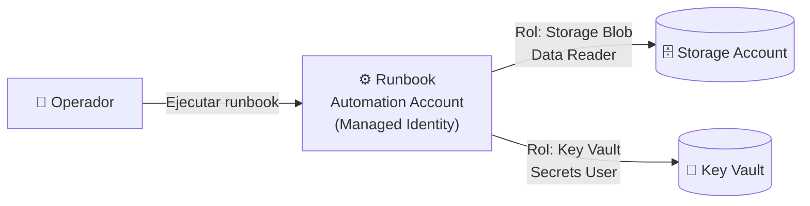

[⬅ Volver al índice](../README.md)

# Sección 6 — Managed Identity: Automation Account (Runbook) → Storage Account + Key Vault (sin credenciales)

**Tiempo estimado:** 35–45 minutos

> 🔄 **Nota de actualización:** esta sección usa **Azure Automation Account** como componente de cómputo, en lugar de Azure App Service. Muchas suscripciones Azure Free Trial nuevas reciben actualmente el error *"Operation cannot be completed without additional quota"* al intentar crear un App Service Plan — incluso en el nivel gratuito `F1` — porque Azure restringe a `0` la cuota de cómputo de App Service por defecto en cuentas nuevas (una medida anti-abuso). Azure Automation tiene un nivel **siempre gratuito** genuino (500 minutos de ejecución al mes) que no depende de esa cuota, así que evitamos el problema sin perder ningún objetivo de aprendizaje: seguimos habilitando una Managed Identity y usándola para acceder a Storage y Key Vault sin credenciales.

## 🎯 Objetivo de esta sección

Construir la arquitectura que modelaste en la [Sección 1](../01-threat-modeling/README.md) y resolver, con una **Managed Identity**, las amenazas de *Information Disclosure* que registraste allí: un **Runbook** de Azure Automation accederá a un Storage Account y a un Key Vault **sin que exista ninguna contraseña, cadena de conexión con clave, ni secreto embebido en el código**.



---

## ⚠️ Antes de empezar

- Todos los recursos de esta sección deben crearse **dentro del Resource Group `rg-lab1-<inic>`** que creaste en la Sección 4.
- Usa siempre la **misma región** que elegiste para el Resource Group.
- Azure Automation, en su modalidad de proceso automatizado (Runbooks), no requiere seleccionar ningún "plan" de precios: se factura por minuto de ejecución, con **500 minutos gratis al mes** — este laboratorio consume menos de 5 minutos en total.
- Al final de esta sección, **eliminarás todo el Resource Group** — es el paso de limpieza obligatorio.

---

## Paso 1 — Crear la Automation Account

### ✅ 1.1

1. En el buscador global, escribe `Automation Accounts` y ábrelo.
2. Haz clic en **+ Create**.

### ✅ 1.2 Pestaña "Basics"

| Campo | Valor |
|---|---|
| Subscription | Tu suscripción Free Trial |
| Resource Group | `rg-lab1-<inic>` (selecciónalo del desplegable, **no crees uno nuevo**) |
| Automation account name | `aa-lab1-<inic>` (ej. `aa-lab1-jsr`) — este nombre solo debe ser único dentro de tu suscripción, no en todo Azure |
| Region | La misma región de tu Resource Group |

### ✅ 1.3 Pestaña "Advanced"

1. Verás una sección **Managed Identities** con una casilla **System assigned**. Es posible que ya aparezca marcada por defecto.
2. **Déjala como está** (marcada o no) — la habilitaremos explícitamente y de forma guiada en el **Paso 4** de esta guía, sin importar el estado inicial.

### ✅ 1.4 Resto de pestañas

- **Networking:** deja los valores por defecto (acceso público).
- **Tags:** agrega `curso` = `seguridad-en-la-nube` y `sesion` = `1`.

### ✅ 1.5 Crear

1. Haz clic en **Review + create**, verifica que no haya errores, y haz clic en **Create**.
2. Espera la notificación **"Your deployment is complete"** (normalmente tarda menos de un minuto — mucho más rápido que un App Service).
3. Haz clic en **Go to resource**.

### 🧪 Checkpoint

Estás en la página **Overview** de tu nueva Automation Account.

### 📸 Evidencia recomendada

Captura de pantalla de la página Overview de la Automation Account.

---

## Paso 2 — Crear la Storage Account

### ✅ 2.1

1. En el buscador global, escribe `Storage accounts` y ábrelo.
2. Haz clic en **+ Create**.

### ✅ 2.2 Pestaña "Basics"

| Campo | Valor |
|---|---|
| Subscription | Tu suscripción Free Trial |
| Resource Group | `rg-lab1-<inic>` |
| Storage account name | `stlab1<inic><num>` — **todo en minúsculas, sin guiones ni espacios**, entre 3 y 24 caracteres (ej. `stlab1jsr2026`) |
| Region | La misma región de tu Resource Group |
| Performance | `Standard` |
| Redundancy | `Locally-redundant storage (LRS)` (la opción más económica) |

### ✅ 2.3 Pestaña "Advanced"

- Deja los valores por defecto. Verifica que **Hierarchical namespace** esté **deshabilitado** (no lo necesitamos).

### ✅ 2.4 Pestaña "Networking"

- Deja **Enable public access from all networks** (valor por defecto). En un entorno de producción restringirías esto con Private Endpoints (tema de la Sesión 4), pero para este laboratorio lo dejamos simple — la protección real aquí vendrá de la identidad y los permisos, no de la red.

### ✅ 2.5 Crear

1. Haz clic en **Review + create**, verifica que no haya errores, y haz clic en **Create**.
2. Espera la confirmación y haz clic en **Go to resource**.

### 🧪 Checkpoint

Estás en la página Overview de tu nueva Storage Account.

---

## Paso 3 — Crear un contenedor y subir un archivo de prueba

### ✅ 3.1 Crear el contenedor

1. En el menú lateral de la Storage Account, dentro de **Data storage**, haz clic en **Containers**.
2. Haz clic en **+ Container**.
3. **Name:** `datos-lab`
4. **Anonymous access level:** `Private (no anonymous access)` — **muy importante**, no debe ser público.
5. Haz clic en **Create**.

### ✅ 3.2 Subir un archivo de prueba

1. Haz clic sobre el contenedor `datos-lab` recién creado.
2. Haz clic en **Upload**.
3. Crea rápidamente un archivo de texto en tu computador llamado `saludo.txt` con el contenido: `Hola desde Blob Storage - acceso via Managed Identity`
4. Selecciona ese archivo y haz clic en **Upload**.

### 🧪 Checkpoint

El archivo `saludo.txt` aparece listado dentro del contenedor `datos-lab`.

### 📸 Evidencia recomendada

Captura de pantalla del contenedor con el archivo subido, mostrando el nivel de acceso `Private`.

---

## Paso 4 — Crear el Key Vault

### ✅ 4.1

1. En el buscador global, escribe `Key vaults` y ábrelo.
2. Haz clic en **+ Create**.

### ✅ 4.2 Pestaña "Basics"

| Campo | Valor |
|---|---|
| Subscription | Tu suscripción Free Trial |
| Resource Group | `rg-lab1-<inic>` |
| Key vault name | `kv-lab1-<inic><num>` — único en todo Azure, 3 a 24 caracteres (ej. `kv-lab1-jsr2026`) |
| Region | La misma región de tu Resource Group |
| Pricing tier | `Standard` |

### ✅ 4.3 Pestaña "Access configuration" (paso clave)

1. En **Permission model**, selecciona **Azure role-based access control (RBAC)** — **no** dejes seleccionado "Vault access policy" (el modelo antiguo). RBAC es el modelo recomendado y es el mismo mecanismo de roles (Least Privilege) que usamos en toda la guía.

### ✅ 4.4 Crear

1. Deja el resto de pestañas con sus valores por defecto.
2. Haz clic en **Review + create → Create**.
3. Espera la confirmación y haz clic en **Go to resource**.

### ✅ 4.5 Crear un secreto de prueba

1. En el menú lateral del Key Vault, dentro de **Objects**, haz clic en **Secrets**.
2. Haz clic en **+ Generate/Import**.
3. **Name:** `SecretoDemo`
4. **Value:** `ValorSecretoDePrueba123`
5. Haz clic en **Create**.

> ⚠️ Como acabas de habilitar el modelo de permisos RBAC, es posible que **tú mismo** necesites un rol para poder ver o crear secretos desde el Portal (por ejemplo, `Key Vault Administrator` o `Key Vault Secrets Officer`) si no te lo asigna automáticamente al ser el creador. Si el Portal te muestra un error de "Access Denied" al intentar crear el secreto, ve a **Access control (IAM)** del Key Vault → **+ Add role assignment** → rol `Key Vault Administrator` → **Assign access to:** `User, group, or service principal` → selecciona tu propio usuario → **Review + assign**. Espera 1–2 minutos y vuelve a intentar crear el secreto.

### 🧪 Checkpoint

El secreto `SecretoDemo` aparece listado en **Secrets**, con un estado **Enabled**.

### 📸 Evidencia recomendada

Captura de pantalla de la lista de secretos del Key Vault.

---

## Paso 5 — Habilitar la Managed Identity en la Automation Account

Este es el paso central del laboratorio.

### ✅ 5.1

1. Ve a tu **Automation Account** (`aa-lab1-<inic>`).
2. En el menú lateral, dentro de **Account Settings**, haz clic en **Identity**.
3. Estás en la pestaña **System assigned**.
4. Si el interruptor **Status** ya está en `On` (por la pestaña Advanced del Paso 1), continúa al siguiente numeral. Si está en `Off`, cámbialo a **`On`** y haz clic en **Save**.
5. Si aparece un cuadro de confirmación preguntando si deseas registrar esta identidad con Microsoft Entra ID, haz clic en **Yes**.

### 🧪 Checkpoint

La pantalla mostrará un **Object (principal) ID** — un identificador único (parecido a `a1b2c3d4-...`) que representa la identidad recién creada. **Cópialo y guárdalo** en tu editor de texto; lo usarás como referencia.

> 💡 Lo que acaba de pasar: Azure creó automáticamente, dentro de tu Microsoft Entra ID, una identidad cuyo **ciclo de vida está atado al de la propia Automation Account** — si la eliminas, esta identidad se elimina automáticamente con ella. No tiene contraseña que tú debas gestionar, rotar o proteger: Azure la gestiona internamente y la renueva sola.

### 📸 Evidencia recomendada

Captura de pantalla de la pestaña Identity con **Status: On** y el Object ID visible.

---

## Paso 6 — Asignar permisos RBAC mínimos (Least Privilege)

Ahora vamos a decirle explícitamente a Azure: "esta identidad puede **leer** datos del Storage y **leer** secretos del Key Vault — nada más". Ni escritura, ni eliminación, ni administración.

### ✅ 6.1 Rol sobre la Storage Account

1. Ve a tu **Storage Account** (`stlab1<inic><num>`).
2. En el menú lateral, haz clic en **Access control (IAM)**.
3. Haz clic en **+ Add → Add role assignment**.
4. En el campo de búsqueda de roles, escribe: `Storage Blob Data Reader`
5. Selecciona ese rol (**no** selecciones `Storage Blob Data Contributor` ni `Owner` — queremos el mínimo necesario, que en este caso es solo lectura) y haz clic en **Next**.
6. En **Assign access to**, selecciona **Managed identity**.
7. Haz clic en **+ Select members**.
8. En el panel que se abre: **Managed identity** → selecciona `Automation Account`. En la lista de abajo debería aparecer tu Automation Account (`aa-lab1-<inic>`).
9. Selecciónala y haz clic en **Select**.
10. Haz clic en **Review + assign** y confirma en **Review + assign** nuevamente.

### ✅ 6.2 Rol sobre el Key Vault

1. Ve a tu **Key Vault** (`kv-lab1-<inic><num>`).
2. En el menú lateral, haz clic en **Access control (IAM)**.
3. Haz clic en **+ Add → Add role assignment**.
4. En el campo de búsqueda de roles, escribe: `Key Vault Secrets User`
5. Selecciona ese rol (**no** `Key Vault Administrator` ni `Contributor` — solo necesita **leer** el secreto) y haz clic en **Next**.
6. En **Assign access to**, selecciona **Managed identity**.
7. Haz clic en **+ Select members** → **Managed identity** → `Automation Account` → selecciona tu Automation Account → **Select**.
8. Haz clic en **Review + assign** y confirma.

> 💡 **Esto es Least Privilege en la práctica.** Comparado con lo que haría alguien apurado (usar una cuenta con permisos de `Owner` o `Contributor` "para que funcione todo"), aquí la identidad del runbook solo puede **leer**. Aunque un atacante lograra ejecutar código dentro de un runbook, no podría eliminar, modificar ni administrar nada en el Storage Account o el Key Vault — el radio de impacto (blast radius) queda limitado.

### 🧪 Checkpoint

En **Access control (IAM) → Role assignments** de la Storage Account, debe aparecer una fila con el rol `Storage Blob Data Reader` asignado a tu Automation Account. Lo mismo en el Key Vault con `Key Vault Secrets User`.

### 📸 Evidencia recomendada

Captura de pantalla de ambas listas de Role assignments (Storage y Key Vault) mostrando la asignación a tu Automation Account.

> ⏳ **Nota de tiempo:** la propagación de roles RBAC en Azure puede tardar entre 1 y 5 minutos en hacerse efectiva. Si el siguiente paso falla con un error de permisos, espera unos minutos y vuelve a intentar.

---

## Paso 7 — Crear y ejecutar un Runbook para verificar el acceso sin credenciales

Vamos a comprobar, con un script real, que la Managed Identity efectivamente puede leer el blob y el secreto — **sin que exista ninguna contraseña involucrada**.

### ✅ 7.1 Crear el Runbook

1. Ve a tu **Automation Account**.
2. En el menú lateral, dentro de **Process Automation**, haz clic en **Runbooks**.
3. Haz clic en **+ Create a runbook**.
4. **Name:** `verificar-managed-identity`
5. **Runbook type:** `PowerShell`
6. **Runtime version:** selecciona la versión más reciente disponible (`7.2` o superior).
7. Haz clic en **Create**.

### ✅ 7.2 Escribir el script

Se abrirá el editor del runbook. Borra cualquier contenido de ejemplo y pega el siguiente script, **reemplazando** `stlab1<inic><num>` y `kv-lab1-<inic><num>` por los nombres exactos que definiste en los Pasos 2 y 4:

```powershell
# Conectarse usando la Managed Identity de la Automation Account (sin ninguna contraseña)
Disable-AzContextAutosave -Scope Process
Connect-AzAccount -Identity | Out-Null
Write-Output "Conectado exitosamente usando Managed Identity."

# --- Leer el blob desde el Storage Account ---
$storageAccountName = "stlab1<inic><num>"
$containerName      = "datos-lab"
$blobName           = "saludo.txt"

$ctx = New-AzStorageContext -StorageAccountName $storageAccountName -UseConnectedAccount
Get-AzStorageBlobContent -Container $containerName -Blob $blobName -Context $ctx -Destination "$env:TEMP\$blobName" -Force | Out-Null
$contenido = Get-Content "$env:TEMP\$blobName"
Write-Output "Contenido leido del blob: $contenido"

# --- Leer el secreto desde el Key Vault ---
$vaultName  = "kv-lab1-<inic><num>"
$secretName = "SecretoDemo"

$secret = Get-AzKeyVaultSecret -VaultName $vaultName -Name $secretName -AsPlainText
Write-Output "Secreto leido correctamente. Longitud del valor: $($secret.Length) caracteres."
Write-Output "(El valor del secreto no se imprime por buena practica de seguridad)"

Write-Output "Verificacion completa: acceso exitoso a Storage y Key Vault sin ninguna credencial embebida."
```

**¿Qué hace `Connect-AzAccount -Identity`?** Internamente, este comando le pide al **Instance Metadata Service (IMDS)** de Azure — la misma dirección especial `169.254.169.254`, accesible únicamente desde dentro del recurso — un token de acceso para la Managed Identity. Es exactamente el mismo mecanismo que usaría un App Service o una VM: el cmdlet solo te evita construir la petición HTTP manualmente.

> 💡 Fíjate que en ningún lugar del script aparece una contraseña, una cadena de conexión con clave, ni el valor del secreto impreso — esa es, precisamente, la mitigación que registraste en la Sección 1 para las amenazas #4 y #5.

### ✅ 7.3 Guardar y publicar

1. Haz clic en **Save**.
2. Haz clic en **Publish** y confirma. **Este paso es obligatorio**: un runbook guardado pero no publicado no se puede ejecutar.

### ✅ 7.4 Ejecutar el Runbook

1. Haz clic en **Start** (o **Run**).
2. Confirma en el cuadro de diálogo (este runbook no requiere parámetros).
3. Espera a que el **Job** cambie de estado `Running` a **`Completed`** (normalmente tarda entre 30 segundos y 2 minutos la primera vez).
4. Haz clic en la pestaña **Output** del Job.

### 🧪 Checkpoint

La salida del Job debe mostrar, en este orden:

```
Conectado exitosamente usando Managed Identity.
Contenido leido del blob: Hola desde Blob Storage - acceso via Managed Identity
Secreto leido correctamente. Longitud del valor: 23 caracteres.
(El valor del secreto no se imprime por buena practica de seguridad)
Verificacion completa: acceso exitoso a Storage y Key Vault sin ninguna credencial embebida.
```

Si el Job termina en estado **`Failed`**, revisa la pestaña **Errors**: las causas más comunes son (a) los roles RBAC del Paso 6 aún no se han propagado — espera unos minutos y vuelve a ejecutar, o (b) un error de escritura en los nombres de `$storageAccountName` o `$vaultName` — verifica que coincidan exactamente con los que creaste.

> ⚠️ **Módulos de PowerShell:** las Automation Accounts con runtime `7.2` incluyen automáticamente los módulos `Az.Accounts`, `Az.Storage` y `Az.KeyVault` necesarios para este script. Si tu ejecución falla con un error del tipo *"the term Get-AzStorageBlobContent is not recognized"*, ve a **Shared Resources → Modules** dentro de tu Automation Account y verifica que `Az.Storage` y `Az.KeyVault` aparezcan instalados; si no, instálalos desde **+ Add a module → Browse from gallery**.

### 📸 Evidencia recomendada

Captura de pantalla de la pestaña Output del Job mostrando las 5 líneas de salida esperadas.

---

## Paso 8 — Confirmar que no hay credenciales en ningún lado

### ✅ 8.1

1. Ve a tu **Automation Account → Shared Resources → Credentials**. Esta lista debe estar **vacía** — no creamos ningún activo de tipo credencial.
2. Ve a **Shared Resources → Variables**. También debe estar vacía o, si contiene algo, no debe incluir ninguna clave, contraseña o cadena de conexión.
3. Revisa nuevamente el código del runbook (**Runbooks → verificar-managed-identity → Edit**) y confirma que no escribiste ningún secreto ni clave — solo nombres de recursos, que no son información sensible por sí solos.

### 🧪 Checkpoint

La ausencia de credenciales en Credentials, Variables y en el propio código del runbook es la evidencia final de que el acceso funciona exclusivamente por identidad y roles — no por secretos compartidos.

### 📸 Evidencia recomendada

Captura de pantalla de **Shared Resources → Credentials** mostrando la lista vacía.

---

## 💡 Opcional — profundizar con código en otro lenguaje

<details>
<summary>Haz clic para ver un ejemplo equivalente en Node.js con DefaultAzureCredential</summary>

El patrón que acabas de usar con `Connect-AzAccount -Identity` es el mismo que usaría cualquier SDK de Azure, sin importar el lenguaje ni el servicio de cómputo (App Service, VM, Azure Functions o Automation):

```javascript
// npm install @azure/identity @azure/storage-blob @azure/keyvault-secrets

const { DefaultAzureCredential } = require("@azure/identity");
const { BlobServiceClient } = require("@azure/storage-blob");
const { SecretClient } = require("@azure/keyvault-secrets");

async function main() {
  // DefaultAzureCredential detecta automáticamente la Managed Identity
  // cuando el código corre dentro de un recurso de Azure — sin ninguna clave en el código.
  const credential = new DefaultAzureCredential();

  const blobServiceClient = new BlobServiceClient(
    "https://stlab1jsr2026.blob.core.windows.net",
    credential
  );
  const containerClient = blobServiceClient.getContainerClient("datos-lab");
  const blobClient = containerClient.getBlobClient("saludo.txt");
  await blobClient.download();
  console.log("Contenido del blob obtenido correctamente.");

  const secretClient = new SecretClient(
    "https://kv-lab1-jsr2026.vault.azure.net",
    credential
  );
  await secretClient.getSecret("SecretoDemo");
  console.log("Secreto obtenido correctamente (valor no impreso por seguridad).");
}

main().catch(console.error);
```

Desplegar y ejecutar este código queda **fuera del alcance obligatorio** de este laboratorio, pero es la forma en la que verías este mismo patrón en un proyecto real construido, por ejemplo, sobre Azure Functions o App Service.

</details>

---

## Paso 9 — Revisita tu modelo de amenazas

Vuelve a abrir el archivo `assets/threat-model-lab1.json` en OWASP Threat Dragon (Sección 1) y, para las amenazas #4 y #5 (Information Disclosure, severidad Alta), agrega una nota confirmando que la mitigación fue **implementada y verificada**:

> "Mitigación implementada: Managed Identity de la Automation Account `aa-lab1-<inic>` con rol `Storage Blob Data Reader` sobre `stlab1<inic><num>` y rol `Key Vault Secrets User` sobre `kv-lab1-<inic><num>`. Verificado ejecutando el runbook `verificar-managed-identity`, Job completado exitosamente el [fecha]."

Guarda nuevamente el modelo.

> 💡 Este es el cierre del ciclo completo del laboratorio: **modelaste** la amenaza en la Sección 1, **construiste** la arquitectura en las Secciones 2 a 6, y ahora **verificas y documentas** que la mitigación funciona — exactamente el ciclo Plan → Build → Verify del threat modeling que viste en la teoría.

---

## Paso 10 — 🧹 Limpieza de recursos (obligatorio)

> ⚠️ **No cierres esta guía sin completar este paso.** Aunque todos los recursos usados están dentro del nivel gratuito, es una buena práctica de higiene de laboratorio — y de seguridad — no dejar recursos huérfanos corriendo.

### ✅ 10.1 Verificar que ya guardaste tu evidencia

Antes de eliminar nada, confirma que ya tienes guardadas todas las capturas de pantalla marcadas con 📸 a lo largo de esta guía, y el archivo `threat-model-lab1.json` actualizado.

### ✅ 10.2 Eliminar el Resource Group completo

1. En el buscador global, escribe `Resource groups` y ábrelo.
2. Haz clic sobre `rg-lab1-<inic>`.
3. Haz clic en **Delete resource group** (en la parte superior de la pantalla Overview).
4. Azure te pedirá escribir el nombre exacto del Resource Group para confirmar — escríbelo (`rg-lab1-<inic>`) y haz clic en **Delete**.
5. Espera la notificación de que la eliminación fue exitosa (puede tardar unos minutos, ya que elimina la Automation Account, el Storage Account y el Key Vault de una sola vez).

> 💡 **Nota sobre Key Vault:** por diseño de seguridad, Azure Key Vault tiene habilitada por defecto la **eliminación temporal (soft delete)** — el Key Vault no desaparece inmediatamente, sino que queda en estado "eliminado recuperable" durante un período (normalmente 90 días) antes de purgarse definitivamente. Esto **no genera ningún costo** para un Key Vault sin operaciones activas y es intencional: evita que una eliminación accidental sea irreversible. No necesitas hacer nada adicional al respecto para este laboratorio.

### 🧪 Checkpoint final

1. Ve nuevamente a **Resource groups** y confirma que `rg-lab1-<inic>` ya no aparece en la lista (o aparece brevemente como "Deleting").
2. Ve a **Cost Management + Billing → Cost analysis** y confirma que el gasto acumulado sigue siendo prácticamente USD 0.

---

## ✅ Checklist de la Sección 6

- [ ] Automation Account creada
- [ ] Storage Account creada, contenedor `datos-lab` privado con archivo de prueba
- [ ] Key Vault creado con modelo de permisos **RBAC**, secreto `SecretoDemo` creado
- [ ] Managed Identity (System assigned) habilitada en la Automation Account
- [ ] Rol `Storage Blob Data Reader` asignado a la Managed Identity sobre la Storage Account
- [ ] Rol `Key Vault Secrets User` asignado a la Managed Identity sobre el Key Vault
- [ ] Runbook `verificar-managed-identity` creado, publicado y ejecutado exitosamente
- [ ] Output del Job muestra el contenido del blob y la confirmación de lectura del secreto
- [ ] Confirmado que no hay credenciales en Credentials, Variables ni en el código del runbook
- [ ] Modelo de amenazas de la Sección 1 actualizado con la mitigación verificada
- [ ] Resource Group `rg-lab1-<inic>` eliminado por completo

---

## 🧠 Preguntas de repaso

1. ¿Qué diferencia hay entre una Managed Identity **System-assigned** y una **User-assigned**? *(Pista: investiga brevemente cuál se ata al ciclo de vida de un único recurso y cuál puede reutilizarse entre varios.)*
2. Si hubieras asignado el rol `Contributor` en lugar de `Storage Blob Data Reader`, ¿qué nueva amenaza STRIDE (de las que no modelaste en la Sección 1) se habría vuelto relevante?
3. `Connect-AzAccount -Identity` obtiene un token del IMDS (`169.254.169.254`) internamente. ¿Por qué esa dirección solo es accesible desde dentro del recurso y no desde Internet? ¿Qué principio de seguridad de la Sesión 1 refuerza esta restricción?

---

## 🎉 Cierre del laboratorio

Has completado el ciclo completo de la Sesión 1: modelaste amenazas, creaste tu entorno cloud, entendiste ARM y la responsabilidad compartida, y construiste — con tus propias manos — una mitigación real de Zero Trust y Least Privilege. Guarda tu carpeta de evidencias (capturas + `threat-model-lab1.json`) para la entrega según las indicaciones de tu instructor.

[⬅ Volver al índice principal](../README.md)
