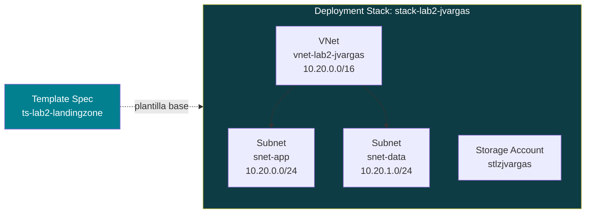

[🏠 README — Laboratorio 2](README.md) · Sección 2 de 8

## Parte 2 — Landing Zone básica con Deployment Stacks y Template Specs

### 2.1 ¿Por qué no usamos Azure Blueprints?

Si investigas sobre "Landing Zones en Azure" vas a encontrar mucho material que menciona **Azure Blueprints**. **No lo usaremos en este laboratorio** por una razón importante y actual:

> ⚠️ **Azure Blueprints (Preview) está en proceso de retiro.** Microsoft inició una restricción por fases desde el **31 de julio de 2026** y el servicio se retira completamente el **31 de enero de 2027**. La recomendación oficial de Microsoft es migrar a **Deployment Stacks** (para el ciclo de vida de los recursos) y **Template Specs** (para versionar y compartir plantillas). Fuente: [Azure Blueprints retirement — Microsoft Learn](https://learn.microsoft.com/en-us/azure/governance/blueprints/blueprint-retirement).

Por eso, en este laboratorio construimos la landing zone básica con el **reemplazo oficial**: un **Template Spec** (la plantilla reutilizable, versionada) desplegado como un **Deployment Stack** (que administra el ciclo de vida completo del conjunto de recursos como una sola unidad, igual que hacía Blueprints).

### 2.2 Concepto de Landing Zone (versión mínima, Free Tier)

Una Landing Zone "real" de nivel empresarial incluye múltiples suscripciones, grupos de administración, hubs de red, etc. — imposible de replicar en una cuenta Free Tier de una sola suscripción. Para este laboratorio construimos una **landing zone mínima y didáctica**: un conjunto pequeño y fijo de recursos (una red virtual + un storage account) desplegados y administrados **como una sola unidad**, con protección contra cambios manuales fuera de la plantilla.



### 2.3 Instalar la extensión de Bicep

Bicep es el lenguaje declarativo (más simple que JSON puro) que usaremos para describir la landing zone.

```powershell
az bicep install
az bicep version
```

Si ya tenías Bicep instalado, actualízalo para evitar incompatibilidades:

```powershell
az bicep upgrade
```

### 2.4 Escribir la plantilla Bicep de la landing zone

1. Crea una carpeta de trabajo y entra en ella:

```powershell
mkdir C:\lab2
cd C:\lab2
```

2. Crea un archivo llamado `landingzone.bicep` (puedes usar el Bloc de notas, o mejor, Visual Studio Code) con el siguiente contenido **exacto**:

```bicep
// landingzone.bicep
// Landing zone mínima para el Laboratorio 2 (Free Tier)

@description('Prefijo único para nombrar los recursos, usa tus iniciales')
param prefijo string = 'lab2jvargas'

@description('Región de despliegue')
param ubicacion string = resourceGroup().location

@description('Etiqueta obligatoria exigida por la Initiative de Policy')
param ambiente string = 'laboratorio'

// Red virtual con dos subredes: aplicación y datos
resource vnet 'Microsoft.Network/virtualNetworks@2023-11-01' = {
  name: 'vnet-${prefijo}'
  location: ubicacion
  tags: {
    ambiente: ambiente
  }
  properties: {
    addressSpace: {
      addressPrefixes: [
        '10.20.0.0/16'
      ]
    }
    subnets: [
      {
        name: 'snet-app'
        properties: {
          addressPrefix: '10.20.0.0/24'
        }
      }
      {
        name: 'snet-data'
        properties: {
          addressPrefix: '10.20.1.0/24'
        }
      }
    ]
  }
}

// Storage Account con configuración segura por defecto
// (Security by Default aplicado: HTTPS obligatorio, TLS 1.2 mínimo, sin acceso público a blobs)
resource storage 'Microsoft.Storage/storageAccounts@2023-01-01' = {
  name: 'st${prefijo}'
  location: ubicacion
  sku: {
    name: 'Standard_LRS'
  }
  kind: 'StorageV2'
  tags: {
    ambiente: ambiente
  }
  properties: {
    supportsHttpsTrafficOnly: true
    minimumTlsVersion: 'TLS1_2'
    allowBlobPublicAccess: false
  }
}

output nombreVnet string = vnet.name
output nombreStorage string = storage.name
```

> **Importante — Storage Account único globalmente:** en el parámetro `prefijo`, reemplaza `lab2jvargas` por algo único a ti (por ejemplo tus iniciales + 2 dígitos), ya que el nombre final `st<prefijo>` debe ser único **en todo Azure**, no solo en tu suscripción.

3. Valida que el archivo no tenga errores de sintaxis:

```powershell
az bicep build --file landingzone.bicep
```

Si no aparece ningún error en rojo, se generó un archivo `landingzone.json` junto al `.bicep` — eso confirma que la sintaxis es correcta.

### 2.5 Publicar la plantilla como Template Spec

Un Template Spec guarda la plantilla **dentro de Azure** (versionada), para que Deployment Stacks pueda referenciarla sin depender de un archivo local.

```powershell
az ts create `
  --name "ts-lab2-landingzone" `
  --version "1.0" `
  --resource-group $RG_NAME `
  --location $LOCATION `
  --template-file "landingzone.bicep" `
  --display-name "Landing Zone básica - Laboratorio 2"
```

✅ **Checkpoint:** en el portal, busca **"Template specs"** y confirma que `ts-lab2-landingzone` aparece con la versión `1.0`.

### 2.6 Crear el Deployment Stack a partir del Template Spec

Primero obtenemos el ID completo (con versión) del Template Spec que acabamos de crear:

```powershell
$TS_ID = az ts show `
  --name "ts-lab2-landingzone" `
  --version "1.0" `
  --resource-group $RG_NAME `
  --query id -o tsv

echo $TS_ID
```

Ahora creamos el Deployment Stack, indicando explícitamente qué debe pasar si alguien intenta modificar o borrar manualmente un recurso administrado por el stack (`--deny-settings-mode`), y qué pasa si un recurso se elimina de la plantilla (`--action-on-unmanage`):

```powershell
az stack group create `
  --name "stack-lab2-jvargas" `
  --resource-group $RG_NAME `
  --template-spec $TS_ID `
  --parameters prefijo=lab2jvargas ambiente=laboratorio `
  --deny-settings-mode "denyWriteAndDelete" `
  --action-on-unmanage "deleteResources" `
  --yes
```

**Explicación de los parámetros clave:**

| Parámetro | Qué controla | Valor usado y por qué |
| --- | --- | --- |
| `--deny-settings-mode` | Si alguien (sin excepción) puede modificar/borrar los recursos administrados **fuera** del stack | `denyWriteAndDelete`: nadie puede tocar manualmente estos recursos — deben cambiarse actualizando la plantilla. Esto es Security by Design aplicado a la gestión del ciclo de vida. |
| `--action-on-unmanage` | Qué pasa con un recurso si lo quitas de la plantilla y vuelves a desplegar | `deleteResources`: se borra automáticamente (útil para que la limpieza final sea más fácil). |

### 2.7 Verificar la landing zone desplegada

```powershell
az stack group show `
  --name "stack-lab2-jvargas" `
  --resource-group $RG_NAME
```

En la salida JSON, busca el arreglo `"resources"` — debe listar dos recursos con `"status": "Managed"`: la VNet y el Storage Account.

También puedes verificarlo visualmente:

1. En el portal, abre tu grupo de recursos `rg-lab2-jvargas`.
2. Confirma que ves: la `vnet-lab2jvargas` (con sus 2 subredes) y el Storage Account `stlab2jvargas`.
3. Busca **"Deployment Stacks"** en la barra superior y abre `stack-lab2-jvargas` para ver el resumen de recursos administrados.

### 2.8 Probar el "deny settings": intentar borrar un recurso manualmente

Vamos a comprobar que la protección funciona de verdad.

```powershell
az network vnet delete --name "vnet-lab2jvargas" --resource-group $RG_NAME
```

**Resultado esperado:** el comando debe **fallar** con un error de tipo `RequestDisallowedByPolicy` o `ScopeLocked`, indicando que el recurso está protegido por el Deployment Stack. Si esto ocurre, ¡la protección está funcionando correctamente! Esta es la misma lógica de "Resource Locks" que evita que un administrador borre por error un recurso crítico en producción.

---

⬅️ Anterior: [Parte 1 · Azure Policy e Initiative](01-azure-policy-initiative.md) · 🏠 [README](README.md) · Siguiente ➡️: [Parte 3 · Microsoft Defender for Cloud (Secure Score)](03-defender-for-cloud.md)
