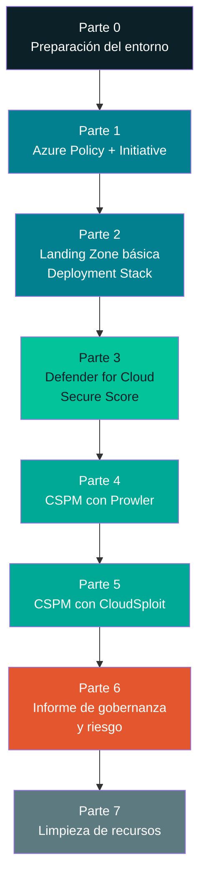

# Laboratorio 2 — Gobernanza, Riesgo y Postura de Seguridad en Azure (Free Tier)

**Seguridad en la Nube · Sesión 2 · Gobernanza, Riesgo, Cumplimiento y Arquitectura Segura**

> Especialización en Ciberseguridad · Instructor: Manuel Alejandro Vargas Rojas · `manuelvargasrojas@cedoc.edu.co`

Este repositorio contiene la guía paso a paso del Laboratorio 2, dividida en un archivo por sección para facilitar la navegación. Empieza por este README y sigue el orden de la tabla de contenido.

---

## 📂 Estructura de este repositorio

```text
Laboratorio-2-Gobernanza-Riesgo-CSPM/
├── README.md                              ← estás aquí: punto de partida
├── 00-preparacion-entorno.md              ← Parte 0: instalación de herramientas
├── 01-azure-policy-initiative.md          ← Parte 1: Azure Policy e Initiative
├── 02-landing-zone-deployment-stacks.md   ← Parte 2: Landing Zone (Deployment Stacks)
├── 03-defender-for-cloud.md               ← Parte 3: Secure Score
├── 04-cspm-prowler.md                     ← Parte 4: CSPM con Prowler
├── 05-cspm-cloudsploit.md                 ← Parte 5: CSPM con CloudSploit
├── 06-consolidacion-informe.md            ← Parte 6: informe final + entregable
├── 07-limpieza-recursos.md                ← Parte 7: limpieza (obligatoria)
├── 08-solucion-problemas.md               ← Troubleshooting de todo el laboratorio
└── 09-rubrica-evaluacion.md               ← Rúbrica de evaluación (cómo se califica)
```

## 🧭 Tabla de contenido / orden de navegación

| # | Sección | Qué vas a hacer |
| --- | --- | --- |
| 0 | [Parte 0 · Preparación del entorno](00-preparacion-entorno.md) | Instalar Azure CLI, Python, Node.js, Git y crear el grupo de recursos base |
| 1 | [Parte 1 · Azure Policy e Initiative](01-azure-policy-initiative.md) | Definir y asignar reglas de gobernanza |
| 2 | [Parte 2 · Landing Zone básica con Deployment Stacks](02-landing-zone-deployment-stacks.md) | Desplegar una estructura mínima administrada como unidad |
| 3 | [Parte 3 · Microsoft Defender for Cloud (Secure Score)](03-defender-for-cloud.md) | Ver cómo Azure evalúa nativamente lo desplegado |
| 4 | [Parte 4 · CSPM con Prowler](04-cspm-prowler.md) | Auditoría externa multi-framework |
| 5 | [Parte 5 · CSPM con CloudSploit](05-cspm-cloudsploit.md) | Segunda auditoría externa, para contrastar cobertura |
| 6 | [Parte 6 · Consolidación: informe de gobernanza y riesgo](06-consolidacion-informe.md) | Armar el entregable final |
| 7 | [Parte 7 · Limpieza de recursos (obligatorio en Free Tier)](07-limpieza-recursos.md) | Eliminar todo lo creado para evitar cargos |
| — | [Solución de problemas frecuentes](08-solucion-problemas.md) | Consulta en cualquier momento si algo falla |
| — | [📊 Rúbrica de evaluación](09-rubrica-evaluacion.md) | Cómo se califica tu entrega — léela antes de empezar |

Cada archivo de sección incluye, al final, **preguntas de repaso** y, a lo largo del texto, recuadros 📸 que indican exactamente qué captura de pantalla tomar en cada momento — ambas cosas alimentan directamente el informe final. También incluye una barra de navegación (⬅️ Anterior · 🏠 README · Siguiente ➡️) para avanzar sin tener que volver aquí cada vez.

---

## Objetivo

Al finalizar este laboratorio, el estudiante habrá configurado y auditado la postura de gobernanza y riesgo de un entorno Azure real (cuenta gratuita), aplicando de forma práctica los conceptos teóricos de la Sesión 2: gestión de riesgos, marcos de gobernanza (CSA/SOC 2), diseño seguro (Security by Design/Default) y separación de planos (Control Plane vs. Data Plane).

El laboratorio se desarrolla en **cinco partes secuenciales**, cada una construida sobre la anterior:

1. **Azure Policy e Initiative** — definir reglas de gobernanza.
2. **Landing Zone básica** (Deployment Stacks + Template Specs) — desplegar una estructura mínima que las políticas van a vigilar.
3. **Microsoft Defender for Cloud (Secure Score)** — ver cómo Azure evalúa nativamente lo que desplegamos.
4. **CSPM con Prowler** — auditoría externa e independiente, multi-framework.
5. **CSPM con CloudSploit** — segunda auditoría externa, para contrastar cobertura.


---

## Resultado de aprendizaje evaluado

> Evalúa el cumplimiento normativo y el riesgo de un entorno cloud utilizando marcos de gobernanza y herramientas CSPM.

**Entregable:** informe de gobernanza/riesgo con marcos CSA + reporte CSPM (Prowler y CloudSploit) con hallazgos priorizados. Se entrega como **un único archivo PDF cargado en Google Classroom** — ver la sección [Entregable final](06-consolidacion-informe.md#entregable-final) para el detalle completo.

---

## Antes de empezar: restricciones de la cuenta Free Tier

Este laboratorio está diseñado íntegramente para funcionar con una **cuenta Azure gratuita (Free Account)**. Lee esta sección completa antes de crear cualquier recurso — evitarás cargos inesperados.

| Restricción | Qué significa para este laboratorio |
| --- | --- |
| Crédito de USD 200 por 30 días (si tu cuenta es nueva) | Si tu cuenta ya no tiene el crédito activo, igual puedes seguir esta guía: todos los recursos usados están dentro de los **servicios "Always Free"** o tienen un costo prácticamente nulo si se eliminan al final. |
| Servicios "Always Free" con límites mensuales | Usaremos **Azure Policy** (gratis siempre), **Storage Account** (5 GB LRS gratis/mes), **Microsoft Defender for Cloud — plan Foundational CSPM** (gratis siempre). No usaremos máquinas virtuales de pago ni bases de datos administradas. |
| Los planes pagos de Defender for Cloud generan cargo por recurso protegido | En la Parte 3 **solo habilitaremos el plan gratuito ("Foundational CSPM")**. En ningún momento actives los planes "Defender CSPM", "Defender for Servers", etc. — estos sí tienen costo. |
| Cuota de vCPU muy baja en suscripciones Free/Estudiante | Este laboratorio **no crea máquinas virtuales**, por lo que no debes preocuparte por cuotas de cómputo. |
| Google/GitHub Copilot, Prowler y CloudSploit corren en tu equipo, no en Azure | Estas herramientas son gratuitas y de código abierto; solo consumen llamadas de **solo lectura** a la API de Azure (rol `Reader`), sin costo. |

> 🛑 **Regla de oro:** al terminar el laboratorio, ejecuta la [Parte 7 — Limpieza de recursos](07-limpieza-recursos.md). Ningún recurso de este laboratorio debe quedar corriendo indefinidamente.

---

## Herramientas a usar

| Nombre | Sitio web | Uso en este laboratorio |
| --- | --- | --- |
| Azure Portal | <https://portal.azure.com/> | Consola gráfica principal |
| Azure CLI | <https://learn.microsoft.com/cli/azure/install-azure-cli> | Automatización desde terminal (Policy, Deployment Stacks) |
| Python | <https://www.python.org/> | Requisito para instalar Prowler |
| Node.js | <https://nodejs.org/en> | Requisito para instalar CloudSploit |
| Git | <https://git-scm.com/downloads> | Clonar el repositorio de CloudSploit |
| Prowler | <https://github.com/prowler-cloud/prowler> | CSPM #1 |
| CloudSploit | <https://github.com/aquasecurity/cloudsploit> | CSPM #2 |
| Visual Studio Code (opcional) | <https://code.visualstudio.com/> | Editar archivos Bicep/JSON con resaltado de sintaxis |

### Herramientas adicionales

1. Navegador web actualizado (Chrome, Edge o Firefox).
2. Una cuenta de Azure Free Tier activa. Si no la tienes, créala en <https://azure.microsoft.com/free/>.
3. Terminal de Windows: **PowerShell** (recomendado, viene instalado en Windows 10/11) o CMD.
4. Permisos de administrador local en tu equipo para instalar software.

> **Nota sobre el sistema operativo:** esta guía usa comandos de **PowerShell en Windows**. Si usas macOS o Linux, los comandos de Azure CLI, Prowler y CloudSploit son prácticamente idénticos (cambian solo `set`/`$env:` por `export`); los pasos de instalación de cada herramienta sí cambian — consulta el sitio oficial de cada una si es tu caso.

---

## Arquitectura general del laboratorio



**Lógica pedagógica:** primero **gobernamos** (Policy/Initiative = las reglas), luego **construimos** algo pequeño que esas reglas deben vigilar (Landing Zone), después vemos cómo **Azure mismo evalúa** ese entorno (Defender for Cloud), y finalmente lo **auditamos con dos herramientas externas e independientes** (Prowler y CloudSploit) para contrastar resultados — exactamente el mismo patrón de verificación cruzada que se usa en auditorías SOC 2 reales.

---

## Convención de nombres que usaremos

Para mantener el entorno ordenado y facilitar la limpieza final, usa siempre este prefijo en todo lo que crees:

```text
lab2-<tu-usuario-o-iniciales>-<recurso>
```

Ejemplo si tu usuario es `jvargas`:

| Recurso | Nombre sugerido |
| --- | --- |
| Grupo de recursos | `rg-lab2-jvargas` |
| Storage Account | `stlab2jvargas` *(sin guiones: los Storage Accounts no admiten `-`, y deben ser únicos globalmente)* |
| Virtual Network | `vnet-lab2-jvargas` |
| Service Principal (Prowler) | `sp-lab2-jvargas-prowler` |
| Service Principal (CloudSploit) | `sp-lab2-jvargas-cloudsploit` |
| Initiative de Policy | `ini-lab2-jvargas-baseline` |

> Sustituye `jvargas` por tus propias iniciales en **todos** los comandos de esta guía.

---

## 🚀 Cómo empezar

1. Lee completa la sección **"Antes de empezar: restricciones de la cuenta Free Tier"** más arriba — evitarás cargos inesperados en tu cuenta.
2. Continúa con **[Parte 0 — Preparación del entorno](00-preparacion-entorno.md)** y sigue en orden hasta la Parte 7. Toma cada captura de pantalla 📸 en el momento indicado y responde las preguntas de repaso al final de cada sección — las necesitarás todas para el informe final.
3. Si algo falla en el camino, consulta **[Solución de problemas frecuentes](08-solucion-problemas.md)**.
4. Al finalizar, no olvides ejecutar **[Parte 7 — Limpieza de recursos](07-limpieza-recursos.md)**.

## 📄 Formato de entrega

> ### 🛑 La entrega se realiza ÚNICAMENTE en un documento PDF, cargado en la plataforma de Google Classroom dispuesta para ello. No se reciben archivos de ningún otro formato.

El detalle completo — checklist de capturas, checklist de preguntas de repaso, y pasos de subida a Classroom — está en **[Parte 6 — Entregable final](06-consolidacion-informe.md#entregable-final)**. La forma exacta en que se califica cada parte de esa entrega está en la **[📊 Rúbrica de evaluación](09-rubrica-evaluacion.md)** — léela antes de empezar el laboratorio, no al final.

---

## Referencias

- Microsoft Learn. [Azure Blueprints retirement](https://learn.microsoft.com/en-us/azure/governance/blueprints/blueprint-retirement).
- Microsoft Learn. [Create and deploy a deployment stack with Bicep](https://learn.microsoft.com/en-us/azure/azure-resource-manager/bicep/quickstart-create-deployment-stacks).
- Microsoft Learn. [Create and deploy deployment stacks from template specs](https://learn.microsoft.com/en-us/azure/azure-resource-manager/bicep/quickstart-create-deployment-stacks-template-specs).
- Microsoft Learn. [What is Cloud Security Posture Management (CSPM)](https://learn.microsoft.com/en-us/azure/defender-for-cloud/concept-cloud-security-posture-management).
- Microsoft Learn. [Opt in to Foundational CSPM](https://learn.microsoft.com/en-us/azure/defender-for-cloud/foundational-cspm-opt-in).
- Microsoft Learn. [Azure Policy overview](https://learn.microsoft.com/en-us/azure/governance/policy/overview).
- Prowler. [Getting Started with Azure](https://docs.prowler.com/user-guide/providers/azure/getting-started-azure).
- Prowler. [Create Prowler Service Principal](https://docs.prowler.com/projects/prowler-open-source/en/latest/tutorials/azure/create-prowler-service-principal/).
- Aqua Security. [CloudSploit — Azure setup guide](https://github.com/aquasecurity/cloudsploit/blob/master/docs/azure.md).
- Vargas Rojas, M. A. [Laboratorio 3 — Configuración Inicial de Seguridad (guía de referencia)](https://github.com/malevarro/Cloud-Lab/blob/main/Laboratorio%203.md).

---

*Manuel Alejandro Vargas Rojas · `manuelvargasrojas@cedoc.edu.co` · Seguridad en la Nube · Sesión 2*
