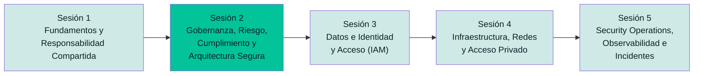

# Sesión 2 — Gobernanza, Riesgo, Cumplimiento y Arquitectura Segura

**Especialización en Ciberseguridad · Seguridad en la Nube**

> Instructor: Manuel Alejandro Vargas Rojas · `manuelvargasrojas@cedoc.edu.co`

Este repositorio reúne **todo el material de la Sesión 2** del módulo Seguridad en la Nube: la presentación teórica y la guía de laboratorio guiado. Este README es el punto de partida — describe de qué trata la sesión y te dirige al material correspondiente según lo que necesites.

---

## 📂 Contenido de este repositorio

| Material | Dónde está | Para qué sirve |
| --- | --- | --- |
| 🖥️ Presentación teórica | [`Sesion2_Gobernanza_Riesgo_Cumplimiento.pptx`](./Presentacion/Sesion2_Gobernanza_Riesgo_Cumplimiento.pptx) | Bloque teórico de la sesión (clase magistral) — 37 diapositivas |
| 🧪 Guía de laboratorio | [`Laboratorio-2-Gobernanza-Riesgo-CSPM/README.md`](./Laboratorio/README.md) | Laboratorio guiado paso a paso en Azure Free Tier |
| 📊 Rúbrica de evaluación | [`Laboratorio-2-Gobernanza-Riesgo-CSPM/09-rubrica-evaluacion.md`](./Laboratorio/09-rubrica-evaluacion.md) | Cómo se califica la entrega del laboratorio |

---

## 🧭 El camino del curso

La Sesión 1 sentó las bases (responsabilidad compartida, amenazas, Zero Trust, threat modeling). La Sesión 2 añade la capa de **gobernanza y riesgo** que prioriza las decisiones técnicas que vendrán en las sesiones 3, 4 y 5.

---

## 🎯 Objetivo de la sesión

Al finalizar la sesión, el estudiante **evaluará el cumplimiento normativo y el riesgo de un entorno cloud** utilizando marcos de gobernanza y herramientas CSPM (Cloud Security Posture Management).

## ✅ Resultado de aprendizaje evaluado

> Evalúa el cumplimiento normativo y el riesgo de un entorno cloud utilizando marcos de gobernanza y herramientas CSPM.

**Peso en la evaluación del módulo:** 20 % de la nota final (bloque teórico + laboratorio).

---

## 📚 Temas cubiertos

| # | Bloque temático | Qué incluye |
| --- | --- | --- |
| 1 | **Gestión de riesgos** | Conceptos base (activo, amenaza, vulnerabilidad, riesgo), ciclo ISO 31000/NIST RMF, matriz de riesgo 5×5, riesgo específico de la nube |
| 2 | **Marcos de gobernanza** | SOC 1/2/3, SOC 2 Tipo I vs. Tipo II, CAIQ y STAR Registry (CSA) |
| 3 | **Diseño seguro** | CSA Security Guidance v5, Cloud Controls Matrix (CCM), Security by Design, Security by Default |
| 4 | **Control Plane vs. Data Plane** | Separación de planos, superficie de ataque, ejemplos concretos en Azure |
| 5 | **CSPM** | Qué es, Prowler, CloudSploit — de la teoría a la herramienta |
| 6 | **Laboratorio guiado** | Azure Policy/Initiative, Landing Zone básica (Deployment Stacks), Defender for Cloud (Secure Score), auditoría con Prowler y CloudSploit |

---

## 🖥️ Presentación teórica

**Archivo:** [`Sesion2_Gobernanza_Riesgo_Cumplimiento.pptx`](./Presentacion/Sesion2_Gobernanza_Riesgo_Cumplimiento.pptx) · 37 diapositivas

Incluye, en orden: portada y agenda, apertura con objetivos y laboratorio, mapa del curso, resumen de la Sesión 1, los cuatro bloques temáticos (gestión de riesgos, gobernanza, diseño seguro, planos de control/datos), síntesis, puente al laboratorio, y cierre con referencias bibliográficas.

## 🧪 Laboratorio guiado

**Carpeta:** [`Laboratorio-2-Gobernanza-Riesgo-CSPM/`](./Laboratorio) · empieza por su [README](./Laboratorio/README.md)

Laboratorio práctico de **90 minutos**, diseñado íntegramente para **cuenta Azure Free Tier**, dividido en 7 partes:

1. Preparación del entorno
2. Azure Policy e Initiative
3. Landing Zone básica (Deployment Stacks + Template Specs)
4. Microsoft Defender for Cloud (Secure Score)
5. CSPM con Prowler
6. CSPM con CloudSploit
7. Consolidación del informe de gobernanza y riesgo
8. Limpieza de recursos

Cada sección incluye capturas de pantalla guiadas y preguntas de repaso. Consulta también la [solución de problemas frecuentes](./Laboratorio/08-solucion-problemas.md) si algo falla.

> ⚠️ **Formato de entrega:** el laboratorio se entrega en **un único archivo PDF, cargado en Google Classroom**. No se reciben archivos de ningún otro formato. Ver el detalle completo en la [Parte 6 — Entregable final](./Laboratorio/06-consolidacion-informe.md#entregable-final) y en la [Rúbrica de evaluación](./Laboratorio/09-rubrica-evaluacion.md).

---

## 🔗 Conexión con la sesión anterior y la siguiente

- **Viene de la Sesión 1** (Fundamentos y Responsabilidad Compartida): el threat modeling con STRIDE/OWASP se formaliza aquí con marcos de gestión de riesgos reconocidos (ISO 31000/NIST RMF).
- **Prepara la Sesión 3** (Datos e Identidad y Acceso — IAM): el riesgo identificado hoy sobre identidades sobre-privilegiadas se resuelve técnicamente con RBAC/ABAC en la siguiente sesión.

---

## 📖 Referencias principales

- Thompson, G. *Certificate of Cloud Security Knowledge (CCSK v5) Official Study Guide*.
- Messier, R. *Learning Cloud Security: Cloud Computing and Security Architecture Essentials*.
- Dotson, C. *Practical Cloud Security: A Guide for Secure Design and Deployment*.
- Edwards, J. *Cloud Security Fundamentals*.
- Cloud Security Alliance. *Top Threats to Cloud Computing 2024* y *Security Guidance for Critical Areas of Focus in Cloud Computing v5*.
- CISA/NSA/FBI et al. *Shifting the Balance of Cybersecurity Risk: Security-by-Design and -Default* (2023).

La lista completa de referencias técnicas del laboratorio está en el [README del laboratorio](./Laboratorio/README.md#referencias).

---

*Manuel Alejandro Vargas Rojas · `manuelvargasrojas@cedoc.edu.co` · Seguridad en la Nube · Sesión 2*
