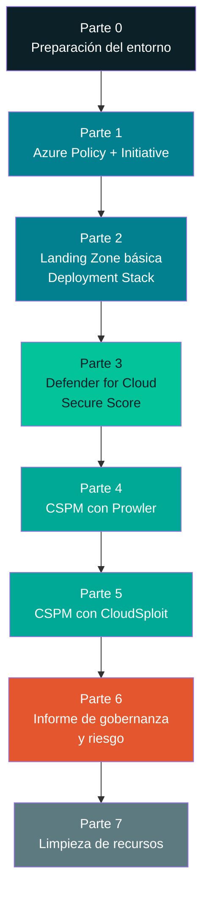
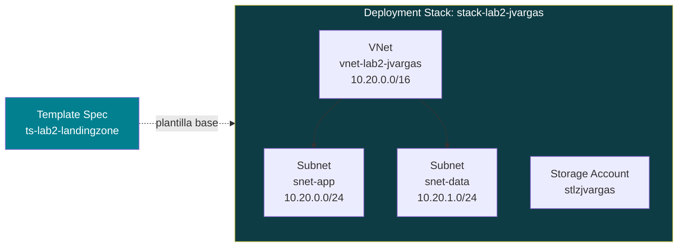

# Laboratorio 2 — Gobernanza, Riesgo y Postura de Seguridad en Azure (Free Tier)

**Seguridad en la Nube · Sesión 2 · Gobernanza, Riesgo, Cumplimiento y Arquitectura Segura**

> Especialización en Ciberseguridad · Instructor: Manuel Alejandro Vargas Rojas · `manuelvargasrojas@cedoc.edu.co`

---

## Tabla de contenido

- [Laboratorio 2 — Gobernanza, Riesgo y Postura de Seguridad en Azure (Free Tier)](#laboratorio-2--gobernanza-riesgo-y-postura-de-seguridad-en-azure-free-tier)
  - [Tabla de contenido](#tabla-de-contenido)
  - [Objetivo](#objetivo)
  - [Resultado de aprendizaje evaluado](#resultado-de-aprendizaje-evaluado)
  - [Antes de empezar: restricciones de la cuenta Free Tier](#antes-de-empezar-restricciones-de-la-cuenta-free-tier)
  - [Herramientas a usar](#herramientas-a-usar)
    - [Herramientas adicionales](#herramientas-adicionales)
  - [Arquitectura general del laboratorio](#arquitectura-general-del-laboratorio)
  - [Convención de nombres que usaremos](#convención-de-nombres-que-usaremos)
  - [Parte 0 — Preparación del entorno](#parte-0--preparación-del-entorno)
    - [0.1 Verificar la cuenta Free Tier](#01-verificar-la-cuenta-free-tier)
    - [0.2 Instalar Azure CLI](#02-instalar-azure-cli)
    - [0.3 Instalar Python](#03-instalar-python)
    - [0.4 Instalar Node.js y Git](#04-instalar-nodejs-y-git)
    - [0.5 Iniciar sesión en Azure desde la terminal](#05-iniciar-sesión-en-azure-desde-la-terminal)
    - [0.6 Crear el grupo de recursos base del laboratorio](#06-crear-el-grupo-de-recursos-base-del-laboratorio)
  - [Parte 1 — Azure Policy e Initiative](#parte-1--azure-policy-e-initiative)
    - [1.1 Conceptos clave](#11-conceptos-clave)
    - [1.2 Explorar policies incorporadas (built-in)](#12-explorar-policies-incorporadas-built-in)
    - [1.3 Crear una Policy Definition personalizada](#13-crear-una-policy-definition-personalizada)
    - [1.4 Crear una Initiative (Policy Set) con varias políticas](#14-crear-una-initiative-policy-set-con-varias-políticas)
    - [1.5 Asignar (Assign) la Initiative](#15-asignar-assign-la-initiative)
    - [1.6 Verificar el cumplimiento (Compliance)](#16-verificar-el-cumplimiento-compliance)
    - [1.7 Probar la política: forzar un incumplimiento a propósito](#17-probar-la-política-forzar-un-incumplimiento-a-propósito)
  - [Parte 2 — Landing Zone básica con Deployment Stacks y Template Specs](#parte-2--landing-zone-básica-con-deployment-stacks-y-template-specs)
    - [2.1 ¿Por qué no usamos Azure Blueprints?](#21-por-qué-no-usamos-azure-blueprints)
    - [2.2 Concepto de Landing Zone (versión mínima, Free Tier)](#22-concepto-de-landing-zone-versión-mínima-free-tier)
    - [2.3 Instalar la extensión de Bicep](#23-instalar-la-extensión-de-bicep)
    - [2.4 Escribir la plantilla Bicep de la landing zone](#24-escribir-la-plantilla-bicep-de-la-landing-zone)
    - [2.5 Publicar la plantilla como Template Spec](#25-publicar-la-plantilla-como-template-spec)
    - [2.6 Crear el Deployment Stack a partir del Template Spec](#26-crear-el-deployment-stack-a-partir-del-template-spec)
    - [2.7 Verificar la landing zone desplegada](#27-verificar-la-landing-zone-desplegada)
    - [2.8 Probar el "deny settings": intentar borrar un recurso manualmente](#28-probar-el-deny-settings-intentar-borrar-un-recurso-manualmente)
  - [Parte 3 — Revisión con Microsoft Defender for Cloud (Secure Score)](#parte-3--revisión-con-microsoft-defender-for-cloud-secure-score)
    - [3.1 Conceptos clave](#31-conceptos-clave)
    - [3.2 Verificar / habilitar Foundational CSPM (gratis)](#32-verificar--habilitar-foundational-cspm-gratis)
    - [3.3 Explorar el Secure Score](#33-explorar-el-secure-score)
    - [3.4 Revisar recomendaciones y remediar al menos dos](#34-revisar-recomendaciones-y-remediar-al-menos-dos)
    - [3.5 Registrar la evolución del Secure Score](#35-registrar-la-evolución-del-secure-score)
  - [Parte 4 — CSPM con Prowler](#parte-4--cspm-con-prowler)
    - [4.1 Instalar Prowler](#41-instalar-prowler)
    - [4.2 Crear la identidad de solo lectura (Service Principal)](#42-crear-la-identidad-de-solo-lectura-service-principal)
    - [4.3 Asignar el rol Reader sobre la suscripción](#43-asignar-el-rol-reader-sobre-la-suscripción)
    - [4.4 Configurar las variables de entorno](#44-configurar-las-variables-de-entorno)
    - [4.5 Ejecutar el escaneo](#45-ejecutar-el-escaneo)
    - [4.6 Revisar el reporte HTML](#46-revisar-el-reporte-html)
    - [4.7 Explorar el Prowler Dashboard (opcional)](#47-explorar-el-prowler-dashboard-opcional)
  - [Parte 5 — CSPM con CloudSploit](#parte-5--cspm-con-cloudsploit)
    - [5.1 Instalar CloudSploit](#51-instalar-cloudsploit)
    - [5.2 Reutilizar o crear el Service Principal](#52-reutilizar-o-crear-el-service-principal)
    - [5.3 Configurar `config.js` y `azure.json`](#53-configurar-configjs-y-azurejson)
    - [5.4 Ejecutar el escaneo](#54-ejecutar-el-escaneo)
    - [5.5 Revisar los resultados exportados](#55-revisar-los-resultados-exportados)
  - [Parte 6 — Consolidación: informe de gobernanza y riesgo](#parte-6--consolidación-informe-de-gobernanza-y-riesgo)
  - [Parte 7 — Limpieza de recursos (obligatorio en Free Tier)](#parte-7--limpieza-de-recursos-obligatorio-en-free-tier)
  - [Entregable final](#entregable-final)
  - [Solución de problemas frecuentes](#solución-de-problemas-frecuentes)
  - [Referencias](#referencias)

---

## Objetivo

Al finalizar este laboratorio, el estudiante habrá configurado y auditado la postura de gobernanza y riesgo de un entorno Azure real (cuenta gratuita), aplicando de forma práctica los conceptos teóricos de la Sesión 2: gestión de riesgos, marcos de gobernanza (CSA/SOC 2), diseño seguro (Security by Design/Default) y separación de planos (Control Plane vs. Data Plane).

El laboratorio se desarrolla en **cinco partes secuenciales**, cada una construida sobre la anterior:

1. **Azure Policy e Initiative** — definir reglas de gobernanza.
2. **Landing Zone básica** (Deployment Stacks + Template Specs) — desplegar una estructura mínima que las políticas van a vigilar.
3. **Microsoft Defender for Cloud (Secure Score)** — ver cómo Azure evalúa nativamente lo que desplegamos.
4. **CSPM con Prowler** — auditoría externa e independiente, multi-framework.
5. **CSPM con CloudSploit** — segunda auditoría externa, para contrastar cobertura.

## Resultado de aprendizaje evaluado

> Evalúa el cumplimiento normativo y el riesgo de un entorno cloud utilizando marcos de gobernanza y herramientas CSPM.

**Entregable:** informe de gobernanza/riesgo con marcos CSA + reporte CSPM (Prowler y CloudSploit) con hallazgos priorizados. Ver la sección [Entregable final](#entregable-final).

---

## Antes de empezar: restricciones de la cuenta Free Tier

Este laboratorio está diseñado íntegramente para funcionar con una **cuenta Azure gratuita (Free Account)**. Lee esta sección completa antes de crear cualquier recurso — evitarás cargos inesperados.

| Restricción | Qué significa para este laboratorio |
| --- | --- |
| Crédito de USD 200 por 30 días (si tu cuenta es nueva) | Si tu cuenta ya no tiene el crédito activo, igual puedes seguir esta guía: todos los recursos usados están dentro de los **servicios "Always Free"** o tienen un costo prácticamente nulo si se eliminan al final. |
| Servicios "Always Free" con límites mensuales | Usaremos **Azure Policy** (gratis siempre), **Storage Account** (5 GB LRS gratis/mes), **Microsoft Defender for Cloud — plan Foundational CSPM** (gratis siempre). No usaremos máquinas virtuales de pago ni bases de datos administradas. |
| Los planes pagos de Defender for Cloud generan cargo por recurso protegido | En la Parte 3 **solo habilitaremos el plan gratuito ("Foundational CSPM")**. En ningún momento actives los planes "Defender CSPM", "Defender for Servers", etc. — estos sí tienen costo. |
| Cuota de vCPU muy baja en suscripciones Free/Estudiante | Este laboratorio **no crea máquinas virtuales**, por lo que no debes preocuparte por cuotas de cómputo. |
| Google/GitHub Copilot, Prowler y CloudSploit corren en tu equipo, no en Azure | Estas herramientas son gratuitas y de código abierto; solo consumen llamadas de **solo lectura** a la API de Azure (rol `Reader`), sin costo. |

> 🛑 **Regla de oro:** al terminar el laboratorio, ejecuta la [Parte 7 — Limpieza de recursos](#parte-7--limpieza-de-recursos-obligatorio-en-free-tier). Ningún recurso de este laboratorio debe quedar corriendo indefinidamente.

---

## Herramientas a usar

| Nombre | Sitio web | Uso en este laboratorio |
| --- | --- | --- |
| Azure Portal | <https://portal.azure.com/> | Consola gráfica principal |
| Azure CLI | <https://learn.microsoft.com/cli/azure/install-azure-cli> | Automatización desde terminal (Policy, Deployment Stacks) |
| Python | <https://www.python.org/> | Requisito para instalar Prowler |
| Node.js | <https://nodejs.org/en> | Requisito para instalar CloudSploit |
| Git | <https://git-scm.com/downloads> | Clonar el repositorio de CloudSploit |
| Prowler | <https://github.com/prowler-cloud/prowler> | CSPM #1 |
| CloudSploit | <https://github.com/aquasecurity/cloudsploit> | CSPM #2 |
| Visual Studio Code (opcional) | <https://code.visualstudio.com/> | Editar archivos Bicep/JSON con resaltado de sintaxis |

### Herramientas adicionales

1. Navegador web actualizado (Chrome, Edge o Firefox).
2. Una cuenta de Azure Free Tier activa. Si no la tienes, créala en <https://azure.microsoft.com/free/>.
3. Terminal de Windows: **PowerShell** (recomendado, viene instalado en Windows 10/11) o CMD.
4. Permisos de administrador local en tu equipo para instalar software.

> **Nota sobre el sistema operativo:** esta guía usa comandos de **PowerShell en Windows**. Si usas macOS o Linux, los comandos de Azure CLI, Prowler y CloudSploit son prácticamente idénticos (cambian solo `set`/`$env:` por `export`); los pasos de instalación de cada herramienta sí cambian — consulta el sitio oficial de cada una si es tu caso.

---

## Arquitectura general del laboratorio



**Lógica pedagógica:** primero **gobernamos** (Policy/Initiative = las reglas), luego **construimos** algo pequeño que esas reglas deben vigilar (Landing Zone), después vemos cómo **Azure mismo evalúa** ese entorno (Defender for Cloud), y finalmente lo **auditamos con dos herramientas externas e independientes** (Prowler y CloudSploit) para contrastar resultados — exactamente el mismo patrón de verificación cruzada que se usa en auditorías SOC 2 reales.

---

## Convención de nombres que usaremos

Para mantener el entorno ordenado y facilitar la limpieza final, usa siempre este prefijo en todo lo que crees:

```text
lab2-<tu-usuario-o-iniciales>-<recurso>
```

Ejemplo si tu usuario es `jvargas`:

| Recurso | Nombre sugerido |
| --- | --- |
| Grupo de recursos | `rg-lab2-jvargas` |
| Storage Account | `stlab2jvargas` *(sin guiones: los Storage Accounts no admiten `-`, y deben ser únicos globalmente)* |
| Virtual Network | `vnet-lab2-jvargas` |
| Service Principal (Prowler) | `sp-lab2-jvargas-prowler` |
| Service Principal (CloudSploit) | `sp-lab2-jvargas-cloudsploit` |
| Initiative de Policy | `ini-lab2-jvargas-baseline` |

> Sustituye `jvargas` por tus propias iniciales en **todos** los comandos de esta guía.

---

## Parte 0 — Preparación del entorno

### 0.1 Verificar la cuenta Free Tier

1. Ingresa a <https://portal.azure.com/> con tu cuenta.
2. En la barra de búsqueda superior escribe `Suscripciones` y haz clic en el resultado **Suscripciones**.
3. Verifica que tu suscripción diga **"Free Trial"**, **"Azure para estudiantes"** o similar. Anota el **ID de suscripción** (una cadena tipo `00000000-0000-0000-0000-000000000000`) — la necesitarás más adelante.

<p align="center"><em>[Captura sugerida: página de Suscripciones mostrando el ID de suscripción]</em></p>

### 0.2 Instalar Azure CLI

1. Descarga el instalador MSI desde: <https://aka.ms/installazurecliwindows>
2. Ejecuta el instalador y sigue el asistente dejando todas las opciones por defecto.
3. Cierra y vuelve a abrir PowerShell (para que reconozca el nuevo comando).
4. Verifica la instalación:

```powershell
az --version
```

Debes ver una salida similar a:

```text
azure-cli                         2.65.0

core                              2.65.0
telemetry                          1.1.0
```

> **Importante:** para la Parte 2 necesitas **Azure CLI 2.61.0 o superior** (soporte de Deployment Stacks). Si tu versión es menor, ejecuta:
>
> ```powershell
> az upgrade
> ```

### 0.3 Instalar Python

1. Descarga Python 3.11 o 3.12 desde <https://www.python.org/downloads/> (Prowler requiere Python ≥ 3.9 y < 3.13).
2. Durante la instalación, **marca la casilla "Add python.exe to PATH"** antes de hacer clic en "Install Now". Este paso es el que más se olvida y causa el error "python no se reconoce como comando".
3. Verifica la instalación abriendo una nueva ventana de PowerShell:

```powershell
python --version
pip --version
```

### 0.4 Instalar Node.js y Git

1. Descarga Node.js LTS desde <https://nodejs.org/en> (elige la versión "LTS", no la "Current").
2. Ejecuta el instalador dejando todas las opciones por defecto.
3. Descarga Git desde <https://git-scm.com/downloads> e instálalo con las opciones por defecto.
4. Verifica ambas instalaciones en una nueva ventana de PowerShell:

```powershell
node --version
npm --version
git --version
```

### 0.5 Iniciar sesión en Azure desde la terminal

```powershell
az login
```

Esto abrirá tu navegador para que inicies sesión con tu cuenta de Azure. Una vez autenticado, la terminal mostrará un JSON con tus suscripciones. Confirma que la propiedad `"isDefault": true` corresponda a la suscripción Free Tier que verificaste en el paso 0.1. Si tienes varias suscripciones y necesitas cambiar la activa:

```powershell
az account set --subscription "<ID-de-tu-suscripción>"
```

Guarda tu ID de suscripción en una variable de PowerShell para reutilizarla durante todo el laboratorio:

```powershell
$SUBSCRIPTION_ID = az account show --query id -o tsv
echo $SUBSCRIPTION_ID
```

### 0.6 Crear el grupo de recursos base del laboratorio

Todo lo que creemos vivirá dentro de un único grupo de recursos, para poder borrarlo todo con un solo comando al finalizar.

```powershell
$RG_NAME = "rg-lab2-jvargas"      # reemplaza "jvargas" por tus iniciales
$LOCATION = "eastus"               # puedes usar otra región cercana, p. ej. "brazilsouth"

az group create --name $RG_NAME --location $LOCATION
```

Salida esperada (resumida):

```json
{
  "id": "/subscriptions/xxxx/resourceGroups/rg-lab2-jvargas",
  "location": "eastus",
  "name": "rg-lab2-jvargas",
  "properties": {
    "provisioningState": "Succeeded"
  }
}
```

✅ **Checkpoint:** en el portal, busca "Grupos de recursos" y confirma que `rg-lab2-jvargas` aparece en la lista.

---

## Parte 1 — Azure Policy e Initiative

### 1.1 Conceptos clave

| Término | Definición simple |
| --- | --- |
| **Policy Definition** | Una única regla ("todo Storage Account debe exigir HTTPS"). |
| **Initiative (Policy Set)** | Un grupo de varias Policy Definitions relacionadas, tratadas como una unidad ("línea base de seguridad"). Equivale a un mini-CCM propio. |
| **Assignment** | Aplicar una Policy o Initiative a un ámbito (scope): un grupo de administración, una suscripción o un grupo de recursos. |
| **Effect** | Qué hace la política al evaluar un recurso no conforme: `Audit` (solo reporta), `Deny` (bloquea la creación), `Modify`/`DeployIfNotExists` (corrige automáticamente). |
| **Compliance state** | El resultado de evaluar todos los recursos del scope contra la política asignada: `Compliant`, `Non-compliant`, `Exempt`. |

> Conexión con la teoría: esto es exactamente **Security by Design** aplicado con una herramienta — en vez de confiar en que cada persona configure bien cada recurso, la plataforma **impide o corrige automáticamente** la configuración insegura.

### 1.2 Explorar policies incorporadas (built-in)

Azure trae cientos de políticas ya escritas. Antes de crear una propia, exploremos el catálogo:

1. En el portal, busca **"Policy"** en la barra superior y entra al servicio **Azure Policy**.
2. En el menú izquierdo, haz clic en **Definitions**.
3. En el filtro **Type**, selecciona **Built-in**.
4. En el buscador, escribe `storage` y observa cuántas políticas ya existen para Storage Accounts (por ejemplo: *"Storage accounts should have infrastructure encryption"*, *"Secure transfer to storage accounts should be enabled"*).

<p align="center"><em>[Captura sugerida: lista filtrada de policies built-in relacionadas con "storage"]</em></p>

### 1.3 Crear una Policy Definition personalizada

Vamos a crear una política simple que **audite** (no bloquee, para no complicarnos en el laboratorio) que todo recurso tenga la etiqueta (`tag`) `ambiente`.

1. En **Azure Policy → Definitions**, haz clic en **+ Policy definition** (parte superior).
2. Completa el formulario:
   - **Definition location:** haz clic en los `...` y selecciona tu suscripción Free Tier (no un Management Group, para mantenerlo simple).
   - **Name:** `lab2-audit-tag-ambiente`
   - **Description:** `Audita que todos los recursos tengan la etiqueta 'ambiente'.`
   - **Category:** selecciona **Use existing** → `Tags`.
3. En el cuadro **Policy rule**, borra el contenido de ejemplo y pega lo siguiente:

```json
{
  "mode": "Indexed",
  "policyRule": {
    "if": {
      "field": "tags['ambiente']",
      "exists": "false"
    },
    "then": {
      "effect": "audit"
    }
  }
}
```

4. Haz clic en **Save**.

**Qué acabas de hacer:** definiste una regla declarativa (no un script) que dice *"si el recurso no tiene la etiqueta `ambiente`, repórtalo como no conforme"*. El campo `"effect": "audit"` es intencional — en producción usarías `"deny"`, pero en un laboratorio de aprendizaje `audit` te deja ver el resultado sin bloquear tus propias pruebas.

### 1.4 Crear una Initiative (Policy Set) con varias políticas

Ahora agrupemos nuestra política personalizada junto con dos políticas built-in relevantes para gobernanza, en una sola Initiative.

1. En **Azure Policy**, ve al menú izquierdo → **Definitions** → **+ Policy set definition** (Initiative).
2. Completa:
   - **Definition location:** tu suscripción.
   - **Name:** `ini-lab2-jvargas-baseline`
   - **Description:** `Línea base de gobernanza del Laboratorio 2: etiquetado y protección básica de datos.`
   - **Category:** `Custom`.
3. En la pestaña **Policies**, haz clic en **Add policy definition(s)** y agrega, una por una (usa el buscador):
   - Tu política `lab2-audit-tag-ambiente` (categoría Tags).
   - La política built-in **"Secure transfer to storage accounts should be enabled"** (categoría Storage).
   - La política built-in **"Storage accounts should restrict network access"** (categoría Storage).
4. Haz clic en **Add** y luego en **Save**.

✅ **Checkpoint:** en **Definitions**, filtra por **Type = Custom** y confirma que ves tu Initiative `ini-lab2-jvargas-baseline` con **3 policies** agrupadas.

### 1.5 Asignar (Assign) la Initiative

Una definición no hace nada hasta que se **asigna** a un scope.

1. Abre tu Initiative `ini-lab2-jvargas-baseline` (búscala en **Definitions**).
2. Haz clic en **Assign**.
3. En la pestaña **Basics**:
   - **Scope:** haz clic en los `...`, selecciona tu suscripción y luego tu grupo de recursos `rg-lab2-jvargas` (así limitamos el impacto solo a nuestro laboratorio, no a toda la suscripción).
   - **Assignment name:** se autocompleta con el nombre de la Initiative; déjalo así.
4. Deja las demás pestañas (**Parameters**, **Remediation**, **Non-compliance messages**) con sus valores por defecto.
5. Haz clic en **Review + create** y luego en **Create**.

**Equivalente en Azure CLI** (opcional, si prefieres automatizar):

```powershell
# Obtener el ID completo de la definición de la Initiative
$INITIATIVE_ID = az policy set-definition show --name "ini-lab2-jvargas-baseline" --query id -o tsv

# Asignarla al grupo de recursos del laboratorio
az policy assignment create `
  --name "asg-lab2-baseline" `
  --policy-set-definition $INITIATIVE_ID `
  --scope "/subscriptions/$SUBSCRIPTION_ID/resourceGroups/$RG_NAME"
```

### 1.6 Verificar el cumplimiento (Compliance)

> ⏱️ **Nota de tiempos:** Azure Policy no evalúa en tiempo real de forma instantánea — el primer ciclo de evaluación puede tardar **entre 5 y 30 minutos**. Aprovecha este tiempo para avanzar a la Parte 2 y vuelve aquí después.

1. En **Azure Policy**, ve a **Compliance** en el menú izquierdo.
2. Busca tu asignación `ini-lab2-jvargas-baseline` (o `asg-lab2-baseline` si la creaste por CLI).
3. Haz clic sobre ella para ver el detalle: verás cada política individual y su porcentaje de cumplimiento.

Como el grupo de recursos `rg-lab2-jvargas` está prácticamente vacío en este punto, es normal ver **"No resources found"** o 100 % de cumplimiento — lo interesante viene en el siguiente paso.

### 1.7 Probar la política: forzar un incumplimiento a propósito

Vamos a crear un recurso simple **sin** la etiqueta `ambiente` para comprobar que Azure Policy lo detecta.

```powershell
az storage account create `
  --name "stlab2jvargas" `
  --resource-group $RG_NAME `
  --location $LOCATION `
  --sku Standard_LRS `
  --kind StorageV2
```

> Si el nombre `stlab2jvargas` ya está en uso (los Storage Accounts son únicos **globalmente** en todo Azure), agrega un número al final, p. ej. `stlab2jvargas01`.

Este comando, además, nos sirve para la Parte 3 y 4 más adelante. Espera unos 15-20 minutos y vuelve a la vista de **Compliance** (paso 1.6): deberías ver el Storage Account marcado como **Non-compliant** frente a la política de la etiqueta `ambiente` (porque no la definimos al crearlo) — exactamente el comportamiento esperado.

<p align="center"><em>[Captura sugerida: panel de Compliance mostrando el recurso "Non-compliant"]</em></p>

---

## Parte 2 — Landing Zone básica con Deployment Stacks y Template Specs

### 2.1 ¿Por qué no usamos Azure Blueprints?

Si investigas sobre "Landing Zones en Azure" vas a encontrar mucho material que menciona **Azure Blueprints**. **No lo usaremos en este laboratorio** por una razón importante y actual:

> ⚠️ **Azure Blueprints (Preview) está en proceso de retiro.** Microsoft inició una restricción por fases desde el **31 de julio de 2026** y el servicio se retira completamente el **31 de enero de 2027**. La recomendación oficial de Microsoft es migrar a **Deployment Stacks** (para el ciclo de vida de los recursos) y **Template Specs** (para versionar y compartir plantillas). Fuente: [Azure Blueprints retirement — Microsoft Learn](https://learn.microsoft.com/en-us/azure/governance/blueprints/blueprint-retirement).

Por eso, en este laboratorio construimos la landing zone básica con el **reemplazo oficial**: un **Template Spec** (la plantilla reutilizable, versionada) desplegado como un **Deployment Stack** (que administra el ciclo de vida completo del conjunto de recursos como una sola unidad, igual que hacía Blueprints).

### 2.2 Concepto de Landing Zone (versión mínima, Free Tier)

Una Landing Zone "real" de nivel empresarial incluye múltiples suscripciones, grupos de administración, hubs de red, etc. — imposible de replicar en una cuenta Free Tier de una sola suscripción. Para este laboratorio construimos una **landing zone mínima y didáctica**: un conjunto pequeño y fijo de recursos (una red virtual + un storage account) desplegados y administrados **como una sola unidad**, con protección contra cambios manuales fuera de la plantilla.



### 2.3 Instalar la extensión de Bicep

Bicep es el lenguaje declarativo (más simple que JSON puro) que usaremos para describir la landing zone.

```powershell
az bicep install
az bicep version
```

Si ya tenías Bicep instalado, actualízalo para evitar incompatibilidades:

```powershell
az bicep upgrade
```

### 2.4 Escribir la plantilla Bicep de la landing zone

1. Crea una carpeta de trabajo y entra en ella:

```powershell
mkdir C:\lab2
cd C:\lab2
```

2. Crea un archivo llamado `landingzone.bicep` (puedes usar el Bloc de notas, o mejor, Visual Studio Code) con el siguiente contenido **exacto**:

```bicep
// landingzone.bicep
// Landing zone mínima para el Laboratorio 2 (Free Tier)

@description('Prefijo único para nombrar los recursos, usa tus iniciales')
param prefijo string = 'lab2jvargas'

@description('Región de despliegue')
param ubicacion string = resourceGroup().location

@description('Etiqueta obligatoria exigida por la Initiative de Policy')
param ambiente string = 'laboratorio'

// Red virtual con dos subredes: aplicación y datos
resource vnet 'Microsoft.Network/virtualNetworks@2023-11-01' = {
  name: 'vnet-${prefijo}'
  location: ubicacion
  tags: {
    ambiente: ambiente
  }
  properties: {
    addressSpace: {
      addressPrefixes: [
        '10.20.0.0/16'
      ]
    }
    subnets: [
      {
        name: 'snet-app'
        properties: {
          addressPrefix: '10.20.0.0/24'
        }
      }
      {
        name: 'snet-data'
        properties: {
          addressPrefix: '10.20.1.0/24'
        }
      }
    ]
  }
}

// Storage Account con configuración segura por defecto
// (Security by Default aplicado: HTTPS obligatorio, TLS 1.2 mínimo, sin acceso público a blobs)
resource storage 'Microsoft.Storage/storageAccounts@2023-01-01' = {
  name: 'st${prefijo}'
  location: ubicacion
  sku: {
    name: 'Standard_LRS'
  }
  kind: 'StorageV2'
  tags: {
    ambiente: ambiente
  }
  properties: {
    supportsHttpsTrafficOnly: true
    minimumTlsVersion: 'TLS1_2'
    allowBlobPublicAccess: false
  }
}

output nombreVnet string = vnet.name
output nombreStorage string = storage.name
```

> **Importante — Storage Account único globalmente:** en el parámetro `prefijo`, reemplaza `lab2jvargas` por algo único a ti (por ejemplo tus iniciales + 2 dígitos), ya que el nombre final `st<prefijo>` debe ser único **en todo Azure**, no solo en tu suscripción.

3. Valida que el archivo no tenga errores de sintaxis:

```powershell
az bicep build --file landingzone.bicep
```

Si no aparece ningún error en rojo, se generó un archivo `landingzone.json` junto al `.bicep` — eso confirma que la sintaxis es correcta.

### 2.5 Publicar la plantilla como Template Spec

Un Template Spec guarda la plantilla **dentro de Azure** (versionada), para que Deployment Stacks pueda referenciarla sin depender de un archivo local.

```powershell
az ts create `
  --name "ts-lab2-landingzone" `
  --version "1.0" `
  --resource-group $RG_NAME `
  --location $LOCATION `
  --template-file "landingzone.bicep" `
  --display-name "Landing Zone básica - Laboratorio 2"
```

✅ **Checkpoint:** en el portal, busca **"Template specs"** y confirma que `ts-lab2-landingzone` aparece con la versión `1.0`.

### 2.6 Crear el Deployment Stack a partir del Template Spec

Primero obtenemos el ID completo (con versión) del Template Spec que acabamos de crear:

```powershell
$TS_ID = az ts show `
  --name "ts-lab2-landingzone" `
  --version "1.0" `
  --resource-group $RG_NAME `
  --query id -o tsv

echo $TS_ID
```

Ahora creamos el Deployment Stack, indicando explícitamente qué debe pasar si alguien intenta modificar o borrar manualmente un recurso administrado por el stack (`--deny-settings-mode`), y qué pasa si un recurso se elimina de la plantilla (`--action-on-unmanage`):

```powershell
az stack group create `
  --name "stack-lab2-jvargas" `
  --resource-group $RG_NAME `
  --template-spec $TS_ID `
  --parameters prefijo=lab2jvargas ambiente=laboratorio `
  --deny-settings-mode "denyWriteAndDelete" `
  --action-on-unmanage "deleteResources" `
  --yes
```

**Explicación de los parámetros clave:**

| Parámetro | Qué controla | Valor usado y por qué |
| --- | --- | --- |
| `--deny-settings-mode` | Si alguien (sin excepción) puede modificar/borrar los recursos administrados **fuera** del stack | `denyWriteAndDelete`: nadie puede tocar manualmente estos recursos — deben cambiarse actualizando la plantilla. Esto es Security by Design aplicado a la gestión del ciclo de vida. |
| `--action-on-unmanage` | Qué pasa con un recurso si lo quitas de la plantilla y vuelves a desplegar | `deleteResources`: se borra automáticamente (útil para que la limpieza final sea más fácil). |

### 2.7 Verificar la landing zone desplegada

```powershell
az stack group show `
  --name "stack-lab2-jvargas" `
  --resource-group $RG_NAME
```

En la salida JSON, busca el arreglo `"resources"` — debe listar dos recursos con `"status": "Managed"`: la VNet y el Storage Account.

También puedes verificarlo visualmente:

1. En el portal, abre tu grupo de recursos `rg-lab2-jvargas`.
2. Confirma que ves: la `vnet-lab2jvargas` (con sus 2 subredes) y el Storage Account `stlab2jvargas`.
3. Busca **"Deployment Stacks"** en la barra superior y abre `stack-lab2-jvargas` para ver el resumen de recursos administrados.

### 2.8 Probar el "deny settings": intentar borrar un recurso manualmente

Vamos a comprobar que la protección funciona de verdad.

```powershell
az network vnet delete --name "vnet-lab2jvargas" --resource-group $RG_NAME
```

**Resultado esperado:** el comando debe **fallar** con un error de tipo `RequestDisallowedByPolicy` o `ScopeLocked`, indicando que el recurso está protegido por el Deployment Stack. Si esto ocurre, ¡la protección está funcionando correctamente! Esta es la misma lógica de "Resource Locks" que evita que un administrador borre por error un recurso crítico en producción.

---

## Parte 3 — Revisión con Microsoft Defender for Cloud (Secure Score)

### 3.1 Conceptos clave

Microsoft Defender for Cloud tiene dos niveles de CSPM:

| Plan | Costo | Qué incluye | ¿Lo usamos? |
| --- | --- | --- | --- |
| **Foundational CSPM** | **Gratis** | Inventario de activos, evaluación continua contra el Microsoft Cloud Security Benchmark (MCSB), recomendaciones y **Secure Score** | ✅ Sí, es el único plan que activaremos |
| **Defender CSPM** (avanzado) | De pago (por recurso protegido) | Análisis de rutas de ataque, Cloud Security Explorer, escaneo de vulnerabilidades sin agente | ❌ **No lo actives** — tiene costo |

> ⚠️ **Cambio importante a partir del 27 de octubre de 2026:** Microsoft anunció que, desde esa fecha, el plan Foundational CSPM dejará de habilitarse automáticamente en suscripciones **nuevas** — pasará a un modelo "opt-in" (hay que activarlo manualmente). Si tu suscripción ya lo tiene activo, seguirá funcionando sin cambios. Esta guía incluye el paso para activarlo manualmente por si tu entorno ya requiere el opt-in. Fuente: [Opt in to Foundational CSPM — Microsoft Learn](https://learn.microsoft.com/en-us/azure/defender-for-cloud/foundational-cspm-opt-in).

### 3.2 Verificar / habilitar Foundational CSPM (gratis)

1. En el portal, busca **"Microsoft Defender for Cloud"** y entra al servicio.
2. En el menú izquierdo, ve a **Environment settings**.
3. Selecciona tu suscripción Free Tier.
4. En la lista de **Defender plans**, busca la fila **"Foundational CSPM"** (o "CSPM" en versiones anteriores del portal).
5. Confirma que el interruptor (**toggle**) está en **On**. Si está apagado, actívalo.
6. **Verifica cuidadosamente** que ningún otro plan (Defender CSPM, Defender for Servers, Defender for Storage, etc.) esté en **On** — todos esos son de pago. Si alguno aparece activo por defecto, apágalo.
7. Haz clic en **Save**.

**Equivalente en Azure CLI** (opcional):

```powershell
az security pricing create --name "CloudPosture" --tier "Free"
```

<p align="center"><em>[Captura sugerida: pantalla de Environment settings mostrando solo "Foundational CSPM" en On]</em></p>

### 3.3 Explorar el Secure Score

1. En el menú izquierdo de Defender for Cloud, ve a **Overview** (o **Secure Score** directamente).
2. Observa el número principal (0-100 %) — representa qué proporción de las recomendaciones aplicables ya cumples.
3. Haz clic sobre el score para ver el desglose por **grupos de control** (por ejemplo: "Enable MFA", "Secure management ports", "Encrypt data in transit").

> ⏱️ **Nota de tiempos:** si acabas de crear los recursos en la Parte 2, Defender for Cloud puede tardar **varias horas** en completar su primera evaluación completa. Es normal ver el score parcial o "Not yet assessed" en algunos controles durante el laboratorio — lo importante es entender la mecánica, no esperar el número final.

### 3.4 Revisar recomendaciones y remediar al menos dos

1. Ve a **Recommendations** en el menú izquierdo.
2. Filtra por **Resource type = Storage account** para ver las recomendaciones sobre el Storage Account que creaste.
3. Identifica al menos **dos recomendaciones** relacionadas con tu Storage Account (por ejemplo: *"Storage accounts should prevent shared key access"*, *"Storage account public access should be disallowed"*).
4. Para cada una, haz clic sobre la recomendación → revisa la pestaña **"Remediation steps"** → si el botón **"Fix"** está disponible, úsalo; si no, sigue los pasos manuales indicados.

> Recuerda: ya configuramos `allowBlobPublicAccess: false` y `minimumTlsVersion: 'TLS1_2'` directamente en la plantilla Bicep de la Parte 2 — esto es la diferencia entre Security by Default (nace seguro) y remediar después de que Defender lo detecta (lo que haces ahora manualmente). Compara cuántas recomendaciones NO aparecen justamente por esos dos parámetros que sí incluimos desde el diseño.

### 3.5 Registrar la evolución del Secure Score

Toma una captura de pantalla del Secure Score **antes** y **después** de remediar las recomendaciones del paso 3.4. La necesitarás para el informe final (Parte 6).

---

## Parte 4 — CSPM con Prowler

### 4.1 Instalar Prowler

```powershell
pip install prowler
```

> **¿Por qué `pip` y no `pipx`?** Ambas opciones son válidas. `pipx` es la práctica recomendada en general porque aísla cada herramienta de línea de comandos en su propio entorno virtual, evitando conflictos de dependencias con otros proyectos Python que tengas instalados. Para este laboratorio usamos `pip` directo porque es un paso menos que explicar y suficiente si tu equipo no tiene otros proyectos Python complejos. Si prefieres la práctica más robusta, usa en su lugar:
>
> ```powershell
> python -m pip install --user pipx
> python -m pipx ensurepath
> # cierra y vuelve a abrir la terminal antes de continuar
> pipx install prowler
> ```

Verifica la instalación:

```powershell
prowler -v
```

> **Si PowerShell no reconoce el comando `prowler`:** el ejecutable no está en el `PATH` del sistema. Ejecuta `pip show prowler`, copia el valor del campo `Location`, y agrega esa ruta (reemplazando `site-packages` por `Scripts`) a la variable de entorno `PATH` de Windows siguiendo [esta guía](https://www.neoguias.com/agregar-directorio-path-windows/).

### 4.2 Crear la identidad de solo lectura (Service Principal)

Prowler necesita autenticarse contra Azure. Vamos a crear una identidad de aplicación (Service Principal) exclusiva para auditoría, **sin permisos de escritura**.

1. En el portal, busca **"Microsoft Entra ID"**.
2. En el menú izquierdo, ve a **App registrations** → **+ New registration**.
3. Completa:
   - **Name:** `sp-lab2-jvargas-prowler`
   - **Supported account types:** deja la opción por defecto (*Accounts in this organizational directory only*).
4. Haz clic en **Register**.
5. En la página de la aplicación recién creada, copia y guarda en un archivo de texto temporal:
   - **Application (client) ID**
   - **Directory (tenant) ID**
6. En el menú izquierdo, ve a **Certificates & secrets** → pestaña **Client secrets** → **+ New client secret**.
7. En **Description** escribe `prowler-lab2`, deja la expiración por defecto (o reduce a 90 días, ya que es solo para el laboratorio) y haz clic en **Add**.
8. **Copia inmediatamente el valor (`Value`) del secreto** — Azure solo lo muestra una vez. Guárdalo en tu archivo temporal.

> 🔒 **Seguridad:** nunca subas este archivo con las credenciales a un repositorio de Git ni lo compartas. Al finalizar el laboratorio, elimina el Service Principal (ver Parte 7).

### 4.3 Asignar el rol Reader sobre la suscripción

1. En el portal, busca **"Suscripciones"** y entra a tu suscripción Free Tier.
2. En el menú izquierdo, ve a **Access control (IAM)**.
3. Haz clic en **+ Add** → **Add role assignment**.
4. En la pestaña **Role**, busca y selecciona **Reader**. Haz clic en **Next**.
5. En **Assign access to**, deja **User, group, or service principal**.
6. Haz clic en **+ Select members**, busca `sp-lab2-jvargas-prowler` por su nombre, selecciónalo y haz clic en **Select**.
7. Haz clic en **Review + assign** (dos veces, para confirmar).

**Equivalente en Azure CLI** (opcional):

```powershell
$APP_ID = "<pega-aquí-el-Application-client-ID>"

az role assignment create `
  --assignee $APP_ID `
  --role "Reader" `
  --scope "/subscriptions/$SUBSCRIPTION_ID"
```

> ✅ **Por qué `Reader` y nunca `Contributor` u `Owner`:** una auditoría de postura solo necesita **leer configuración**, nunca modificarla. Asignar el mínimo privilegio necesario (Least Privilege, Sesión 1) es una buena práctica que además reduce el riesgo si el secreto llegara a filtrarse.

### 4.4 Configurar las variables de entorno

En tu terminal de PowerShell (la misma sesión donde ejecutarás Prowler):

```powershell
$env:AZURE_CLIENT_ID = "<Application (client) ID>"
$env:AZURE_TENANT_ID = "<Directory (tenant) ID>"
$env:AZURE_CLIENT_SECRET = "<Value del secreto>"
```

> Estas variables solo existen mientras esa ventana de PowerShell permanezca abierta. Si la cierras, deberás volver a ejecutarlas.

### 4.5 Ejecutar el escaneo

```powershell
prowler azure --sp-env-auth
```

Prowler comenzará a ejecutar cientos de checks contra tu suscripción usando el framework por defecto (CIS). Verás una barra de progreso en la terminal. El escaneo de una suscripción pequeña como la de este laboratorio toma normalmente **entre 3 y 8 minutos**.

Si prefieres especificar un framework de cumplimiento explícito (recomendado, para conectarlo con la teoría de gobernanza de la Sesión 2):

```powershell
prowler azure --sp-env-auth --compliance cis_4.0_azure
```

Otras banderas útiles:

```powershell
# Ver todos los checks disponibles sin ejecutarlos
prowler azure --sp-env-auth --list-checks

# Generar explícitamente varios formatos de salida
prowler azure --sp-env-auth -M csv json html
```

### 4.6 Revisar el reporte HTML

1. Al finalizar, Prowler indica en la terminal la carpeta donde quedaron los resultados (por defecto: `./output/`).
2. Navega a esa carpeta desde el Explorador de Windows.
3. Abre el archivo `.html` con doble clic (se abre en tu navegador).
4. Explora el resumen: verás los hallazgos agrupados por severidad (`critical`, `high`, `medium`, `low`) y por servicio.
5. Identifica los **3 hallazgos de mayor severidad** relacionados con tu Storage Account o tu suscripción — los necesitarás para el informe final.

### 4.7 Explorar el Prowler Dashboard (opcional)

Prowler incluye un dashboard interactivo local:

```powershell
prowler dashboard
```

La terminal mostrará una URL local (típicamente `http://127.0.0.1:11666`). Ábrela en tu navegador para explorar los hallazgos de forma interactiva, con filtros por severidad, servicio y framework de cumplimiento.

---

## Parte 5 — CSPM con CloudSploit

### 5.1 Instalar CloudSploit

```powershell
mkdir C:\apps
cd C:\apps
git clone https://github.com/aquasecurity/cloudsploit.git
cd C:\apps\cloudsploit
npm install
```

> La instalación de dependencias (`npm install`) puede tardar varios minutos — CloudSploit tiene muchas dependencias para cubrir todos los proveedores cloud que soporta.

Verifica que la herramienta responde:

```powershell
node index.js -h
```

### 5.2 Reutilizar o crear el Service Principal

Puedes reutilizar el mismo Service Principal `sp-lab2-jvargas-prowler` de la Parte 4 (ya tiene rol Reader), **o** crear uno independiente `sp-lab2-jvargas-cloudsploit` repitiendo los pasos 4.2 y 4.3 — la ventaja de usar uno separado es poder revocar el acceso de una herramienta sin afectar la otra. Para este laboratorio, **reutilizar el mismo Service Principal es suficiente**.

### 5.3 Configurar `config.js` y `azure.json`

1. Copia el archivo de configuración de ejemplo:

```powershell
cd C:\apps\cloudsploit
copy config_example.js config.js
```

2. Abre `config.js` con un editor de texto (VS Code, Bloc de notas) y busca la sección `azure:`. Modifícala para que quede así:

```javascript
    azure: {
        // OPTION 1: If using a credential JSON file, enter the path below
        credential_file: './azure.json',
        // OPTION 2 queda comentada, no la usamos
    },
```

3. En la misma carpeta `C:\apps\cloudsploit`, crea un nuevo archivo llamado exactamente `azure.json` con el siguiente contenido:

```json
{
  "ApplicationID": "<Application (client) ID>",
  "KeyValue": "<Value del secreto>",
  "DirectoryID": "<Directory (tenant) ID>",
  "SubscriptionID": "<tu ID de suscripción>"
}
```

> 🔒 Igual que con Prowler: **nunca subas `azure.json` a un repositorio**. Si este proyecto lo vas a subir a GitHub como evidencia, agrega `azure.json` a tu archivo `.gitignore` antes de tu primer `git add`.

### 5.4 Ejecutar el escaneo

```powershell
node index.js --config="C:\apps\cloudsploit\config.js" --cloud=azure --json=resultados.json --csv=resultados.csv --console=table --ignore-ok
```

**Explicación de las banderas:**

| Bandera | Qué hace |
| --- | --- |
| `--cloud=azure` | Le indica a CloudSploit que audite Azure (no AWS/GCP) |
| `--console=table` | Muestra los resultados en la terminal como tabla legible |
| `--ignore-ok` | Oculta los checks que **sí** pasaron, para enfocarte en los hallazgos |
| `--json=` / `--csv=` | Exporta los resultados completos a esos archivos, en la carpeta actual |

El escaneo toma normalmente **entre 2 y 5 minutos** para una suscripción del tamaño de este laboratorio.

### 5.5 Revisar los resultados exportados

1. En `C:\apps\cloudsploit`, localiza el archivo `resultados.csv`.
2. Ábrelo con Excel (o Google Sheets).
3. Filtra la columna de estado (`status`) por `FAIL` para ver solo los hallazgos.
4. Compara: ¿los mismos hallazgos que reportó Prowler en la Parte 4 también aparecen aquí? ¿Hay hallazgos que **solo** detectó una de las dos herramientas? Anótalo — es exactamente el propósito de usar dos motores de reglas distintos (contrastar cobertura, como se explicó en la Sesión 2).

---

## Parte 6 — Consolidación: informe de gobernanza y riesgo

Con los resultados de las Partes 1 a 5, construye un documento (Word, PDF o Markdown, según indique tu instructor) que contenga:

1. **Portada** con tu nombre, fecha y "Laboratorio 2 — Gobernanza, Riesgo y CSPM".
2. **Tabla de hallazgos priorizados**, con al menos estas columnas:

   | Hallazgo | Herramienta que lo detectó (Defender / Prowler / CloudSploit) | Severidad | Control CCM relacionado (ver Sesión 2, Bloque 3) | Tratamiento propuesto (Mitigar / Transferir / Aceptar / Evitar) |
   | --- | --- | --- | --- | --- |

3. **Capturas de pantalla** de: Compliance de Policy (Parte 1), Deployment Stack desplegado (Parte 2), Secure Score antes/después (Parte 3), reporte HTML de Prowler (Parte 4), tabla de resultados de CloudSploit (Parte 5).
4. **Reflexión corta (mínimo 150 palabras):** ¿qué hallazgo te sorprendió más? ¿La configuración "Security by Default" de la plantilla Bicep (Parte 2) evitó algún hallazgo que de otra forma habría aparecido? ¿Qué controles priorizarías primero según la matriz de riesgo 5×5 vista en la Sesión 2?

---

## Parte 7 — Limpieza de recursos (obligatorio en Free Tier)

Ejecuta esto al terminar, en el mismo orden, para evitar cargos y dejar tu tenant limpio.

```powershell
# 1. Eliminar la asignación de la Initiative de Policy
az policy assignment delete --name "asg-lab2-baseline" --scope "/subscriptions/$SUBSCRIPTION_ID/resourceGroups/$RG_NAME"

# 2. Eliminar el Deployment Stack (y los recursos que administra: VNet + Storage Account)
az stack group delete `
  --name "stack-lab2-jvargas" `
  --resource-group $RG_NAME `
  --action-on-unmanage "deleteResources" `
  --yes

# 3. Eliminar el Template Spec
az ts delete --name "ts-lab2-landingzone" --resource-group $RG_NAME --yes

# 4. Eliminar el grupo de recursos completo (por si quedó algo suelto, como el Storage Account de la Parte 1.7)
az group delete --name $RG_NAME --yes --no-wait

# 5. Eliminar las definiciones de Policy e Initiative personalizadas (a nivel de suscripción)
az policy definition delete --name "lab2-audit-tag-ambiente"
az policy set-definition delete --name "ini-lab2-jvargas-baseline"
```

Finalmente, elimina el/los Service Principal(s) creados en Microsoft Entra ID:

1. Ve a **Microsoft Entra ID → App registrations**.
2. Busca `sp-lab2-jvargas-prowler` (y `sp-lab2-jvargas-cloudsploit` si creaste uno separado).
3. Selecciona la aplicación → **Delete** → confirma.

Por último, **desactiva Foundational CSPM** si no vas a seguir usando Defender for Cloud en tu suscripción (opcional, ya que es gratis y no genera cargos — pero mantiene el entorno limpio para futuros laboratorios):

1. Defender for Cloud → **Environment settings** → tu suscripción → apaga el toggle de **Foundational CSPM** → **Save**.

✅ **Checkpoint final:** en el portal, busca "Grupos de recursos" y confirma que `rg-lab2-jvargas` ya no aparece en la lista (puede tardar unos minutos en desaparecer).

---

## Entregable final

Sube a la plataforma indicada por tu instructor:

1. El informe de gobernanza/riesgo consolidado (Parte 6).
2. El reporte HTML de Prowler (`Parte 4`).
3. El archivo `resultados.csv` de CloudSploit (`Parte 5`).
4. (Opcional pero recomendado) El archivo `landingzone.bicep` de la Parte 2, como evidencia de la configuración Security by Default aplicada.

---

## Solución de problemas frecuentes

| Problema | Causa probable | Solución |
| --- | --- | --- |
| `az` no se reconoce como comando | Azure CLI no está en el PATH o no se reinició la terminal | Cierra y abre una nueva ventana de PowerShell; reinstala si persiste |
| `prowler` no se reconoce como comando | La carpeta `Scripts` de Python no está en el PATH | Ver nota en la sección [4.1](#41-instalar-prowler) |
| Error `AuthorizationFailed` al ejecutar Prowler/CloudSploit | El rol Reader no se asignó correctamente o aún no se propagó | Espera 2-3 minutos tras asignar el rol; verifica en IAM → Role assignments que el Service Principal aparece |
| El nombre del Storage Account ya existe | Los nombres son únicos globalmente en todo Azure, no solo en tu cuenta | Agrega números o iniciales adicionales al nombre |
| `az stack group create` falla con error de permisos | Tu cuenta no tiene permisos suficientes en el grupo de recursos | Verifica que tu cuenta tiene el rol Owner o Contributor sobre `rg-lab2-jvargas` |
| El Secure Score no cambia después de remediar | Defender for Cloud tarda horas en re-evaluar | Es esperado; documenta la recomendación como "remediada" con la captura del cambio de configuración, no esperes el número actualizado en tiempo real |
| CloudSploit falla con `Cannot find module` | `npm install` no terminó correctamente | Borra la carpeta `node_modules` y ejecuta `npm install` de nuevo |

---

## Referencias

- Microsoft Learn. [Azure Blueprints retirement](https://learn.microsoft.com/en-us/azure/governance/blueprints/blueprint-retirement).
- Microsoft Learn. [Create and deploy a deployment stack with Bicep](https://learn.microsoft.com/en-us/azure/azure-resource-manager/bicep/quickstart-create-deployment-stacks).
- Microsoft Learn. [Create and deploy deployment stacks from template specs](https://learn.microsoft.com/en-us/azure/azure-resource-manager/bicep/quickstart-create-deployment-stacks-template-specs).
- Microsoft Learn. [What is Cloud Security Posture Management (CSPM)](https://learn.microsoft.com/en-us/azure/defender-for-cloud/concept-cloud-security-posture-management).
- Microsoft Learn. [Opt in to Foundational CSPM](https://learn.microsoft.com/en-us/azure/defender-for-cloud/foundational-cspm-opt-in).
- Microsoft Learn. [Azure Policy overview](https://learn.microsoft.com/en-us/azure/governance/policy/overview).
- Prowler. [Getting Started with Azure](https://docs.prowler.com/user-guide/providers/azure/getting-started-azure).
- Prowler. [Create Prowler Service Principal](https://docs.prowler.com/projects/prowler-open-source/en/latest/tutorials/azure/create-prowler-service-principal/).
- Aqua Security. [CloudSploit — Azure setup guide](https://github.com/aquasecurity/cloudsploit/blob/master/docs/azure.md).
- Vargas Rojas, M. A. [Laboratorio 3 — Configuración Inicial de Seguridad (guía de referencia)](https://github.com/malevarro/Cloud-Lab/blob/main/Laboratorio%203.md).

---

*Manuel Alejandro Vargas Rojas · `manuelvargasrojas@cedoc.edu.co` · Seguridad en la Nube · Sesión 2*
