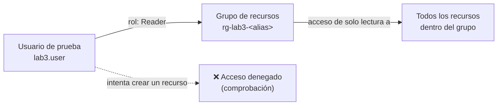

[⬅ Volver al README](./README.md) · [⬅ Sección anterior](./00-preparacion-entorno.md)

# 1. Entra ID + RBAC

## 🎯 Objetivo

Crear una identidad de prueba en Microsoft Entra ID y asignarle acceso mediante **RBAC (Role-Based Access Control)** con el **principio de mínimo privilegio**: el rol más pequeño que le permita hacer exactamente lo que necesita, ni más. Vamos a comprobar el control funcionando en ambos sentidos: qué SÍ puede hacer la identidad, y qué NO puede hacer.

Esta sección pone en práctica el Bloque 1 de la teoría ("Cloud IAM — fundamentos" y "RBAC, ABAC y PBAC").

> **Nota importante sobre roles:** el resto de las secciones de este laboratorio (Storage, VM, SAML, OIDC) las vas a realizar con **tu cuenta principal** (la propietaria de la suscripción), no con el usuario de prueba. El usuario de prueba de esta sección existe únicamente para practicar y demostrar el funcionamiento de RBAC — es un ejercicio autocontenido.

---

## 🧭 Lo que vas a construir

---

## Prerrequisitos

- Haber completado la [Sección 0](./00-preparacion-entorno.md) (grupo de recursos `rg-lab3-<alias>` creado).
- Tener permisos de administrador en tu tenant de Entra ID (si creaste la cuenta Free Trial tú mismo, ya eres Global Administrator por defecto — no necesitas hacer nada adicional).

---

## Paso 1 — Crear el usuario de prueba

1. En el Azure Portal, busca `Microsoft Entra ID` en la barra superior y entra.
2. En el menú izquierdo, haz clic en **"Users"** (Usuarios).
3. Haz clic en **"+ New user"** > **"Create new user"**.
4. Completa el formulario:
   - **User principal name:** `lab3.user` (el dominio `@tunombre.onmicrosoft.com` se completa automáticamente — este es el "Primary domain" que anotaste en la Sección 0).
   - **Display name:** `Lab3 Usuario de Prueba`.
   - En la sección **"Password"**, deja la opción "Auto-generate password" marcada.
5. Haz clic en **"Review + create"** y luego en **"Create"**.
6. Azure te mostrará la contraseña temporal generada **una sola vez**. Cópiala y guárdala en un lugar seguro — la necesitarás en el Paso 4 para iniciar sesión como este usuario.

📸 **Captura para el informe — 1.1:** el formulario de creación con el nombre de usuario visible (puedes tapar la contraseña si aparece en la captura, no es necesario mostrarla).

---

## Paso 2 — (Recomendado) Habilitar MFA base para todo el tenant

Como vimos en la teoría, MFA habilitado por defecto es un ejemplo real de *Security by Default*. En el tier Free de Entra ID no tenemos Conditional Access (requiere licencia P1/P2), pero sí tenemos **Security Defaults**, que exige MFA a todos los usuarios sin costo adicional.

1. En Microsoft Entra ID, ve a **"Properties"** (Propiedades) en el menú izquierdo.
2. Busca el enlace **"Manage Security defaults"** al final de la página.
3. Verifica el estado de **"Security defaults"**. Si está en "Disabled", actívalo y guarda.

> Si tu tenant ya tiene una política de Conditional Access configurada (poco probable en una cuenta nueva), Azure no te dejará habilitar Security Defaults — en ese caso, simplemente documenta el mensaje que ves y continúa.

📸 **Captura para el informe — 1.2:** la pantalla de "Security defaults" mostrando su estado.

---

## Paso 3 — Asignar el rol RBAC con alcance mínimo

1. Ve a **"Resource groups"** y entra a `rg-lab3-<alias>`.
2. En el menú izquierdo del grupo de recursos, haz clic en **"Access control (IAM)"**.
3. Haz clic en **"+ Add"** > **"Add role assignment"**.
4. En la pestaña **"Role"**, busca y selecciona **"Reader"**. Haz clic en "Next".

   > **¿Por qué "Reader" y no "Contributor"?** Reader permite ver todos los recursos del grupo, pero no crear, modificar ni eliminar nada — es el ejemplo más claro de mínimo privilegio: el usuario de prueba solo necesita *observar* para efectos de esta demostración.

5. En la pestaña **"Members"**, dejа seleccionado "User, group, or service principal", haz clic en **"+ Select members"**, busca `lab3.user` y selecciónalo.
6. Haz clic en **"Review + assign"** dos veces para confirmar.

📸 **Captura para el informe — 1.3:** la lista de asignaciones de roles en "Access control (IAM)" > pestaña "Role assignments", mostrando `lab3.user` con el rol `Reader` y el **scope** (alcance) apuntando al grupo de recursos (no a la suscripción).

---

## Paso 4 — Verificar el acceso: qué SÍ puede hacer

1. Abre una ventana de navegación privada / incógnito (para no mezclar sesiones con tu cuenta principal).
2. Ve a [portal.azure.com](https://portal.azure.com) e inicia sesión con `lab3.user@<tudominio>.onmicrosoft.com` y la contraseña temporal que guardaste.
3. Azure te pedirá cambiar la contraseña en el primer inicio de sesión — hazlo y anota la nueva contraseña.
4. Navega a **"Resource groups"** > `rg-lab3-<alias>`. Deberías poder ver el grupo y su contenido sin problema.

📸 **Captura para el informe — 1.4:** `lab3.user` viendo el contenido del grupo de recursos.

---

## Paso 5 — Verificar el acceso: qué NO puede hacer

1. Todavía como `lab3.user`, dentro de `rg-lab3-<alias>`, haz clic en **"+ Create"** (o intenta crear cualquier recurso, por ejemplo un Storage Account).
2. Completa el formulario mínimo y haz clic en **"Review + create"**.
3. Azure debería mostrarte un error de autorización (algo como *"...is not authorized to perform action..."*) — este es el comportamiento esperado y correcto.

📸 **Captura para el informe — 1.5:** el mensaje de error de autorización al intentar crear un recurso como `lab3.user`. **Esta es la evidencia más importante de la sección** — demuestra que RBAC realmente está restringiendo el acceso, no solo que está "configurado".

4. Cierra la sesión de `lab3.user` y cierra la ventana de incógnito. Continúa el resto del laboratorio con tu cuenta principal.

---

## 🧪 Reto opcional — pensando en ABAC

No es necesario resolverlo ahora (vas a crear el Storage Account en la siguiente sección), pero piénsalo: Azure permite agregar **condiciones** a una asignación de rol sobre Storage (por ejemplo, "solo puede leer blobs cuyo nombre empiece por `publico/`"). Eso es **ABAC** funcionando sobre RBAC. Vas a tener la oportunidad de configurarlo como reto opcional al final de la Sección 2.

---

## ❓ Preguntas de repaso — Sección 1

1. ¿Por qué el rol se asignó con alcance en el **grupo de recursos** y no en la **suscripción completa**? ¿Qué hubiera pasado si lo hacemos a nivel de suscripción?
2. En tus propias palabras, ¿qué diferencia hay entre **autenticación** y **autorización**? ¿Cuál de las dos demuestra el Paso 4, y cuál el Paso 5?
3. Security Defaults exige MFA sin licencia P1/P2. ¿Por qué esto es relevante para una organización con presupuesto limitado?
4. Si en vez de "Reader" hubiéramos asignado "Contributor", ¿qué habría pasado en el Paso 5?

---

[➡ Continuar con la Sección 2 — Cifrado de Storage](./02-cifrado-storage.md)
