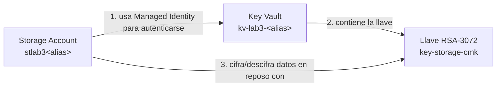

[⬅ Volver al README](./README.md) · [⬅ Sección anterior](./01-entra-id-rbac.md)

# 2. Cifrado de Storage con Customer-Managed Key (CMK)

## 🎯 Objetivo

Crear un Azure Key Vault y un Storage Account, y configurar el Storage Account para que use una **Customer-Managed Key (CMK)** — una llave que tú controlas — en lugar de la llave gestionada por Microsoft que Azure usa por defecto. Esta sección es la implementación práctica del ejemplo "CMK en Azure Key Vault" visto en la teoría (Bloque 3).

---

## 🧭 Lo que vas a construir

---

## Prerrequisitos

- Haber completado la [Sección 1](./01-entra-id-rbac.md).
- Estar conectado con tu **cuenta principal** (propietaria de la suscripción), no con `lab3.user`.

---

## Paso 1 — Crear el Key Vault

1. En el Azure Portal, busca `Key Vaults` en la barra superior y haz clic en **"+ Create"**.
2. Pestaña **"Basics"**:
   - **Subscription:** tu suscripción Free Trial.
   - **Resource group:** `rg-lab3-<alias>`.
   - **Key vault name:** `kv-lab3-<alias>` (debe ser único en todo Azure; si Azure te dice que el nombre ya existe, agrega un número, ej. `kv-lab3-mvr01x`).
   - **Region:** la misma región de tu grupo de recursos.
   - **Pricing tier:** **Standard** (no selecciones Premium — Premium está respaldado por HSM y no lo necesitamos para este laboratorio).
3. Pestaña **"Access configuration"**:
   - **Permission model:** selecciona **"Azure role-based access control"** (RBAC) — no "Vault access policy". Esto es importante: vamos a usar el mismo modelo RBAC que configuramos en la Sección 1, en vez del modelo antiguo de políticas de acceso.
4. En la misma pestaña, baja hasta **"Recovery options"** y confirma que:
   - **Soft delete** está **habilitado** (viene así por defecto y no se puede desactivar en Key Vaults nuevos).
   - Activa también **"Enable purge protection"**.

   > ⚠️ **Purge protection es obligatorio para usar el Key Vault con cifrado de Storage o de discos**, y **no se puede desactivar una vez habilitado**. Esto es intencional: protege la llave que descifra tus datos de una eliminación accidental o maliciosa. Tenlo en cuenta para la Sección 7 (limpieza) — el Key Vault quedará en estado "soft-deleted" por un período de retención antes de poder purgarse por completo, aunque esto no genera ningún costo.

5. Haz clic en **"Review + create"** y luego en **"Create"**. Espera a que termine el despliegue.

📸 **Captura para el informe — 2.1:** la pantalla "Overview" del Key Vault recién creado, mostrando su nombre, región y estado.

---

## Paso 2 — Crear la llave de cifrado

1. Dentro del Key Vault, ve a **"Objects"** > **"Keys"** en el menú izquierdo.
2. Haz clic en **"+ Generate/Import"**.
3. Completa el formulario:
   - **Options:** "Generate".
   - **Name:** `key-storage-cmk`.
   - **Key type:** `RSA`.
   - **RSA key size:** `RSA 3072`.
   - Deja las demás opciones por defecto.
4. Haz clic en **"Create"**.

> Es posible que el Portal te muestre un aviso de que necesitas permisos para crear llaves. Como acabas de crear el Key Vault, tu cuenta ya tiene el rol `Key Vault Administrator` asignado automáticamente por Azure — si ves un error de permisos, espera 1-2 minutos (los roles pueden tardar en propagarse) y refresca la página.

📸 **Captura para el informe — 2.2:** la llave `key-storage-cmk` visible en la lista de "Keys" del Key Vault, con su estado "Enabled".

---

## Paso 3 — Crear el Storage Account

1. En el Portal, busca `Storage accounts` y haz clic en **"+ Create"**.
2. Pestaña **"Basics"**:
   - **Subscription** y **Resource group:** los mismos de siempre.
   - **Storage account name:** `stlab3<alias>` — **sin guiones**, solo letras minúsculas y números (ej. `stlab3mvr01`). Este nombre también debe ser único en todo Azure.
   - **Region:** la misma de tu grupo de recursos.
   - **Performance:** `Standard`.
   - **Redundancy:** `Locally-redundant storage (LRS)` — la opción más económica.
3. Deja las demás pestañas con sus valores por defecto y haz clic en **"Review + create"**, luego **"Create"**.

📸 **Captura para el informe — 2.3:** el Storage Account recién creado, pantalla "Overview".

---

## Paso 4 — Habilitar la identidad administrada del Storage Account

Para que el Storage Account pueda "presentarse" ante el Key Vault y pedir permiso para usar la llave, necesita una identidad propia — la misma **Managed Identity** que vimos en la teoría como alternativa a credenciales embebidas.

1. Dentro del Storage Account, ve a **"Settings"** > **"Identity"** en el menú izquierdo.
2. En la pestaña **"System assigned"**, cambia el interruptor **"Status"** a **"On"**.
3. Haz clic en **"Save"**. Confirma cuando se te pregunte.
4. Una vez guardado, Azure te mostrará un **Object ID** — este es el identificador único de la identidad del Storage Account. No necesitas copiarlo manualmente, pero tenlo presente: es lo que vas a autorizar en el siguiente paso.

📸 **Captura para el informe — 2.4:** la pantalla "Identity" del Storage Account mostrando el Status "On" y el Object ID generado.

---

## Paso 5 — Otorgar permiso al Storage Account sobre el Key Vault

1. Ve a tu Key Vault > **"Access control (IAM)"**.
2. Haz clic en **"+ Add"** > **"Add role assignment"**.
3. Busca y selecciona el rol **"Key Vault Crypto Service Encryption User"**. Haz clic en "Next".

   > Este rol es deliberadamente estrecho: solo permite cifrar/descifrar usando la llave, no administrar el Key Vault ni leer su contenido. Es el mismo principio de mínimo privilegio de la Sección 1, aplicado a un recurso en vez de a una persona.

4. En "Members", selecciona **"Managed identity"** en vez de "User, group, or service principal".
5. Haz clic en **"+ Select members"**, en el desplegable "Managed identity" elige **"Storage Account"**, y selecciona tu Storage Account `stlab3<alias>` de la lista.
6. Haz clic en **"Review + assign"** dos veces.

📸 **Captura para el informe — 2.5:** la asignación de rol visible en "Access control (IAM)" > "Role assignments", mostrando el Storage Account con el rol `Key Vault Crypto Service Encryption User`.

---

## Paso 6 — Configurar el cifrado con Customer-Managed Key

1. Vuelve a tu Storage Account > **"Security + networking"** > **"Encryption"**.
2. Cambia **"Encryption type"** de "Microsoft-managed keys" a **"Customer-managed keys"**.
3. En **"Encryption key"**, selecciona **"Select a key vault and key"**.
4. Elige:
   - **Key vault:** `kv-lab3-<alias>`.
   - **Key:** `key-storage-cmk`.
   - **Version:** deja la versión más reciente seleccionada automáticamente.
5. Haz clic en **"Save"**.

> Si Azure muestra un error de permisos aquí, es casi siempre porque el rol del Paso 5 aún no se ha propagado. Espera 2-3 minutos y vuelve a intentar — no necesitas rehacer nada.

📸 **Captura para el informe — 2.6:** la pantalla "Encryption" del Storage Account mostrando "Customer-managed keys" seleccionado, con el Key Vault y la llave visibles.

---

## Paso 7 — Prueba práctica: subir un archivo

1. En el Storage Account, ve a **"Data storage"** > **"Containers"**.
2. Haz clic en **"+ Container"**, nómbralo `pruebas`, y déjalo con acceso privado (por defecto). Crea.
3. Entra al contenedor `pruebas` y haz clic en **"Upload"**.
4. Sube cualquier archivo pequeño de tu computador (por ejemplo, un `.txt` con cualquier texto).
5. Verifica que el archivo aparece en la lista sin errores — esto confirma que el cifrado con tu CMK está funcionando de forma transparente: subiste y puedes leer el archivo con normalidad, pero por debajo, Azure lo cifró usando tu llave.

📸 **Captura para el informe — 2.7:** el archivo subido, visible dentro del contenedor `pruebas`.

---

## 🧪 Reto opcional — condición ABAC sobre el Storage

Ahora que existe el Storage Account, puedes practicar ABAC de verdad:

1. Ve a tu Storage Account > **"Access control (IAM)"** > **"+ Add"** > **"Add role assignment"**.
2. Selecciona el rol **"Storage Blob Data Reader"** y en members agrega a `lab3.user`.
3. Antes de finalizar, en la pestaña **"Conditions (optional)"**, haz clic en **"Add condition"**.
4. Usa el editor visual para construir una condición simple, por ejemplo: *"Blob path starts with `pruebas/publico/"`*.
5. Guarda. Esto significa que `lab3.user`, aunque tenga el rol asignado, **solo** podrá leer blobs cuya ruta empiece por `pruebas/publico/` — el resto le será negado, aunque el rol diga "Reader" sobre todo el Storage Account.

Este es exactamente el mecanismo de ABAC visto en la teoría: la decisión de acceso ya no depende solo del rol, sino de un **atributo** del recurso (su ruta).

---

## ❓ Preguntas de repaso — Sección 2

1. ¿Qué significa exactamente que el Storage Account tenga una "Managed Identity", y por qué es más seguro que usar una contraseña o clave embebida?
2. ¿Por qué el rol otorgado en el Paso 5 es `Key Vault Crypto Service Encryption User` y no un rol más amplio como `Key Vault Administrator`?
3. Purge protection no se puede desactivar una vez habilitado. ¿Qué problema de seguridad busca prevenir esta restricción?
4. Si resolviste el reto opcional: ¿en qué se diferencia la condición que configuraste de una simple asignación RBAC sin condiciones?

---

[➡ Continuar con la Sección 3 — Cifrado de VM's](./03-cifrado-vms.md)
