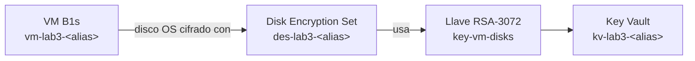

[⬅ Volver al README](./README.md) · [⬅ Sección anterior](./02-cifrado-storage.md)

# 3. Cifrado de VM's con Disk Encryption Set

## 🎯 Objetivo

Crear una máquina virtual elegible para el Free Tier de Azure, con su disco cifrado desde el momento de la creación usando un **Disk Encryption Set (DES)** respaldado por una Customer-Managed Key. A diferencia del cifrado clásico dentro del sistema operativo (BitLocker/dm-crypt vía extensión de VM), un Disk Encryption Set cifra el disco administrado **por fuera** del sistema operativo invitado — se configura íntegramente desde el Portal, sin instalar nada dentro de la VM.

---

## 🧭 Lo que vas a construir

---

## Prerrequisitos

- Haber completado la [Sección 2](./02-cifrado-storage.md) — usamos el mismo Key Vault.
- Estar conectado con tu cuenta principal.

---

## Paso 1 — Crear una llave dedicada para discos

Como buena práctica vista en la teoría ("evitar reutilizar la misma llave para múltiples sistemas"), vamos a crear una llave **separada** de la que usamos para Storage, aunque viva en el mismo Key Vault.

1. Ve a tu Key Vault `kv-lab3-<alias>` > **"Objects"** > **"Keys"**.
2. Haz clic en **"+ Generate/Import"**.
3. Configura:
   - **Name:** `key-vm-disks`.
   - **Key type:** `RSA`.
   - **RSA key size:** `RSA 3072`.
4. Haz clic en **"Create"**.

📸 **Captura para el informe — 3.1:** la lista de "Keys" del Key Vault mostrando ahora **dos** llaves: `key-storage-cmk` y `key-vm-disks`.

---

## Paso 2 — Crear el Disk Encryption Set

1. En la barra de búsqueda superior del Portal, escribe `Disk Encryption Sets` y haz clic en el resultado.
2. Haz clic en **"+ Create"**.
3. Pestaña **"Basics"**:
   - **Subscription** y **Resource group:** los de siempre.
   - **Disk encryption set name:** `des-lab3-<alias>`.
   - **Region:** la misma de tu grupo de recursos.
   - **Encryption type:** `Encryption at rest with a customer-managed key` (deja la opción de doble cifrado sin marcar — no la necesitamos y algunas requieren SKU Premium).
   - **Key Vault:** `kv-lab3-<alias>`.
   - **Key:** `key-vm-disks`.
4. Haz clic en **"Review + create"** y luego en **"Create"**.

📸 **Captura para el informe — 3.2:** el Disk Encryption Set creado, pantalla "Overview", mostrando el Key Vault y la llave asociados.

---

## Paso 3 — Otorgar acceso del Disk Encryption Set al Key Vault

Al igual que con el Storage Account, el Disk Encryption Set tiene su propia identidad administrada y necesita permiso explícito sobre la llave.

1. Dentro del Disk Encryption Set recién creado, busca en el menú izquierdo (o en la barra de notificaciones superior tras la creación) la opción **"Key"**, y verifica si aparece un botón **"Grant access"** o una advertencia de permisos pendientes. Si aparece, haz clic en él y confirma — esto asigna automáticamente el rol necesario.
2. Si no aparece automáticamente, hazlo manual: ve al Key Vault > **"Access control (IAM)"** > **"+ Add"** > **"Add role assignment"**, selecciona el rol **"Key Vault Crypto Service Encryption User"**, en "Members" elige **"Managed identity"** > **"Disk Encryption Set"** > tu `des-lab3-<alias>`, y confirma con "Review + assign".

📸 **Captura para el informe — 3.3:** la asignación de rol del Disk Encryption Set visible en "Access control (IAM)" del Key Vault.

---

## Paso 4 — Crear la máquina virtual con el disco cifrado

1. En el Portal, busca `Virtual machines` y haz clic en **"+ Create"** > **"Azure virtual machine"**.
2. Pestaña **"Basics"**:
   - **Subscription** y **Resource group:** los de siempre.
   - **Virtual machine name:** `vm-lab3-<alias>`.
   - **Region:** la misma de tu grupo de recursos.
   - **Image:** `Ubuntu Server 22.04 LTS - x64 Gen2` (o la versión que el Portal marque explícitamente como **"Free tier eligible"** — busca la etiqueta verde junto al nombre de la imagen).
   - **Size:** haz clic en "See all sizes" y selecciona **`Standard_B1s`** — confirma que el Portal muestra la etiqueta **"Free tier eligible"** junto a este tamaño.
   - **Authentication type:** `Password` (más simple para este laboratorio) o `SSH public key` si ya sabes manejar llaves SSH.
   - **Username:** `azureuser` (o el que prefieras).
   - Si elegiste "Password", define una contraseña que cumpla los requisitos de complejidad de Azure y **anótala**.
3. Pestaña **"Disks"**:
   - **OS disk type:** `Standard SSD` (la opción más económica compatible con cifrado CMK).
   - **Encryption type:** haz clic en el desplegable y selecciona **"Encryption at rest with a customer-managed key"**.
   - En el selector que aparece, elige tu Disk Encryption Set: `des-lab3-<alias>`.
4. Pestaña **"Networking"**: deja los valores por defecto (Azure crea una red virtual y un grupo de seguridad de red nuevos automáticamente).
5. Haz clic en **"Review + create"**. Revisa que en el resumen aparezca el mensaje **"Free tier eligible"** en algún punto de la pantalla (confirma que no vas a incurrir en cargos de cómputo).
6. Haz clic en **"Create"** y espera a que termine el despliegue (puede tardar 2-4 minutos).

📸 **Captura para el informe — 3.4:** la pestaña "Disks" del formulario de creación, mostrando "Encryption at rest with a customer-managed key" y el Disk Encryption Set seleccionados, **antes** de crear la VM.

📸 **Captura para el informe — 3.5:** la VM ya creada y en ejecución, pantalla "Overview", mostrando su tamaño (`Standard_B1s`) y estado ("Running").

---

## Paso 5 — Verificar el cifrado del disco

1. Dentro de la VM, ve a **"Settings"** > **"Disks"** en el menú izquierdo.
2. Haz clic en el nombre del disco del sistema operativo (OS disk).
3. En la página del disco, ve a **"Settings"** > **"Encryption"**.
4. Confirma que el tipo de cifrado muestra **"Encryption at rest with a customer-managed key"** y el Disk Encryption Set correcto.

📸 **Captura para el informe — 3.6:** la pantalla "Encryption" del disco, confirmando el cifrado con CMK.

---

## ⚠️ Nota de costos — Free Tier

- `Standard_B1s` está incluido en las **750 horas/mes gratuitas** durante los primeros 12 meses de una cuenta Azure Free — suficiente para tener la VM prendida todo un mes sin costo.
- El **disco** en sí (Standard SSD de 30 GB por defecto) tiene un costo muy bajo pero **no es parte de las horas de cómputo gratuitas** — si lo dejas existiendo por mucho tiempo después del laboratorio, sí puede generar cargos menores. Por eso la [Sección 7 — Limpieza de recursos](./07-limpieza-recursos.md) es obligatoria.
- **Apaga la VM cuando no la estés usando activamente**: Portal > tu VM > botón **"Stop"** (no "Deallocate" manual necesario, "Stop" en el Portal ya desasigna el cómputo).

---

## ❓ Preguntas de repaso — Sección 3

1. ¿Cuál es la diferencia conceptual entre un Disk Encryption Set y el cifrado clásico "Azure Disk Encryption" (BitLocker/dm-crypt dentro del sistema operativo)?
2. ¿Por qué creamos una llave separada (`key-vm-disks`) en vez de reutilizar `key-storage-cmk`?
3. Si alguien deshabilitara la llave `key-vm-disks` en el Key Vault, ¿qué le pasaría a la VM? Relaciona tu respuesta con el concepto de "crypto-shredding" visto en la teoría.
4. ¿Por qué es importante verificar la etiqueta "Free tier eligible" tanto en la imagen como en el tamaño de la VM?

---

[➡ Continuar con la Sección 4 — Integración SAML](./04-integracion-saml.md)
