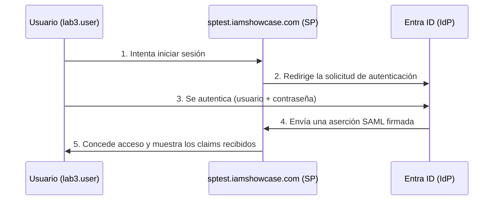

[⬅ Volver al README](./README.md) · [⬅ Sección anterior](./03-cifrado-vms.md)

# 4. Integración SAML — Entra ID ↔ sptest.iamshowcase.com

## 🎯 Objetivo

Configurar tu tenant de Microsoft Entra ID como **Identity Provider (IdP)** SAML, y federarlo con `sptest.iamshowcase.com`, un **Service Provider (SP)** público diseñado específicamente para practicar integraciones SAML. Vamos a completar el flujo completo visto en la teoría: solicitud → redirección → autenticación → aserción → acceso.

---

## 🧭 El flujo que vas a construir

---

## Prerrequisitos

- Haber completado la [Sección 1](./01-entra-id-rbac.md) — usamos el usuario `lab3.user` que creaste ahí.
- Tener a mano la contraseña de `lab3.user` (la que definiste al cambiarla en el Paso 4 de la Sección 1).

---

## Paso 1 — Explorar el Service Provider de pruebas

1. Abre [sptest.iamshowcase.com](https://sptest.iamshowcase.com/) en tu navegador.
2. Lee la página principal: es un sitio mantenido para que cualquiera pueda practicar integraciones SAML sin necesidad de desplegar su propia aplicación.
3. Busca en la página los valores que el sitio requiere para configurarse como SP — usualmente aparecen ahí mismo un **Entity ID / Identifier** y un **ACS URL / Reply URL** que debes usar del lado del IdP. **Anota exactamente los valores que veas en el sitio en este momento** (pueden variar respecto a lo escrito en esta guía si el sitio se actualiza) — normalmente son similares a:
   - Identifier (Entity ID): `https://sptest.iamshowcase.com/`
   - Reply URL (ACS URL): `https://sptest.iamshowcase.com/acs`

📸 **Captura para el informe — 4.1:** la página principal de sptest.iamshowcase.com mostrando las instrucciones/valores de configuración SAML que vas a usar.

---

## Paso 2 — Crear la Enterprise Application en Entra ID

1. En el Azure Portal, busca `Microsoft Entra ID` > menú izquierdo **"Enterprise applications"**.
2. Haz clic en **"+ New application"**.
3. Haz clic en **"+ Create your own application"** (arriba a la izquierda).
4. Nombra la aplicación `Lab3-SAML-iamshowcase` y selecciona la opción **"Integrate any other application you don't find in the gallery (Non-gallery)"**.
5. Haz clic en **"Create"**. Espera a que Azure termine de aprovisionar la aplicación (unos segundos).

📸 **Captura para el informe — 4.2:** la Enterprise Application creada, pantalla "Overview", mostrando su nombre y Object ID.

---

## Paso 3 — Configurar el Single Sign-On tipo SAML

1. Dentro de la aplicación, ve a **"Manage"** > **"Single sign-on"**.
2. Selecciona el método **"SAML"**.
3. En la sección **"Basic SAML Configuration"**, haz clic en **"Edit"** (ícono de lápiz).
4. Completa con los valores que anotaste en el Paso 1:
   - **Identifier (Entity ID):** `https://sptest.iamshowcase.com/`
   - **Reply URL (Assertion Consumer Service URL):** `https://sptest.iamshowcase.com/acs`
5. Haz clic en **"Save"**.

📸 **Captura para el informe — 4.3:** la sección "Basic SAML Configuration" con los valores de Identifier y Reply URL guardados.

---

## Paso 4 — Descargar el certificado y las URLs necesarias

1. En la misma página de "Single sign-on", baja hasta la sección **"SAML Certificates"**.
2. Descarga el **"Certificate (Base64)"** haciendo clic en su enlace de descarga — guárdalo en tu computador.
3. Baja hasta la sección **"Set up [nombre de tu app]"** y copia estos dos valores (los vas a necesitar en el Paso 6):
   - **Login URL**
   - **Microsoft Entra Identifier**

📸 **Captura para el informe — 4.4:** la sección "SAML Certificates" mostrando el certificado descargable y las URLs de configuración.

---

## Paso 5 — Asignar el usuario de prueba a la aplicación

1. Dentro de la misma Enterprise Application, ve a **"Manage"** > **"Users and groups"**.
2. Haz clic en **"+ Add user/group"**.
3. En "Users", selecciona `lab3.user` y haz clic en "Select", luego en **"Assign"**.

> Esto es necesario porque, por defecto, una Enterprise Application no está disponible para nadie hasta que se le asignen usuarios explícitamente — otro ejemplo de mínimo privilegio.

📸 **Captura para el informe — 4.5:** `lab3.user` visible en la lista de "Users and groups" de la aplicación.

---

## Paso 6 — Configurar sptest.iamshowcase.com con los datos de tu IdP

1. Vuelve a [sptest.iamshowcase.com](https://sptest.iamshowcase.com/).
2. Busca el formulario o enlace de configuración del sitio para "conectar tu propio IdP" (el sitio típicamente ofrece pegar directamente una **Login URL** de tu IdP, o subir/pegar el contenido de tu certificado).
3. Pega los valores que copiaste en el Paso 4:
   - **Login URL** (la de tu Enterprise Application).
   - Contenido del **certificado** descargado (ábrelo con un editor de texto si el sitio pide pegar el contenido en vez de subir el archivo).
4. Guarda/aplica la configuración según lo indique el sitio.

📸 **Captura para el informe — 4.6:** la configuración aplicada en sptest.iamshowcase.com con tus datos.

---

## Paso 7 — Probar el flujo de SSO completo

1. Abre una ventana de navegación privada / incógnito.
2. Ve al enlace de prueba de login que ofrezca sptest.iamshowcase.com (normalmente un botón "Login" o un enlace directo desde la página principal).
3. Deberías ser redirigido a la pantalla de inicio de sesión de Microsoft. Autentícate con `lab3.user@<tudominio>.onmicrosoft.com` y su contraseña.
4. Tras autenticarte, deberías regresar automáticamente a sptest.iamshowcase.com, que mostrará los **claims** (atributos) recibidos en la aserción SAML — típicamente el `NameID` del usuario y otros atributos.

📸 **Captura para el informe — 4.7:** la pantalla final de sptest.iamshowcase.com mostrando el login exitoso y los claims recibidos. **Esta es la evidencia principal de la sección.**

> **Alternativa si el paso anterior falla:** también puedes iniciar el flujo desde el lado de Microsoft, en [myapplications.microsoft.com](https://myapplications.microsoft.com), iniciando sesión como `lab3.user` y haciendo clic en el ícono de `Lab3-SAML-iamshowcase`. El resultado final debe ser el mismo.

---

## ❓ Preguntas de repaso — Sección 4

1. En este flujo, ¿quién es el Identity Provider (IdP) y quién es el Service Provider (SP)? ¿Por qué?
2. ¿Qué función cumple el certificado que descargaste en el Paso 4 dentro del flujo SAML?
3. ¿Por qué fue necesario asignar explícitamente a `lab3.user` en "Users and groups" antes de que el login funcionara?
4. Si alguien interceptara la aserción SAML en tránsito (sin TLS), ¿qué riesgo específico introduciría eso, más allá de la simple exposición de datos?

---

[➡ Continuar con la Sección 5 — Integración OIDC](./05-integracion-oidc.md)
