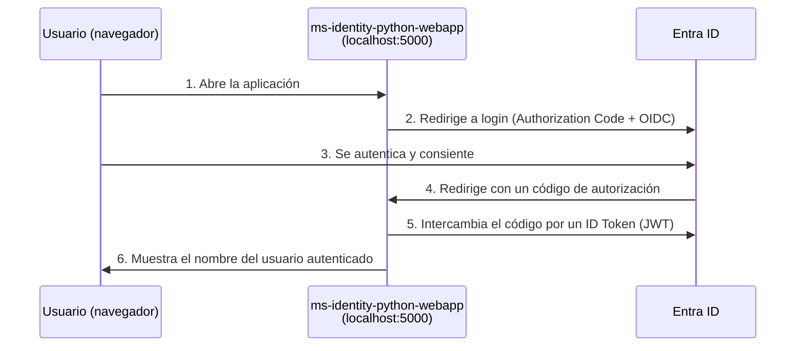

[⬅ Volver al README](./README.md) · [⬅ Sección anterior](./04-integracion-saml.md)

# 5. Integración OIDC — ms-identity-python-webapp

## 🎯 Objetivo

Registrar una aplicación en Microsoft Entra ID y ejecutar localmente en tu computador la aplicación de referencia de Microsoft `ms-identity-python-webapp`, que implementa un login completo con **OpenID Connect (OIDC)** usando la librería MSAL (Microsoft Authentication Library) de Python. Al finalizar, vas a poder inspeccionar el ID Token (un JWT) que recibe la aplicación.

---

## 🧭 El flujo que vas a construir



---

## Prerrequisitos

- Haber completado la [Sección 0](./00-preparacion-entorno.md) (Python 3.10+ y Git instalados).
- Tu **Tenant ID** anotado desde la Sección 0.

---

## Paso 1 — Registrar la aplicación en Entra ID

1. En el Azure Portal, busca `Microsoft Entra ID` > menú izquierdo **"App registrations"**.
2. Haz clic en **"+ New registration"**.
3. Completa el formulario:
   - **Name:** `Lab3-OIDC-PythonWebApp`.
   - **Supported account types:** `Accounts in this organizational directory only (Single tenant)`.
   - **Redirect URI:** selecciona el tipo **"Web"** en el desplegable, y en el campo de texto escribe exactamente:
     ```
     http://localhost:5000/getAToken
     ```
4. Haz clic en **"Register"**.

📸 **Captura para el informe — 5.1:** la pantalla "Overview" de la App Registration recién creada, mostrando **Application (client) ID** y **Directory (tenant) ID** visibles (puedes dejarlos visibles en la captura, no son secretos).

---

## Paso 2 — Anotar los identificadores

1. En la misma pantalla "Overview", copia y guarda:
   - **Application (client) ID**
   - **Directory (tenant) ID**

---

## Paso 3 — Crear un client secret

1. En el menú izquierdo de la App Registration, ve a **"Certificates & secrets"**.
2. En la pestaña **"Client secrets"**, haz clic en **"+ New client secret"**.
3. Descripción: `lab3-secret`. Expiración: `6 months` (la más corta disponible, buena práctica de rotación vista en la teoría).
4. Haz clic en **"Add"**.
5. **Inmediatamente**, copia el valor de la columna **"Value"** (no el "Secret ID") y guárdalo en un lugar seguro temporal.

> ⚠️ **Advertencia crítica:** el valor del secret **solo se muestra una vez**. Si navegas fuera de esta página sin copiarlo, tendrás que crear uno nuevo. **Nunca** tomes una captura de pantalla con el valor del secret visible — lo vas a necesitar para el archivo de configuración, no para el informe.

📸 **Captura para el informe — 5.2:** la lista de "Client secrets" mostrando la descripción `lab3-secret` y su fecha de expiración — **con la columna "Value" ya oculta/expirada en la captura** (Azure la oculta automáticamente al recargar la página; toma la captura después de navegar y volver).

---

## Paso 4 — Verificar los permisos de API

1. En el menú izquierdo, ve a **"API permissions"**.
2. Deberías ver por defecto el permiso `User.Read` de Microsoft Graph — es todo lo que necesitamos para este laboratorio (solo lee el perfil básico del usuario autenticado).

---

## Paso 5 — Clonar y preparar el proyecto

1. Abre una terminal (PowerShell) en la carpeta donde quieras guardar el proyecto.
2. Clona el repositorio:
   ```powershell
   git clone https://github.com/Azure-Samples/ms-identity-python-webapp.git
   cd ms-identity-python-webapp
   ```
3. Crea un entorno virtual de Python (aísla las dependencias de este proyecto del resto de tu sistema):
   ```powershell
   python -m venv venv
   ```
4. Actívalo:
   - **Windows (PowerShell):**
     ```powershell
     venv\Scripts\Activate.ps1
     ```
   - **macOS / Linux:**
     ```bash
     source venv/bin/activate
     ```
   Deberías ver `(venv)` al inicio de tu línea de comandos.
5. Instala las dependencias del proyecto:
   ```powershell
   pip install -r requirements.txt
   ```

📸 **Captura para el informe — 5.3:** la terminal mostrando `pip install -r requirements.txt` completado sin errores.

---

## Paso 6 — Configurar la aplicación con tus datos

1. Abre la carpeta del proyecto en un editor de texto (VS Code, Notepad++, o el que prefieras).
2. Busca el archivo de configuración del proyecto — en la versión actual del repositorio suele llamarse `app_config.py` (revisa el `README.md` del propio repositorio clonado si el nombre no coincide, ya que las plantillas de Microsoft se actualizan con el tiempo).
3. Reemplaza los valores de ejemplo por los tuyos:
   ```python
   CLIENT_ID = "<tu Application (client) ID>"
   CLIENT_SECRET = "<tu client secret del Paso 3>"
   AUTHORITY = "https://login.microsoftonline.com/<tu Directory (tenant) ID>"
   REDIRECT_PATH = "/getAToken"
   ```
4. Confirma que el resto de los valores (scopes, puerto) coincidan con lo que dejaste configurado como Redirect URI en el Paso 1 (`localhost:5000`).
5. Guarda el archivo.

> ⚠️ **Nunca subas este archivo con tu client secret real a un repositorio público de GitHub.** Si vas a subir tu propia copia del código a GitHub como parte de otro ejercicio, usa variables de entorno o un archivo `.env` excluido con `.gitignore` — exactamente lo que la teoría llamó *Secrets Management*.

---

## Paso 7 — Ejecutar la aplicación

1. Con el entorno virtual activado, ejecuta:
   ```powershell
   python app.py
   ```
2. Deberías ver en la terminal un mensaje indicando que el servidor está corriendo, típicamente algo como `Running on http://127.0.0.1:5000`.

📸 **Captura para el informe — 5.4:** la terminal mostrando la aplicación Flask corriendo sin errores.

---

## Paso 8 — Probar el login

1. Abre tu navegador en `http://localhost:5000`.
2. Haz clic en el enlace/botón de **"Sign In"** (o similar) que ofrece la aplicación.
3. Serás redirigido a la pantalla de login de Microsoft. Autentícate con tu cuenta principal (o con `lab3.user`, cualquiera funciona porque el permiso `User.Read` no requiere asignación explícita en tenants de un solo usuario administrador).
4. Acepta el consentimiento de permisos si se te solicita.
5. Deberías ser redirigido de vuelta a `http://localhost:5000` y ver el nombre de tu cuenta reflejado en la página — confirmación de que el ID Token fue recibido y procesado correctamente.

📸 **Captura para el informe — 5.5:** la página de la aplicación tras el login exitoso, mostrando tu nombre de usuario. **Esta es la evidencia principal de la sección.**

---

## Paso 9 — (Opcional avanzado) Inspeccionar el ID Token

1. Con las herramientas de desarrollador del navegador abiertas (tecla `F12`) antes de iniciar sesión, ve a la pestaña **"Network"**.
2. Repite el login y busca la solicitud hacia `/getAToken` en la lista de peticiones capturadas.
3. Si la aplicación expone el token decodificado en pantalla (algunas versiones del sample lo hacen), identifica visualmente sus tres partes separadas por puntos: **header.payload.signature** — exactamente la estructura vista en la teoría.
4. Alternativamente, puedes copiar un JWT de ejemplo (nunca uno de producción real) en [jwt.ms](https://jwt.ms) — una herramienta de Microsoft para decodificar y visualizar tokens de forma segura (procesa todo localmente en tu navegador).

---

## Paso 10 — Detener la aplicación

1. Vuelve a la terminal donde corre `python app.py`.
2. Presiona `Ctrl + C` para detener el servidor.
3. Desactiva el entorno virtual:
   ```powershell
   deactivate
   ```

---

## ❓ Preguntas de repaso — Sección 5

1. ¿Qué diferencia hay entre el **Redirect URI** configurado en el Paso 1 y la URL general de la aplicación (`http://localhost:5000`)? ¿Por qué debe coincidir exactamente?
2. En este flujo, ¿en qué momento se emite el **ID Token**, y qué tipo de información contiene su payload?
3. ¿Por qué el laboratorio insiste en que nunca tomes una captura con el client secret visible? ¿Qué podría hacer alguien con ese valor?
4. Compara esta integración con la de la Sección 4 (SAML): ¿qué formato usa cada una para transportar la prueba de identidad (XML vs. JSON/JWT)?

---

[➡ Continuar con la Sección 6 — Consolidación del informe](./06-consolidacion-informe.md)
