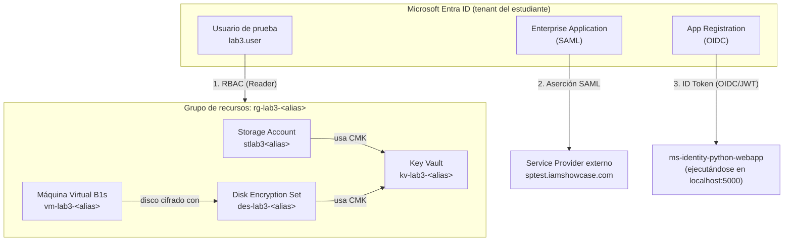

# Laboratorio 3 — Seguridad de Datos e Identidad y Acceso (IAM)

**Especialización en Ciberseguridad · Seguridad en la Nube · Sesión 3**
Escuela de Comunicaciones Militares (ESCOM) — Ejército Nacional de Colombia
Instructor: Manuel Alejandro Vargas Rojas · manuelvargasrojas@cedoc.edu.co

Este es el **punto de partida** del laboratorio. Léelo completo antes de abrir cualquiera de las secciones numeradas.

---

## 1. Objetivo del laboratorio

Configurar y validar, sobre una suscripción de Microsoft Azure **Free Tier**, los cinco pilares técnicos vistos en la teoría de la Sesión 3:

1. Gestión de identidades y control de acceso con **Entra ID + RBAC**.
2. Protección de datos en reposo con **cifrado de Storage mediante una Customer‑Managed Key (CMK)**.
3. Protección de datos en reposo a nivel de infraestructura con **cifrado de discos de VM mediante un Disk Encryption Set (CMK)**.
4. Federación de identidades con el protocolo **SAML 2.0**, contra el Service Provider público de pruebas `sptest.iamshowcase.com`.
5. Federación de identidades con el protocolo **OpenID Connect (OIDC)**, usando la aplicación de referencia de Microsoft `ms-identity-python-webapp`.

**Resultado de aprendizaje evaluado:** el estudiante es capaz de implementar controles de identidad, acceso y protección de datos en un entorno cloud real, documentando cada paso con evidencia verificable.

Este laboratorio equivale al **20 % de la nota final del módulo**. La rúbrica de calificación está en [`RUBRICA-EVALUACION.md`](./RUBRICA-EVALUACION.md).

---

## 2. Restricciones — Azure Free Tier

Todo el laboratorio está diseñado para funcionar **exclusivamente con recursos gratuitos o de costo mínimo/despreciable**. No se requiere ninguna suscripción de pago. Ten en cuenta lo siguiente:

| Recurso | Nivel usado | Por qué es gratuito o casi gratuito |
|---|---|---|
| Microsoft Entra ID | Free (incluido con toda suscripción de Azure) | Usuarios, roles RBAC, aplicaciones empresariales y App Registrations no tienen costo en el tier Free. |
| Azure Key Vault | **Standard** (no Premium/HSM) | Sin costo base mensual; se cobra por operación, y el uso de este laboratorio está muy por debajo de cualquier umbral relevante. |
| Azure Storage Account | Standard, redundancia **LRS** | La opción más económica disponible; el volumen de datos del laboratorio es mínimo (un archivo de prueba). |
| Máquina Virtual | Tamaño **B1s**, imagen Linux (Ubuntu Server, marcada "Free tier eligible" en el Portal) | Incluida en las 750 horas/mes gratuitas de cómputo B‑series durante los primeros 12 meses de una cuenta Azure Free. |
| Disk Encryption Set | Sin costo propio | Es una capa de configuración sobre el disco administrado y el Key Vault; no genera cargo adicional. |
| App Registration / Enterprise Application | Free | No requiere licencias Entra ID P1/P2. |

> ⚠️ **Aun así, configura una alerta de presupuesto** antes de empezar (ver [`00-preparacion-entorno.md`](./00-preparacion-entorno.md)). Una VM o un disco que olvides eliminar sí puede generar cargos con el tiempo. La [Sección 7 — Limpieza de recursos](./07-limpieza-recursos.md) es de carácter **obligatorio**, no opcional.

---

## 3. Arquitectura general del laboratorio

---

## 4. Herramientas necesarias

| Herramienta | Uso en el laboratorio | Instalación |
|---|---|---|
| Cuenta de Microsoft Azure (Free Tier) | Suscripción donde se crean todos los recursos | [azure.microsoft.com/free](https://azure.microsoft.com/free) (detallado en la Sección 0) |
| Navegador web actualizado | Azure Portal, sptest.iamshowcase.com, localhost | Chrome, Edge o Firefox |
| PowerShell 7+ con el módulo **Az** | Algunos pasos de verificación y automatización puntual | Detallado en la Sección 0 |
| Python 3.10 o superior | Ejecutar la aplicación de ejemplo OIDC localmente | Detallado en la Sección 0 |
| Git | Clonar el repositorio `ms-identity-python-webapp` | Detallado en la Sección 0 |

---

## 5. Convención de nombres

A lo largo de todo el laboratorio vas a reemplazar `<alias>` por un identificador corto y único tuyo (por ejemplo tus iniciales + un número: `mvr01`). **Usa siempre el mismo `<alias>` en todos los recursos** — esto es lo que evita colisiones de nombre (Key Vault y Storage Account requieren nombres **globalmente únicos** en todo Azure, no solo en tu suscripción).

| Recurso | Patrón | Ejemplo con alias `mvr01` |
|---|---|---|
| Grupo de recursos | `rg-lab3-<alias>` | `rg-lab3-mvr01` |
| Key Vault | `kv-lab3-<alias>` | `kv-lab3-mvr01` |
| Storage Account | `stlab3<alias>` (sin guiones, solo minúsculas/números) | `stlab3mvr01` |
| Disk Encryption Set | `des-lab3-<alias>` | `des-lab3-mvr01` |
| Máquina virtual | `vm-lab3-<alias>` | `vm-lab3-mvr01` |
| Usuario de prueba Entra ID | `lab3.user@<tudominio>.onmicrosoft.com` | `lab3.user@mvrtenant.onmicrosoft.com` |

---

## 6. Cómo usar este material — orden de navegación

Sigue las secciones **en este orden exacto**. Cada archivo asume que completaste el anterior.

| # | Archivo | Contenido |
|---|---|---|
| 0 | [`00-preparacion-entorno.md`](./00-preparacion-entorno.md) | Cuenta Azure, alerta de presupuesto, instalación de herramientas, grupo de recursos |
| 1 | [`01-entra-id-rbac.md`](./01-entra-id-rbac.md) | Usuario de prueba + RBAC con alcance mínimo |
| 2 | [`02-cifrado-storage.md`](./02-cifrado-storage.md) | Key Vault + Storage Account + cifrado con CMK |
| 3 | [`03-cifrado-vms.md`](./03-cifrado-vms.md) | Disk Encryption Set + VM Free Tier con disco cifrado |
| 4 | [`04-integracion-saml.md`](./04-integracion-saml.md) | Entra ID como IdP SAML ↔ sptest.iamshowcase.com |
| 5 | [`05-integracion-oidc.md`](./05-integracion-oidc.md) | App Registration + ms-identity-python-webapp (OIDC) |
| 6 | [`06-consolidacion-informe.md`](./06-consolidacion-informe.md) | Cómo armar y entregar el PDF único |
| 7 | [`07-limpieza-recursos.md`](./07-limpieza-recursos.md) | Eliminar todos los recursos (obligatorio) |
| 8 | [`08-solucion-problemas.md`](./08-solucion-problemas.md) | Errores comunes y cómo resolverlos |

Además, cada sección (1 a 5) contiene:

- 🎯 **Objetivo** de la sección y su conexión con la teoría.
- 🧭 Un **diagrama Mermaid** de lo que vas a construir.
- 🪜 **Pasos numerados**, sin dar nada por sentado — incluyen el nombre exacto de cada botón, menú o campo en el Azure Portal.
- 📸 **Capturas de pantalla solicitadas**, numeradas, que debes guardar para el informe final.
- ❓ **Preguntas de repaso** al cierre, que también debes responder en el informe final.

---

## 7. Formato de entrega — léelo ahora

> ⚠️ **La entrega del laboratorio se realiza en un único archivo PDF, cargado en Google Classroom.** No se aceptan Word, ZIP, enlaces de Drive, ni archivos separados por sección. El detalle completo del proceso de armado y entrega está en [`06-consolidacion-informe.md`](./06-consolidacion-informe.md), y los criterios exactos de calificación están en [`RUBRICA-EVALUACION.md`](./RUBRICA-EVALUACION.md).

---

## 8. Conexión con el resto del curso

- **Viene de la Sesión 2:** el grupo de recursos y las prácticas de gobernanza (CSPM, principio de mínimo privilegio) que ya configuraste se reutilizan como base de higiene aquí.
- **Prepara la Sesión 4:** el Key Vault que configuras hoy con acceso público se protegerá en la Sesión 4 con un **Private Endpoint**, eliminando la exposición a internet.

---

## 9. Referencias

- Presentación teórica: *Sesión 3 — Seguridad de Datos e Identidad y Acceso (IAM)*.
- Microsoft Learn — [Microsoft Entra ID](https://learn.microsoft.com/entra/), [Azure Key Vault](https://learn.microsoft.com/azure/key-vault/), [Azure Disk Encryption / Disk Encryption Sets](https://learn.microsoft.com/azure/virtual-machines/disk-encryption), [Azure Storage encryption](https://learn.microsoft.com/azure/storage/common/storage-service-encryption).
- SAML Test IdP/SP — [sptest.iamshowcase.com](https://sptest.iamshowcase.com/)
- Aplicación de referencia OIDC — [github.com/Azure-Samples/ms-identity-python-webapp](https://github.com/Azure-Samples/ms-identity-python-webapp)
- Cloud Security Alliance — CCSK v5 Study Guide (gestión de identidad y llaves).

---

**Siguiente paso:** abre [`00-preparacion-entorno.md`](./00-preparacion-entorno.md).
