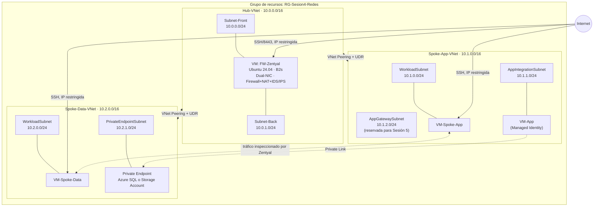

[← Volver al README](README.md) | **Siguiente:** [Parte A — Hub-Spoke y Zentyal →](02-Parte-A-Hub-Spoke-NVA.md)

# 1. Introducción y Arquitectura de Referencia

## 1.1 Objetivo del laboratorio

Al finalizar este laboratorio serás capaz de:

- Diseñar y desplegar una topología **Hub-and-Spoke** en Azure, con una VNet central (hub) y dos VNets satélite (spokes) conectadas por *VNet Peering*.
- Instalar y configurar **Zentyal Server** como firewall, router NAT e **IDS/IPS (Suricata)** sobre una máquina virtual Linux dual-NIC.
- Desplegar **una máquina virtual de prueba en cada spoke** y usarlas para validar conectividad, generar tráfico de prueba y confirmar que el IDS/IPS detecta actividad anómala (escaneos de puertos, shells inversas).
- Forzar el tráfico entre spokes e Internet mediante **rutas definidas por el usuario (UDR)** para que pase obligatoriamente por Zentyal.
- Aplicar **microsegmentación con NSG y Application Security Groups (ASG)** siguiendo el principio de *deny-by-default*.
- Exponer una capa de aplicación y una capa de datos con acceso completamente privado — la aplicación corre sobre una **VM con identidad administrada** (en lugar de App Service, que en este momento presenta restricciones de capacidad en varias regiones de Azure) y la capa de datos usa **Azure SQL Database** o, como alternativa equivalente, **Azure Storage Account**, ambas mediante **Private Endpoints** y sin contraseñas embebidas.
- Aplicar buenas prácticas de **control de costos** en una cuenta Azure Free Tier: dimensionamiento correcto de recursos y una arquitectura que se pueda "pausar" a costo mínimo en lugar de reconstruirla desde cero.

> ℹ️ **Sobre el WAF y DVWA:** en una versión anterior de esta guía, la Parte C desplegaba un Application Gateway con WAF contra una aplicación vulnerable (DVWA). Ese contenido **se trasladó al laboratorio de la Sesión 5**, donde se retoma esta misma arquitectura (ya construida y en estado de mínimo consumo — ver la [Parte 04](04-Cierre-Validacion-Limpieza.md)) para añadir el WAF junto con las capacidades de observabilidad y respuesta a incidentes propias de esa sesión. Por eso ya dejamos preparada, desde la Parte A, la subred `AppGatewaySubnet` que la Sesión 5 usará directamente.

## 1.2 Por qué esta arquitectura (y no la de la teoría, tal cual)

En la presentación de la Sesión 4 viste una arquitectura de referencia con **Azure Firewall** en el hub y **Azure Bastion** para administración. Ambos son servicios excelentes en un entorno productivo real, pero **ninguno de los dos tiene nivel gratuito** en Azure. Este laboratorio los sustituye por alternativas equivalentes en concepto:

| Servicio (teoría) | Costo aproximado | Sustituto en este laboratorio | Por qué funciona igual para aprender |
|---|---|---|---|
| Azure Firewall | ≈ USD 1.25/hora + procesamiento de datos | VM `Standard_B2s` con **Zentyal Server** (firewall + NAT + IDS/IPS Suricata) | Zentyal es una plataforma de gestión unificada de red y seguridad, de código abierto, con un panel web propio. Enseña los mismos conceptos —filtrado de paquetes, NAT, IDS/IPS— con una interfaz administrada en lugar de un panel de Azure, y añade una capa de detección de intrusos que Azure Firewall Standard ni siquiera incluye por defecto. |
| Azure Bastion | ≈ USD 0.19/hora + datos | SSH directo + regla NSG temporal restringida a tu IP | El objetivo pedagógico (ninguna VM con IP pública accesible desde cualquier origen) se cumple igual: la IP pública de cada VM solo acepta conexiones desde tu IP específica. |
| Application Gateway + WAF | ≈ USD 0.36/hora + unidades de capacidad | **No se despliega en este laboratorio** | Se traslada al laboratorio de la Sesión 5, que reactiva esta misma arquitectura y agrega el WAF sobre la subred `AppGatewaySubnet` ya reservada aquí. Mantener este componente fuera de la Sesión 4 reduce el consumo de crédito mientras la arquitectura permanece disponible entre sesiones. |
| App Service (capa de aplicación) | Nivel `B1` ≈ USD 13/mes | **VM `Standard_B1ls` (`VM-App`) con identidad administrada del sistema** | En este momento, App Service presenta **restricciones de capacidad** en varias regiones para cuentas Free Tier/de prueba (el aprovisionamiento falla o queda en cola indefinidamente). Una VM normal, sin necesidad de una subred delegada, ofrece la misma demostración pedagógica: una identidad administrada que autentica sin contraseñas contra Key Vault y contra la capa de datos. Es exactamente el mismo tipo de sustitución que ya se usó en la Sesión 1 cuando App Service tuvo el mismo problema. |

Adicionalmente, en la **Parte B** vas a encontrar dos caminos posibles para la capa de datos:

| Opción | Cuándo usarla |
|---|---|
| **Opción 1 — Azure SQL Database** | Tu suscripción permite aprovisionarla sin error de cuota. Es la opción que más se acerca a un escenario empresarial real (base de datos relacional). |
| **Opción 2 — Azure Storage Account (Blob)** | Tu suscripción devuelve un error de cuota o de registro de proveedor al intentar crear Azure SQL — algo que en este momento se presenta con frecuencia en cuentas Free Tier/de prueba. Un Storage Account cumple el mismo propósito pedagógico (un recurso de datos PaaS sin acceso público, alcanzado por Private Endpoint y Managed Identity), con un aprovisionamiento mucho más simple y sin las restricciones de cuota que actualmente afectan a Azure SQL en muchas suscripciones nuevas. |

> ⚠️ Solo necesitas completar **una** de las dos opciones para avanzar. Documenta en tu entrega cuál elegiste y por qué.

## 1.3 Diagrama de arquitectura completo



### Cómo leer el diagrama

- Las **líneas punteadas** (`-.->`) representan tráfico que viaja por **Private Link** o que es inspeccionado por Zentyal en su paso entre spokes.
- `VM-Spoke-App` y `VM-Spoke-Data` son las dos máquinas de prueba — una por cada spoke — que usarás para validar conectividad y generar tráfico que el IDS/IPS de Zentyal debe detectar.
- `VM-App` es la capa de aplicación: una VM independiente con identidad administrada, que sustituye a App Service por las restricciones de capacidad actuales.
- El diagrama muestra `DATAPE` como un recurso genérico: será el Private Endpoint de **Azure SQL** o de **Azure Storage Account**, según la opción que elijas en la Parte B.
- `AppGatewaySubnet` aparece **vacía** en este laboratorio: la Parte A la crea, pero ningún recurso vive ahí todavía. La Sesión 5 la usa para desplegar el Application Gateway con WAF sin tener que rediseñar la red.
- Los **únicos** puntos de entrada externos permitidos en la Sesión 4 son: SSH/8443 hacia Zentyal, y SSH hacia cada VM de spoke — todos restringidos a tu IP.

## 1.4 Tabla de nomenclatura de recursos

| Recurso | Nombre | Notas |
|---|---|---|
| Grupo de recursos | `RG-Sesion4-Redes` | Todo el laboratorio vive aquí; se elimina completo al final |
| Región | `eastus` | Usa la misma región en **todos** los comandos de esta guía |
| VNet Hub | `Hub-VNet` | 10.0.0.0/16 |
| Subred Hub (interna) | `Subnet-Front` | 10.0.0.0/24 |
| Subred Hub (externa) | `Subnet-Back` | 10.0.1.0/24 |
| VM Firewall (Zentyal) | `FW-Zentyal` | `Standard_B2s` (mínimo exigido por Zentyal), dual-NIC |
| VNet Spoke App | `Spoke-App-VNet` | 10.1.0.0/16 |
| Subred workload (App) | `WorkloadSubnet` | 10.1.0.0/24 |
| Subred de aplicación | `AppIntegrationSubnet` | 10.1.1.0/24 — aloja `VM-App` |
| Subred Application Gateway | `AppGatewaySubnet` | 10.1.2.0/24 |
| VM de prueba — spoke App | `VM-Spoke-App` | `Standard_B1ls` |
| VM de aplicación | `VM-App` | `Standard_B1ls`, con identidad administrada asignada por el sistema — reemplaza a App Service |
| VNet Spoke Datos | `Spoke-Data-VNet` | 10.2.0.0/16 |
| Subred workload (Datos) | `WorkloadSubnet` | 10.2.0.0/24 |
| Subred private endpoints | `PrivateEndpointSubnet` | 10.2.1.0/24 |
| VM de prueba — spoke Datos | `VM-Spoke-Data` | `Standard_B1ls` |
| Tabla de rutas — spoke App | `RT-Spoke-App` | Asociada a `WorkloadSubnet` y `AppIntegrationSubnet` del spoke App |
| Tabla de rutas — spoke Datos | `RT-Spoke-Data` | Asociada a `WorkloadSubnet` y `PrivateEndpointSubnet` del spoke Datos |
| **Opción 1:** Servidor SQL | `sql-sesion4-<tusiniciales>` | ej. `sql-sesion4-mvr` |
| **Opción 1:** Base de datos SQL | `db-sesion4` | Nivel de servicio `Basic` |
| **Opción 2:** Storage Account | `stsesion4<tusiniciales>` | Sin guiones, solo minúsculas y números; nombre único global |
| Key Vault | `kv-sesion4-<tusiniciales>` | Nombre único global |
| Zona DNS privada SQL | `privatelink.database.windows.net` | Solo si usas Opción 1 |
| Zona DNS privada Storage (blob) | `privatelink.blob.core.windows.net` | Solo si usas Opción 2 |
| Zona DNS privada Key Vault | `privatelink.vaultcore.azure.net` | Nombre fijo |
| Private Endpoint (datos) | `pe-datos-sesion4` | Apunta a SQL o a Storage según tu opción |
| Private Endpoint Key Vault | `pe-kv-sesion4` | |

> ℹ️ **Nombres que verás en la Sesión 5, no aquí:** `aci-dvwa-<...>`, `agw-sesion4`, `pip-agw-sesion4`, `waf-policy-sesion4`. Se reservan la subred (`AppGatewaySubnet`) y el espacio de nombres para que la guía de la Sesión 5 los use directamente sobre esta misma arquitectura.

> ⚠️ **Sobre `<tusiniciales>`:** reemplázalo siempre por algo corto y único tuyo (ej. `mvr07`) y úsalo de forma **consistente** en toda la guía.

## 1.5 Requisitos previos técnicos

- Suscripción de Azure activa con rol **Owner** o **Contributor**.
- Acceso a **Azure Cloud Shell** en modo **Bash**.
- Tu **IP pública actual** (`curl ifconfig.me`).
- Cliente SSH disponible en tu equipo.
- Un navegador web moderno (necesitarás acceder al panel de administración de Zentyal por HTTPS en el puerto 8443).

## 1.6 Antes de empezar: crea el grupo de recursos

1. Entra a [portal.azure.com](https://portal.azure.com) e inicia sesión.
2. Abre **Azure Cloud Shell** (ícono `>_`) en modo **Bash**.

📸 **Captura 1.1:** el Cloud Shell abierto y funcionando.

```bash
az account show --output table

az group create \
  --name RG-Sesion4-Redes \
  --location eastus
```

🧪 **Checkpoint:** el segundo comando debe devolver `"provisioningState": "Succeeded"`.

```bash
curl ifconfig.me
echo ""
```

📸 **Captura 1.2:** tu IP pública (la llamaremos **`MI_IP`** de aquí en adelante).

---

## 🧩 Preguntas de repaso

1. ¿Por qué el hub de una arquitectura Hub-and-Spoke no debería alojar directamente la lógica de negocio de una aplicación?
2. En este laboratorio, ¿qué reemplaza a Azure Firewall y qué reemplaza a Azure Bastion? Explica en qué se parece y en qué se diferencia Zentyal de un firewall completamente hecho a mano con `iptables`.
3. Según el diagrama de la sección 1.3, ¿cuáles son los únicos puntos de entrada permitidos desde Internet hacia la arquitectura de la Sesión 4? ¿Por qué la subred `AppGatewaySubnet` aparece vacía en este momento?
4. ¿Cuál es el criterio que determina si debes usar la Opción 1 (Azure SQL) o la Opción 2 (Storage Account) en la Parte B?

---

[← Volver al README](README.md) | **Siguiente:** [Parte A — Hub-Spoke y Zentyal →](02-Parte-A-Hub-Spoke-NVA.md)
