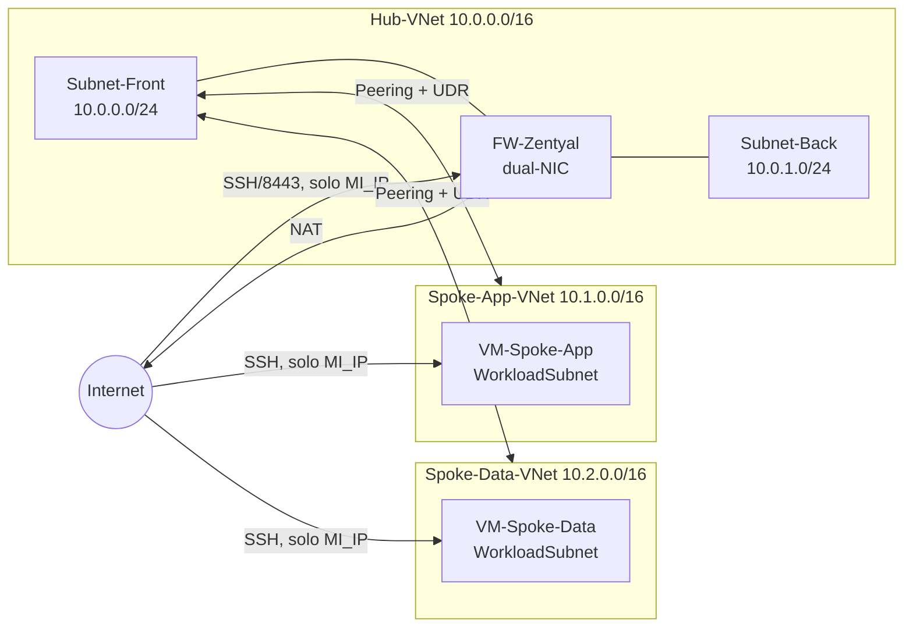

[← Introducción y Arquitectura](01-Introduccion-y-Arquitectura.md) | **Siguiente:** [Parte B — Acceso Privado a PaaS →](03-Parte-B-Acceso-Privado-PaaS.md)

# 2. Parte A — Arquitectura Hub-and-Spoke con Zentyal

## 2.1 Qué vas a construir en esta parte



Al final de esta parte tendrás: 3 VNets, **tres** VMs (Zentyal como firewall/IDS-IPS, y una VM de prueba en cada spoke), peering en ambas direcciones, rutas forzando el tráfico a través de Zentyal, reglas de firewall administradas desde el panel web de Zentyal, y evidencia de que el IDS/IPS detecta un escaneo de puertos entre spokes.

---

## 2.2 Paso 1 — Crear la VNet Hub y sus subredes

```bash
az network vnet create \
  --resource-group RG-Sesion4-Redes \
  --name Hub-VNet \
  --address-prefix 10.0.0.0/16 \
  --location eastus

az network vnet subnet create \
  --resource-group RG-Sesion4-Redes \
  --vnet-name Hub-VNet \
  --name Subnet-Front \
  --address-prefix 10.0.0.0/24

az network vnet subnet create \
  --resource-group RG-Sesion4-Redes \
  --vnet-name Hub-VNet \
  --name Subnet-Back \
  --address-prefix 10.0.1.0/24
```

🧪 **Checkpoint:**
```bash
az network vnet subnet list --resource-group RG-Sesion4-Redes --vnet-name Hub-VNet --output table
```

## 2.3 Paso 2 — Crear las VNets Spoke (con subred de workload en ambas)

```bash
# Spoke de aplicación
az network vnet create \
  --resource-group RG-Sesion4-Redes \
  --name Spoke-App-VNet \
  --address-prefix 10.1.0.0/16 \
  --subnet-name WorkloadSubnet \
  --subnet-prefix 10.1.0.0/24 \
  --location eastus

az network vnet subnet create \
  --resource-group RG-Sesion4-Redes \
  --vnet-name Spoke-App-VNet \
  --name AppIntegrationSubnet \
  --address-prefix 10.1.1.0/24

az network vnet subnet create \
  --resource-group RG-Sesion4-Redes \
  --vnet-name Spoke-App-VNet \
  --name AppGatewaySubnet \
  --address-prefix 10.1.2.0/24

# Spoke de datos — ahora también con su propia WorkloadSubnet para la VM de prueba
az network vnet create \
  --resource-group RG-Sesion4-Redes \
  --name Spoke-Data-VNet \
  --address-prefix 10.2.0.0/16 \
  --subnet-name WorkloadSubnet \
  --subnet-prefix 10.2.0.0/24 \
  --location eastus

az network vnet subnet create \
  --resource-group RG-Sesion4-Redes \
  --vnet-name Spoke-Data-VNet \
  --name PrivateEndpointSubnet \
  --address-prefix 10.2.1.0/24

az network vnet subnet update \
  --resource-group RG-Sesion4-Redes \
  --vnet-name Spoke-Data-VNet \
  --name PrivateEndpointSubnet \
  --disable-private-endpoint-network-policies true
```

🧪 **Checkpoint:**
```bash
az network vnet list --resource-group RG-Sesion4-Redes --output table
```
Debes ver las 3 VNets.

📸 **Captura 2.1:** en el Azure Portal, **Grupos de recursos → RG-Sesion4-Redes**, mostrando las 3 VNets creadas.

## 2.4 Paso 3 — Desplegar la VM firewall con doble tarjeta de red (para Zentyal)

Zentyal requiere, como mínimo, **2 vCPU y 2 GB de RAM** — por eso usamos `Standard_B2s` en lugar de `Standard_B1s`.

```bash
# NIC hacia Subnet-Front (interna → será "Internal" en Zentyal)
az network nic create \
  --resource-group RG-Sesion4-Redes \
  --name fw-nic-front \
  --vnet-name Hub-VNet \
  --subnet Subnet-Front

# IP pública estática para administración y salida a Internet
az network public-ip create \
  --resource-group RG-Sesion4-Redes \
  --name pip-zentyal \
  --sku Standard \
  --allocation-method Static

# NIC hacia Subnet-Back (externa → será "External" en Zentyal)
az network nic create \
  --resource-group RG-Sesion4-Redes \
  --name fw-nic-back \
  --vnet-name Hub-VNet \
  --subnet Subnet-Back \
  --public-ip-address pip-zentyal

# Habilitar IP forwarding en AMBAS NIC (a nivel de Azure)
az network nic update --resource-group RG-Sesion4-Redes --name fw-nic-front --ip-forwarding true
az network nic update --resource-group RG-Sesion4-Redes --name fw-nic-back  --ip-forwarding true
```

> ⚠️ **No te saltes el `--ip-forwarding true`.** Sin este ajuste, Azure descarta silenciosamente cualquier paquete cuyo origen o destino no sea la propia NIC, sin importar qué tan bien configures Zentyal por dentro.

```bash
# Reemplaza <CONTRASEÑA_SEGURA> por una contraseña real que tú elijas y recuerdes
az vm create \
  --resource-group RG-Sesion4-Redes \
  --name FW-Zentyal \
  --image Ubuntu2404 \
  --size Standard_B2s \
  --nics fw-nic-back fw-nic-front \
  --admin-username azureuser \
  --authentication-type password \
  --admin-password '<CONTRASEÑA_SEGURA>'
```

> ℹ️ La primera NIC en la lista (`fw-nic-back`) se convierte en la interfaz primaria del sistema operativo. Lo confirmarás con `ip -br a` en el siguiente paso.

🧪 **Checkpoint:**
```bash
az vm show --resource-group RG-Sesion4-Redes --name FW-Zentyal --show-details --query "{estado:powerState, ipPublica:publicIps}" --output table
```

Guarda la IP privada de la interfaz Front — la necesitarás como *next-hop* de las rutas más adelante:

```bash
FW_FRONT_IP=$(az network nic show \
  --resource-group RG-Sesion4-Redes \
  --name fw-nic-front \
  --query "ipConfigurations[0].privateIPAddress" -o tsv)
echo "IP del firewall en Subnet-Front (next-hop UDR): $FW_FRONT_IP"
```

## 2.5 Paso 4 — Restringir el acceso administrativo a Zentyal a tu IP

Por defecto, `az vm create` abre el puerto 22 a **todo Internet**. Además necesitamos abrir el puerto **8443** (panel web de Zentyal), pero también restringido a tu IP.

```bash
NSG_ZEN=$(az network nsg list --resource-group RG-Sesion4-Redes --query "[?contains(name,'Zentyal')].name" -o tsv)
echo "NSG de Zentyal: $NSG_ZEN"

az network nsg rule delete \
  --resource-group RG-Sesion4-Redes \
  --nsg-name "$NSG_ZEN" \
  --name default-allow-ssh

az network nsg rule create \
  --resource-group RG-Sesion4-Redes \
  --nsg-name "$NSG_ZEN" \
  --name Allow-SSH-MiIP \
  --priority 100 \
  --direction Inbound \
  --access Allow \
  --protocol Tcp \
  --destination-port-ranges 22 \
  --source-address-prefixes <MI_IP>/32

az network nsg rule create \
  --resource-group RG-Sesion4-Redes \
  --nsg-name "$NSG_ZEN" \
  --name Allow-WebAdmin-MiIP \
  --priority 110 \
  --direction Inbound \
  --access Allow \
  --protocol Tcp \
  --destination-port-ranges 8443 \
  --source-address-prefixes <MI_IP>/32 \
  --description "Panel de administración de Zentyal, sustituto de Bastion"
```

> ⚠️ Si tu IP pública cambia durante el laboratorio (`curl ifconfig.me` para confirmar), usa `az network nsg rule update` con el mismo nombre de regla y tu nueva IP.

🧪 **Checkpoint:** confirma que puedes conectarte por SSH: `ssh azureuser@<IP_PUBLICA_ZENTYAL>`.

## 2.6 Paso 5 — Preparar el sistema operativo antes de instalar Zentyal

Todo lo siguiente se ejecuta **dentro de la VM `FW-Zentyal`**, por SSH.

### 2.6.1 Verificar la nomenclatura de las interfaces

El instalador de Zentyal 8.1 requiere interfaces con prefijo `eth` (`eth0`, `eth1`). Ubuntu 24.04 usa por defecto nombres predecibles distintos.

```bash
ip -br a
```

| Resultado | Acción |
|---|---|
| Ves `eth0`, `eth1` | Continúa a la sección 2.6.2 |
| Ves nombres como `enP1s1`, `enp3s0` | Aplica el ajuste de GRUB de abajo |

Si tus interfaces **no** tienen prefijo `eth`:

```bash
sudo sed -i 's/GRUB_CMDLINE_LINUX_DEFAULT=".*"/GRUB_CMDLINE_LINUX_DEFAULT="net.ifnames=0 biosdevname=0"/' /etc/default/grub
sudo update-grub
sudo reboot
```

Espera unos 30 segundos, vuelve a conectarte por SSH y repite `ip -br a` para confirmar `eth0`/`eth1`.

📸 **Captura 2.2:** la salida de `ip -br a` mostrando las interfaces ya con prefijo `eth`.

### 2.6.2 Actualizar todos los paquetes

El instalador de Zentyal **aborta** si hay actualizaciones pendientes.

```bash
sudo apt update
sudo apt dist-upgrade -y
sudo dpkg --configure -a
sudo apt install -f
apt list --upgradable 2>/dev/null   # debe mostrar solo "Listing..." (sin paquetes pendientes)
```

## 2.7 Paso 6 — Instalar Zentyal Server 8.1

```bash
wget -U "Mozilla/5.0 (Windows NT 10.0; Win64; x64) Chrome/120.0.0.0" \
  -O zentyal_installer_8.1.sh \
  https://raw.githubusercontent.com/malevarro/Cloud-Lab/main/Firewall/zentyal_installer_8.1.sh

# Revisa el script antes de ejecutarlo (buena práctica de seguridad: nunca ejecutes
# un script descargado de Internet sin mirar primero qué hace)
less zentyal_installer_8.1.sh
# (presiona "q" para salir del visor)

chmod +x zentyal_installer_8.1.sh
sudo ./zentyal_installer_8.1.sh
```

Cuando pregunte `Do you want to install the Zentyal Graphical environment? (n|y)`, responde **`n`** (no necesitas interfaz gráfica local; administrarás todo por el panel web). La instalación tarda entre **10 y 20 minutos**.

Al finalizar, verás un mensaje similar a:
```
Installation complete, you can access the Zentyal Web Interface at:
  * https://<zentyal-ip-address>:8443/
```

🧪 **Checkpoint:** ese mensaje de éxito debe aparecer sin errores previos. Si el instalador se detuvo con un error, revisa la tabla de solución de problemas en la Parte 04 antes de continuar.

## 2.8 Paso 7 — Asistente de configuración inicial de Zentyal

1. Abre tu navegador en `https://<IP_PUBLICA_ZENTYAL>:8443`.
2. Verás una advertencia de certificado no confiable (es un certificado autofirmado, esperado). Acepta continuar ("Avanzado" → "Continuar de todos modos", según tu navegador).
3. Inicia sesión con el usuario `azureuser` y la contraseña que definiste al crear la VM.

📸 **Captura 2.3:** la pantalla de login del panel de Zentyal.

4. En el asistente de selección de módulos ("Configuración inicial"), marca:

| Módulo | Función |
|---|---|
| **Firewall** | Filtrado de paquetes (requerido) |
| **Gateway** | Enrutamiento y NAT hacia Internet (requerido) |
| **IDS/IPS** | Detección/prevención con Suricata (requerido) |
| **Network** | Configuración de interfaces (requerido) |

5. Haz clic en **"Instalar"** y espera a que Zentyal termine de configurar los módulos seleccionados.

> ⚠️ **No reinicies el servidor** en este punto sin haber completado la configuración de red del siguiente paso.

## 2.9 Paso 8 — Configurar las interfaces en Zentyal

Ve a **Network → Interfaces**. Verifica primero, por SSH (`ip -br a`), cuál interfaz (`eth0` o `eth1`) corresponde a cuál NIC de Azure, y asigna los roles:

| Interfaz SO | NIC Azure | Rol en Zentyal | Subred |
|---|---|---|---|
| `eth0` | `fw-nic-back` (primaria) | **External** | Subnet-Back 10.0.1.0/24 |
| `eth1` | `fw-nic-front` | **Internal** | Subnet-Front 10.0.0.0/24 |

Guarda los cambios: **Save Changes → Apply**.

📸 **Captura 2.4:** la pantalla de **Network → Interfaces** mostrando `eth0 = External` y `eth1 = Internal`.

## 2.10 Paso 9 — Configurar el Firewall en Zentyal

> Recuerda: después de cada bloque de cambios en Zentyal, haz clic en **Save Changes → Apply** en la parte superior del panel.

### 2.10.1 Habilitar módulos

**Module Status** → confirma que **Firewall** y **Gateway** estén activados (deberían estarlo si los marcaste en el asistente inicial).

### 2.10.2 NAT / Masquerade

**Gateway → NAT Rules** → crea una nueva regla: **Interface** = `eth0` (External), **Masquerade** = habilitado. Esto traduce las IPs privadas de los spokes hacia la IP pública de Zentyal cuando salen a Internet.

### 2.10.3 Reglas para tráfico desde redes internas

Ve a **Firewall → Packet Filter → Filtering rules for traffic coming from internal networks** y crea, **en este orden**:

| # | Nombre | Origen | Destino | Protocolo | Puerto | Acción |
|---|---|---|---|---|---|---|
| 1 | Allow-Established | Any | Any | Any | Any | **Allow** |
| 2 | Allow-ICMP-Spokes | 10.1.0.0/16, 10.2.0.0/16 | Any | ICMP | Any | **Allow** |
| 3 | Allow-DNS-Spokes | 10.1.0.0/16, 10.2.0.0/16 | Any | UDP | 53 | **Allow** |
| 4 | Allow-HTTP-Spokes | 10.1.0.0/16, 10.2.0.0/16 | Any | TCP | 80 | **Allow** |
| 5 | Allow-HTTPS-Spokes | 10.1.0.0/16, 10.2.0.0/16 | Any | TCP | 443 | **Allow** |
| 6 | Allow-SSH-entre-Spokes | 10.1.0.0/16, 10.2.0.0/16 | 10.1.0.0/16, 10.2.0.0/16 | TCP | 22 | **Allow** |
| 7 | Deny-All | Any | Any | Any | Any | **Deny** |

> ℹ️ En la Parte B agregaremos una regla `Allow-App-to-Datos` (puerto 1433 o 443, según tu opción de datos) **antes** de `Deny-All`. Esa es precisamente la microsegmentación entre el tier de aplicación y el tier de datos que estudiaste en la teoría.

### 2.10.4 Reglas para tráfico desde redes externas

Ve a **Firewall → Packet Filter → Filtering rules for traffic coming from external networks**:

| # | Nombre | Origen | Destino | Protocolo | Puerto | Acción |
|---|---|---|---|---|---|---|
| 1 | Allow-SSH-Admin | Any | FW-Zentyal | TCP | 22 | **Allow** |
| 2 | Allow-WebAdmin | Any | FW-Zentyal | TCP | 8443 | **Allow** |
| 3 | Deny-All-External | Any | Any | Any | Any | **Deny** |

> ℹ️ Estas reglas son adicionales al NSG de Azure que ya restringe el acceso a `MI_IP` (Paso 4) — son dos capas de defensa independientes: el NSG a nivel de plataforma, y el firewall de Zentyal a nivel de sistema operativo.

📸 **Captura 2.5:** la tabla de reglas de **Filtering rules for traffic coming from internal networks**, completa.

### 2.10.5 Verificar las reglas por SSH

```bash
sudo iptables -S
sudo iptables -t nat -S
```

🧪 **Checkpoint:** debes ver reglas `-A fnort-i-...` (la nomenclatura interna de Zentyal) reflejando las reglas que configuraste en el panel, y una regla `MASQUERADE` en la tabla `nat`.

## 2.11 Paso 10 — Configurar el IDS/IPS (Suricata) en Zentyal

### 2.11.1 Habilitar el módulo

**Module Status** → confirma que **IDS/IPS** esté activado.

### 2.11.2 Interfaces monitoreadas

**IDS/IPS → Configuration** → selecciona `eth1` (Internal, tráfico de los spokes) y `eth0` (External, egreso). Dejar el modo en **IDS** (solo detecta y alerta) para esta guía — el modo **IPS (Inline)**, que además bloquea, queda como ejercicio opcional para quien quiera profundizar.

### 2.11.3 Rulesets de Suricata

**IDS/IPS → Rules** → habilita:

| Ruleset | Detecta |
|---|---|
| `emerging-scan` | Escaneos de puertos (nmap) |
| `emerging-policy` | Servicios/puertos no autorizados |
| `emerging-shellcode` | Shells inversas (netcat) |

📸 **Captura 2.6:** la pantalla de **IDS/IPS → Rules** mostrando los rulesets habilitados.

### 2.11.4 Verificar Suricata por SSH

```bash
sudo systemctl status suricata
```

🧪 **Checkpoint:** debe mostrar `active (running)`. Deja esta sesión SSH abierta y en una segunda terminal ejecuta, cuando llegues a las pruebas del paso 2.15:

```bash
sudo tail -f /var/log/suricata/fast.log
```

---

## 2.12 Paso 11 — Desplegar las dos VMs de prueba (una por spoke)

```bash
# VM de prueba en el spoke de aplicación
az vm create \
  --resource-group RG-Sesion4-Redes \
  --name VM-Spoke-App \
  --image Ubuntu2404 \
  --size Standard_B1ls \
  --vnet-name Spoke-App-VNet \
  --subnet WorkloadSubnet \
  --admin-username azureuser \
  --authentication-type password \
  --admin-password '<CONTRASEÑA_SEGURA>'

# VM de prueba en el spoke de datos
az vm create \
  --resource-group RG-Sesion4-Redes \
  --name VM-Spoke-Data \
  --image Ubuntu2404 \
  --size Standard_B1ls \
  --vnet-name Spoke-Data-VNet \
  --subnet WorkloadSubnet \
  --admin-username azureuser \
  --authentication-type password \
  --admin-password '<CONTRASEÑA_SEGURA>'
```

Restringe el SSH de ambas a tu IP, igual que hiciste con Zentyal:

```bash
for VM in VM-Spoke-App VM-Spoke-Data; do
  NSG_VM=$(az network nsg list --resource-group RG-Sesion4-Redes --query "[?contains(name,'$VM')].name" -o tsv)
  az network nsg rule delete --resource-group RG-Sesion4-Redes --nsg-name "$NSG_VM" --name default-allow-ssh
  az network nsg rule create \
    --resource-group RG-Sesion4-Redes \
    --nsg-name "$NSG_VM" \
    --name Allow-SSH-MiIP \
    --priority 100 \
    --direction Inbound \
    --access Allow \
    --protocol Tcp \
    --destination-port-ranges 22 \
    --source-address-prefixes <MI_IP>/32
done
```

🧪 **Checkpoint:** confirma que puedes conectarte por SSH a ambas VMs desde tu equipo.

📸 **Captura 2.7:** dos conexiones SSH exitosas, una a `VM-Spoke-App` y otra a `VM-Spoke-Data`.

## 2.13 Paso 12 — VNet Peering (Hub ↔ cada Spoke)

```bash
az network vnet peering create \
  --resource-group RG-Sesion4-Redes --name Hub-to-SpokeApp \
  --vnet-name Hub-VNet --remote-vnet Spoke-App-VNet \
  --allow-vnet-access true --allow-forwarded-traffic true

az network vnet peering create \
  --resource-group RG-Sesion4-Redes --name SpokeApp-to-Hub \
  --vnet-name Spoke-App-VNet --remote-vnet Hub-VNet \
  --allow-vnet-access true --allow-forwarded-traffic true

az network vnet peering create \
  --resource-group RG-Sesion4-Redes --name Hub-to-SpokeData \
  --vnet-name Hub-VNet --remote-vnet Spoke-Data-VNet \
  --allow-vnet-access true --allow-forwarded-traffic true

az network vnet peering create \
  --resource-group RG-Sesion4-Redes --name SpokeData-to-Hub \
  --vnet-name Spoke-Data-VNet --remote-vnet Hub-VNet \
  --allow-vnet-access true --allow-forwarded-traffic true
```

🧪 **Checkpoint:**
```bash
az network vnet peering list --resource-group RG-Sesion4-Redes --vnet-name Hub-VNet --output table
```
`PeeringState` debe decir `Connected` en ambas filas.

## 2.14 Paso 13 — Rutas (UDR) forzando el tráfico por Zentyal

```bash
# Tabla de rutas para cada spoke
az network route-table create --resource-group RG-Sesion4-Redes --name RT-Spoke-App
az network route-table create --resource-group RG-Sesion4-Redes --name RT-Spoke-Data

# Rutas del spoke de aplicación
az network route-table route create \
  --resource-group RG-Sesion4-Redes --route-table-name RT-Spoke-App \
  --name Default-via-Zentyal --address-prefix 0.0.0.0/0 \
  --next-hop-type VirtualAppliance --next-hop-ip-address "$FW_FRONT_IP"

az network route-table route create \
  --resource-group RG-Sesion4-Redes --route-table-name RT-Spoke-App \
  --name To-SpokeData --address-prefix 10.2.0.0/16 \
  --next-hop-type VirtualAppliance --next-hop-ip-address "$FW_FRONT_IP"

# Rutas del spoke de datos
az network route-table route create \
  --resource-group RG-Sesion4-Redes --route-table-name RT-Spoke-Data \
  --name Default-via-Zentyal --address-prefix 0.0.0.0/0 \
  --next-hop-type VirtualAppliance --next-hop-ip-address "$FW_FRONT_IP"

az network route-table route create \
  --resource-group RG-Sesion4-Redes --route-table-name RT-Spoke-Data \
  --name To-SpokeApp --address-prefix 10.1.0.0/16 \
  --next-hop-type VirtualAppliance --next-hop-ip-address "$FW_FRONT_IP"

# Asociar cada tabla a la WorkloadSubnet de su spoke
az network vnet subnet update \
  --resource-group RG-Sesion4-Redes --vnet-name Spoke-App-VNet \
  --name WorkloadSubnet --route-table RT-Spoke-App

az network vnet subnet update \
  --resource-group RG-Sesion4-Redes --vnet-name Spoke-Data-VNet \
  --name WorkloadSubnet --route-table RT-Spoke-Data

az network vnet subnet update \
  --resource-group RG-Sesion4-Redes --vnet-name Spoke-Data-VNet \
  --name PrivateEndpointSubnet --route-table RT-Spoke-Data
```

> ℹ️ La subred `AppIntegrationSubnet` se asocia a `RT-Spoke-App` en la Parte B, cuando despliegues `VM-App` — así su tráfico hacia la capa de datos también queda inspeccionado por Zentyal, replicando exactamente la microsegmentación app→datos de la teoría.

🧪 **Checkpoint:**
```bash
az network vnet subnet show --resource-group RG-Sesion4-Redes --vnet-name Spoke-App-VNet --name WorkloadSubnet --query "routeTable.id" -o tsv
```
No debe estar vacío.

📸 **Captura 2.8:** portal → **RT-Spoke-App → Rutas**, mostrando las dos rutas configuradas.

## 2.15 Paso 14 — Validar conectividad e IDS/IPS entre spokes

### 2.15.1 Instalar herramientas de prueba en ambas VMs

Repite en **VM-Spoke-App** y en **VM-Spoke-Data** (por SSH):

```bash
sudo apt-get update
sudo apt-get install -y nmap netcat-openbsd
nmap --version
```

### 2.15.2 Prueba de conectividad básica

Desde **VM-Spoke-App**, haz ping a la IP privada de **VM-Spoke-Data** (consíguela con `az vm list-ip-addresses --resource-group RG-Sesion4-Redes --name VM-Spoke-Data -o table` desde Cloud Shell):

```bash
ping -c 4 <IP_PRIVADA_VM_SPOKE_DATA>
```

🧪 **Checkpoint:** un TTL de aproximadamente 62 (en lugar de 64) indica que el paquete pasó por **dos saltos** — evidencia de que atravesó Zentyal en lugar de ir directo.

📸 **Captura 2.9:** el resultado del `ping`, señalando el valor de TTL observado.

### 2.15.3 Prueba de detección por el IDS (nmap)

En una ventana aparte, conéctate por SSH a `FW-Zentyal` y deja corriendo el monitor de alertas:

```bash
sudo tail -f /var/log/suricata/fast.log
```

Desde **VM-Spoke-App**, lanza un escaneo de puertos contra **VM-Spoke-Data**:

```bash
sudo nmap -sS -p 22,80,443,3389 <IP_PRIVADA_VM_SPOKE_DATA>
```

🧪 **Checkpoint:** en la ventana de `fast.log` en Zentyal deben aparecer líneas con alertas tipo `ET SCAN ...` casi de inmediato.

📸 **Captura 2.10:** la ventana de `fast.log` mostrando las alertas de escaneo generadas por tu prueba `nmap`.

### 2.15.4 Prueba de salida a Internet (verificar NAT)

Desde **VM-Spoke-App**:

```bash
curl ifconfig.me
```

🧪 **Checkpoint clave:** debe devolver la **IP pública de Zentyal** (`pip-zentyal`), no una IP propia de la VM — confirma que el NAT/masquerade está funcionando y que todo el egreso pasa por el firewall.

📸 **Captura 2.11:** el resultado de `curl ifconfig.me` desde `VM-Spoke-App`, con una nota confirmando que coincide con la IP de Zentyal.

## 2.16 Paso 15 — Microsegmentación con NSG y ASG en la subred de integración

```bash
az network asg create \
  --resource-group RG-Sesion4-Redes \
  --name asg-app-sesion4

az network nsg create \
  --resource-group RG-Sesion4-Redes \
  --name NSG-AppIntegration

az network nsg rule create \
  --resource-group RG-Sesion4-Redes \
  --nsg-name NSG-AppIntegration \
  --name Allow-App-to-Datos \
  --priority 100 \
  --direction Outbound \
  --access Allow \
  --protocol Tcp \
  --destination-port-ranges 1433 443 \
  --destination-address-prefixes 10.2.0.0/16

az network nsg rule create \
  --resource-group RG-Sesion4-Redes \
  --nsg-name NSG-AppIntegration \
  --name Allow-Https-Outbound \
  --priority 110 \
  --direction Outbound \
  --access Allow \
  --protocol Tcp \
  --destination-port-ranges 443 \
  --destination-address-prefixes Internet

az network nsg rule create \
  --resource-group RG-Sesion4-Redes \
  --nsg-name NSG-AppIntegration \
  --name Deny-All-Outbound \
  --priority 4000 \
  --direction Outbound \
  --access Deny \
  --protocol '*' \
  --destination-port-ranges '*' \
  --destination-address-prefixes '*'

az network vnet subnet update \
  --resource-group RG-Sesion4-Redes \
  --vnet-name Spoke-App-VNet \
  --name AppIntegrationSubnet \
  --network-security-group NSG-AppIntegration
```

🧪 **Checkpoint:**
```bash
az network nsg rule list --resource-group RG-Sesion4-Redes --nsg-name NSG-AppIntegration --output table
```

📸 **Captura 2.12:** portal en **NSG-AppIntegration → Reglas de seguridad de salida**, mostrando las 3 reglas.

---

## 2.17 Resumen de lo construido en la Parte A

| Elemento | Estado al cierre de esta parte |
|---|---|
| 3 VNets (Hub, Spoke-App, Spoke-Data) | ✅ Creadas, cada spoke con su propia `WorkloadSubnet` |
| FW-Zentyal | ✅ Corriendo, con firewall, NAT e IDS/IPS (Suricata) activos |
| VM-Spoke-App y VM-Spoke-Data | ✅ Corriendo, accesibles solo desde `MI_IP` |
| Peering Hub↔Spokes | ✅ Conectado, con forwarded traffic |
| UDR (RT-Spoke-App, RT-Spoke-Data) | ✅ Forzando el tráfico por Zentyal |
| IDS/IPS | ✅ Verificado: detecta escaneo `nmap` entre spokes |
| NSG-AppIntegration | ✅ Deny-by-default con 2 excepciones documentadas |

---

## 🧩 Preguntas de repaso

1. ¿Por qué Zentyal exige un mínimo de 2 vCPU/2 GB de RAM, y qué habría pasado si hubieras intentado instalarlo sobre un `Standard_B1s`?
2. Explica la diferencia entre las reglas de firewall que configuraste **dentro de Zentyal** (sección 2.10) y las reglas de **NSG de Azure** que configuraste en el Paso 4. ¿Por qué tener ambas capas es más seguro que tener solo una?
3. En la prueba de la sección 2.15.3, ¿qué habría pasado si hubieras dejado el IDS/IPS en modo **IDS** en lugar de **IPS (Inline)**, y por qué esta guía eligió modo IDS para el ejercicio principal?
4. El TTL observado en la sección 2.15.2 fue clave para confirmar que el tráfico pasó por Zentyal. ¿Qué otro método, usado en la guía, confirma lo mismo sin depender de interpretar el TTL?

---

[← Introducción y Arquitectura](01-Introduccion-y-Arquitectura.md) | **Siguiente:** [Parte B — Acceso Privado a PaaS →](03-Parte-B-Acceso-Privado-PaaS.md)
