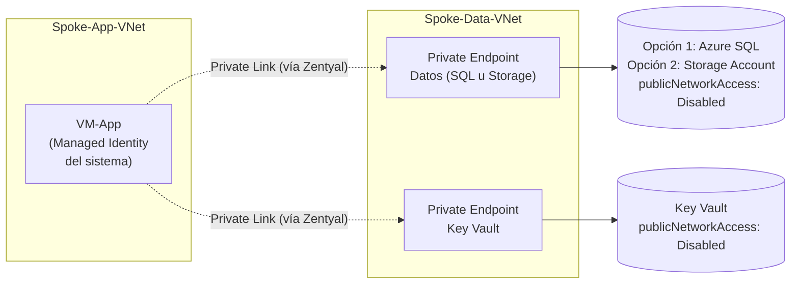

[← Parte A — Hub-Spoke y Zentyal](02-Parte-A-Hub-Spoke-NVA.md) | **Siguiente:** [Cierre y Validación →](04-Cierre-Validacion-Limpieza.md)

# 3. Parte B — Acceso Privado a Servicios PaaS

## 3.1 Qué vas a construir en esta parte



> ℹ️ **Sobre `VM-App`:** esta parte usa una máquina virtual con identidad administrada en lugar de App Service. En este momento, App Service presenta **restricciones de capacidad** en varias regiones para cuentas Free Tier/de prueba (el aprovisionamiento falla o queda en cola indefinidamente sin completarse). Una VM logra exactamente el mismo objetivo de aprendizaje — una identidad administrada que autentica sin contraseñas contra Key Vault y contra la capa de datos — sin depender de un servicio con disponibilidad actualmente inestable. Es el mismo tipo de sustitución que ya usaste en la Sesión 1.

> ⚠️ **Antes de empezar, decide tu opción de datos.** Intenta primero la **Opción 1 (Azure SQL)** en el Paso 16. Si el comando de creación falla con un error de cuota, de registro de proveedor (`SubscriptionNotRegistered`) o de disponibilidad de SKU, no insistas — pasa directamente a la **Opción 2 (Storage Account)**. Ambas cumplen el mismo objetivo de aprendizaje; documenta en tu entrega cuál usaste y, si probaste la Opción 1 primero, incluye una captura del error que te hizo cambiar de opción.

---

## 3.2 Paso 15 — Zona(s) DNS privada(s)

Crea **solo** la zona correspondiente a tu opción, más la de Key Vault (que siempre se necesita):

```bash
# Solo si usarás Opción 1 (Azure SQL)
az network private-dns zone create \
  --resource-group RG-Sesion4-Redes \
  --name privatelink.database.windows.net

# Solo si usarás Opción 2 (Storage Account)
az network private-dns zone create \
  --resource-group RG-Sesion4-Redes \
  --name privatelink.blob.core.windows.net

# Siempre (Key Vault)
az network private-dns zone create \
  --resource-group RG-Sesion4-Redes \
  --name privatelink.vaultcore.azure.net
```

Enlaza la(s) zona(s) que creaste a las 3 VNets. Ejemplo si elegiste **Opción 1**:

```bash
for VNET in Hub-VNet Spoke-App-VNet Spoke-Data-VNet; do
  az network private-dns link vnet create \
    --resource-group RG-Sesion4-Redes \
    --zone-name privatelink.database.windows.net \
    --name "link-sql-$VNET" \
    --virtual-network "$VNET" \
    --registration-enabled false

  az network private-dns link vnet create \
    --resource-group RG-Sesion4-Redes \
    --zone-name privatelink.vaultcore.azure.net \
    --name "link-kv-$VNET" \
    --virtual-network "$VNET" \
    --registration-enabled false
done
```

> Si elegiste **Opción 2**, reemplaza `privatelink.database.windows.net` por `privatelink.blob.core.windows.net` en el bloque anterior.

🧪 **Checkpoint:**
```bash
az network private-dns link vnet list --resource-group RG-Sesion4-Redes --zone-name <TU_ZONA> --output table
```
Debes ver 3 enlaces, todos con `VirtualNetworkLinkState = Completed`.

Define tu sufijo único (lo usarás en todos los nombres globales de esta parte):

```bash
MI_SUFIJO="mvr07"   # <-- cámbialo por el tuyo, corto y en minúsculas
```

---

## 3.3 Opción 1 — Azure SQL Database

> Si vas a usar la **Opción 2 (Storage Account)**, salta a la sección 3.4.

### 3.3.1 Paso 16a — Crear el servidor y la base de datos

```bash
az sql server create \
  --resource-group RG-Sesion4-Redes \
  --name "sql-sesion4-$MI_SUFIJO" \
  --location eastus \
  --enable-ad-only-auth \
  --external-admin-principal-type User \
  --external-admin-name "$(az ad signed-in-user show --query userPrincipalName -o tsv)" \
  --external-admin-sid "$(az ad signed-in-user show --query id -o tsv)"

az sql db create \
  --resource-group RG-Sesion4-Redes \
  --server "sql-sesion4-$MI_SUFIJO" \
  --name db-sesion4 \
  --service-objective Basic
```

> ⚠️ **Si este paso falla** con un mensaje de cuota, registro de proveedor no completado, o SKU no disponible en tu suscripción: toma una captura del error y continúa con la **Opción 2** en la sección 3.4. Es exactamente la situación que esta guía anticipa.

🧪 **Checkpoint:**
```bash
az sql db show --resource-group RG-Sesion4-Redes --server "sql-sesion4-$MI_SUFIJO" --name db-sesion4 --query "{estado:status, nivel:currentServiceObjectiveName}" --output table
```

### 3.3.2 Paso 17a — Deshabilitar el acceso público

```bash
az sql server update \
  --resource-group RG-Sesion4-Redes \
  --name "sql-sesion4-$MI_SUFIJO" \
  --set publicNetworkAccess="Disabled"
```

### 3.3.3 Paso 18a — Crear el Private Endpoint

```bash
SQL_SERVER_ID=$(az sql server show \
  --resource-group RG-Sesion4-Redes \
  --name "sql-sesion4-$MI_SUFIJO" \
  --query id -o tsv)

az network private-endpoint create \
  --resource-group RG-Sesion4-Redes \
  --name pe-datos-sesion4 \
  --vnet-name Spoke-Data-VNet \
  --subnet PrivateEndpointSubnet \
  --private-connection-resource-id "$SQL_SERVER_ID" \
  --group-id sqlServer \
  --connection-name conexion-datos-sesion4

az network private-endpoint dns-zone-group create \
  --resource-group RG-Sesion4-Redes \
  --endpoint-name pe-datos-sesion4 \
  --name datos-dns-zone-group \
  --private-dns-zone privatelink.database.windows.net \
  --zone-name sql
```

🧪 **Checkpoint:**
```bash
az network private-endpoint show --resource-group RG-Sesion4-Redes --name pe-datos-sesion4 --query "provisioningState" -o tsv
```
Debe decir `Succeeded`. Continúa en la sección **3.5**.

---

## 3.4 Opción 2 — Azure Storage Account

> Usa esta opción si la Opción 1 falló por cuota, o si tu docente indicó que la usaras directamente.

### 3.4.1 Paso 16b — Crear el Storage Account

```bash
az storage account create \
  --resource-group RG-Sesion4-Redes \
  --name "stsesion4$MI_SUFIJO" \
  --location eastus \
  --sku Standard_LRS \
  --kind StorageV2 \
  --min-tls-version TLS1_2 \
  --allow-blob-public-access false

# Crea un contenedor de blobs de prueba (usando tu propia identidad, vía Entra)
az storage container create \
  --account-name "stsesion4$MI_SUFIJO" \
  --name datos-sesion4 \
  --auth-mode login
```

> ℹ️ **`--allow-blob-public-access false`** deshabilita el acceso anónimo a nivel de cuenta desde el momento de la creación — el mismo principio de "sin acceso público por defecto" que aplicaste a SQL en la Opción 1.

🧪 **Checkpoint:**
```bash
az storage account show --resource-group RG-Sesion4-Redes --name "stsesion4$MI_SUFIJO" --query "{estado:provisioningState, accesoPublico:allowBlobPublicAccess}" --output table
```

### 3.4.2 Paso 17b — Deshabilitar el acceso público de red

```bash
az storage account update \
  --resource-group RG-Sesion4-Redes \
  --name "stsesion4$MI_SUFIJO" \
  --public-network-access Disabled
```

### 3.4.3 Paso 18b — Crear el Private Endpoint (subrecurso `blob`)

```bash
ST_ID=$(az storage account show --resource-group RG-Sesion4-Redes --name "stsesion4$MI_SUFIJO" --query id -o tsv)

az network private-endpoint create \
  --resource-group RG-Sesion4-Redes \
  --name pe-datos-sesion4 \
  --vnet-name Spoke-Data-VNet \
  --subnet PrivateEndpointSubnet \
  --private-connection-resource-id "$ST_ID" \
  --group-id blob \
  --connection-name conexion-datos-sesion4

az network private-endpoint dns-zone-group create \
  --resource-group RG-Sesion4-Redes \
  --endpoint-name pe-datos-sesion4 \
  --name datos-dns-zone-group \
  --private-dns-zone privatelink.blob.core.windows.net \
  --zone-name blob
```

🧪 **Checkpoint:**
```bash
az network private-endpoint show --resource-group RG-Sesion4-Redes --name pe-datos-sesion4 --query "provisioningState" -o tsv
```
Debe decir `Succeeded`.

📸 **Captura 3.1:** en el portal, abre **pe-datos-sesion4 → Configuración DNS** y captura la IP privada asignada (dentro de `10.2.1.0/24`), junto con una nota indicando qué opción (1 o 2) elegiste.

---

## 3.5 Paso 19 — Key Vault y su Private Endpoint (siempre se hace, ambas opciones)

```bash
az keyvault create \
  --resource-group RG-Sesion4-Redes \
  --name "kv-sesion4-$MI_SUFIJO" \
  --location eastus \
  --enable-rbac-authorization true \
  --public-network-access Disabled

KV_ID=$(az keyvault show --resource-group RG-Sesion4-Redes --name "kv-sesion4-$MI_SUFIJO" --query id -o tsv)

az network private-endpoint create \
  --resource-group RG-Sesion4-Redes \
  --name pe-kv-sesion4 \
  --vnet-name Spoke-Data-VNet \
  --subnet PrivateEndpointSubnet \
  --private-connection-resource-id "$KV_ID" \
  --group-id vault \
  --connection-name conexion-kv-sesion4

az network private-endpoint dns-zone-group create \
  --resource-group RG-Sesion4-Redes \
  --endpoint-name pe-kv-sesion4 \
  --name kv-dns-zone-group \
  --private-dns-zone privatelink.vaultcore.azure.net \
  --zone-name vault
```

🧪 **Checkpoint:** `provisioningState = Succeeded` para `pe-kv-sesion4`.

📸 **Captura 3.2:** el Key Vault en el portal, pestaña **Redes**, mostrando `Acceso de red público: Deshabilitado`.

## 3.6 Paso 20 — Probar el acceso privado desde VM-Spoke-App

Como el acceso público está deshabilitado, cualquier prueba debe hacerse **desde dentro de la VNet**. Usa `VM-Spoke-App` (la VM de prueba que desplegaste en la Parte A).

Date permiso temporal sobre Key Vault:
```bash
MI_OBJECT_ID=$(az ad signed-in-user show --query id -o tsv)
az role assignment create --assignee "$MI_OBJECT_ID" --role "Key Vault Secrets Officer" --scope "$KV_ID"
```

Conéctate por SSH a `VM-Spoke-App` e instala Azure CLI:

```bash
ssh azureuser@<IP_PUBLICA_VM_SPOKE_APP>
curl -sL https://aka.ms/InstallAzureCLIDeb | sudo bash
az login
```

Prueba de Key Vault (siempre):
```bash
az keyvault secret set \
  --vault-name "kv-sesion4-<TU_SUFIJO>" \
  --name secreto-prueba \
  --value "Este secreto solo es alcanzable por la red privada"

nslookup kv-sesion4-<TU_SUFIJO>.vault.azure.net
```

Si usaste **Opción 1 (SQL)**, valida además:
```bash
nslookup sql-sesion4-<TU_SUFIJO>.database.windows.net
```

Si usaste **Opción 2 (Storage)**, valida además:
```bash
# Otorga a tu propio usuario el rol para poder probar
az role assignment create --assignee "$(az ad signed-in-user show --query id -o tsv)" \
  --role "Storage Blob Data Contributor" --scope "$ST_ID"

az storage blob upload \
  --account-name "stsesion4<TU_SUFIJO>" \
  --container-name datos-sesion4 \
  --name prueba.txt \
  --data "Este blob solo es alcanzable por la red privada" \
  --auth-mode login

nslookup stsesion4<TU_SUFIJO>.blob.core.windows.net
```

🧪 **Checkpoint:** todos los `nslookup` deben resolver a IPs dentro de `10.2.1.0/24`, **no** a IPs públicas.

📸 **Captura 3.3:** la salida exitosa del comando de escritura (secreto o blob, según tu opción) y del `nslookup` correspondiente, ambos ejecutados desde `VM-Spoke-App`.

Sal de la VM (`exit`) y vuelve a Cloud Shell para el resto de esta parte.

## 3.7 Paso 21 — Desplegar VM-App con identidad administrada

```bash
az vm create \
  --resource-group RG-Sesion4-Redes \
  --name VM-App \
  --image Ubuntu2404 \
  --size Standard_B1ls \
  --vnet-name Spoke-App-VNet \
  --subnet AppIntegrationSubnet \
  --admin-username azureuser \
  --authentication-type password \
  --admin-password '<CONTRASEÑA_SEGURA>'

# Identidad administrada asignada por el sistema — sin contraseñas ni secretos
az vm identity assign \
  --resource-group RG-Sesion4-Redes \
  --name VM-App
```

Restringe su SSH a tu IP, igual que las demás VMs:

```bash
NSG_APP=$(az network nsg list --resource-group RG-Sesion4-Redes --query "[?contains(name,'VM-App')].name" -o tsv)

az network nsg rule delete --resource-group RG-Sesion4-Redes --nsg-name "$NSG_APP" --name default-allow-ssh

az network nsg rule create \
  --resource-group RG-Sesion4-Redes \
  --nsg-name "$NSG_APP" \
  --name Allow-SSH-MiIP \
  --priority 100 \
  --direction Inbound \
  --access Allow \
  --protocol Tcp \
  --destination-port-ranges 22 \
  --source-address-prefixes <MI_IP>/32
```

> ℹ️ **Por qué una VM y no App Service:** App Service presenta en este momento restricciones de capacidad que impiden su aprovisionamiento en varias regiones/suscripciones Free Tier. Una VM con identidad administrada del sistema logra el mismo objetivo pedagógico — autenticación sin contraseñas hacia Key Vault y hacia la capa de datos — sin necesidad de una subred delegada ni de un plan de cómputo con disponibilidad inestable. Por eso `AppIntegrationSubnet` ya **no** está delegada (Paso 2 de la Parte A): ahora aloja una VM normal, como cualquier otra subred.

🧪 **Checkpoint:**
```bash
az vm identity show --resource-group RG-Sesion4-Redes --name VM-App --query principalId -o tsv
```
Debe devolver un GUID (identificador único). Si devuelve vacío, repite `az vm identity assign`.

📸 **Captura 3.4:** portal → `VM-App` → **Identidad**, mostrando `Activado` y el Object (principal) ID.

## 3.8 Paso 22 — Forzar el tráfico de VM-App por Zentyal

A diferencia de App Service (que necesitaba un paso explícito de "VNet Integration"), `VM-App` ya **nace dentro** de la VNet — solo falta asociar su subred a la tabla de rutas para que su tráfico hacia la capa de datos también pase por Zentyal.

```bash
az network vnet subnet update \
  --resource-group RG-Sesion4-Redes \
  --vnet-name Spoke-App-VNet \
  --name AppIntegrationSubnet \
  --route-table RT-Spoke-App
```

> ℹ️ Con la subred asociada a `RT-Spoke-App`, **todo** el tráfico de `VM-App` (incluido su acceso a la capa de datos) pasa por Zentyal — es la misma microsegmentación app→datos que preparaste en la Parte A, Paso 9, sección 2.10.3.

🧪 **Checkpoint:**
```bash
az network vnet subnet show --resource-group RG-Sesion4-Redes --vnet-name Spoke-App-VNet --name AppIntegrationSubnet --query "routeTable.id" -o tsv
```
No debe estar vacío.

## 3.9 Paso 23 — Otorgar acceso de la identidad de VM-App

**Key Vault (siempre):**
```bash
APP_PRINCIPAL_ID=$(az vm identity show --resource-group RG-Sesion4-Redes --name VM-App --query principalId -o tsv)

az role assignment create \
  --assignee "$APP_PRINCIPAL_ID" \
  --role "Key Vault Secrets User" \
  --scope "$KV_ID"
```

**Si usaste Opción 1 (SQL):** crea el usuario externo desde `VM-Spoke-App` (necesitas `sqlcmd`, instalado igual que en la sección 3.6):

```bash
ssh azureuser@<IP_PUBLICA_VM_SPOKE_APP>
# (si no lo instalaste antes)
curl https://packages.microsoft.com/keys/microsoft.asc | sudo tee /etc/apt/trusted.gpg.d/microsoft.asc
curl -sSL https://packages.microsoft.com/config/ubuntu/24.04/prod.list | sudo tee /etc/apt/sources.list.d/mssql-release.list
sudo apt-get update
sudo ACCEPT_EULA=Y apt-get install -y mssql-tools18 unixodbc-dev
echo 'export PATH="$PATH:/opt/mssql-tools18/bin"' >> ~/.bashrc
source ~/.bashrc

sqlcmd -S "sql-sesion4-<TU_SUFIJO>.database.windows.net" -d db-sesion4 -G -N -C
```

Dentro de `sqlcmd`:
```sql
CREATE USER [VM-App] FROM EXTERNAL PROVIDER;
ALTER ROLE db_datareader ADD MEMBER [VM-App];
ALTER ROLE db_datawriter ADD MEMBER [VM-App];
GO
```

> ℹ️ El nombre del usuario externo (`VM-App`) debe coincidir exactamente con el nombre de la identidad administrada, que por defecto toma el nombre de la VM.

**Si usaste Opción 2 (Storage):** un solo comando en Cloud Shell, sin necesidad de otra VM:
```bash
az role assignment create \
  --assignee "$APP_PRINCIPAL_ID" \
  --role "Storage Blob Data Contributor" \
  --scope "$ST_ID"
```

🧪 **Checkpoint (Opción 1):**
```sql
SELECT name, type_desc FROM sys.database_principals WHERE name = 'VM-App';
GO
```
🧪 **Checkpoint (Opción 2):**
```bash
az role assignment list --assignee "$APP_PRINCIPAL_ID" --scope "$ST_ID" --output table
```

📸 **Captura 3.5:** evidencia del checkpoint correspondiente a tu opción.

## 3.10 Paso 24 — Permitir el tráfico App → Datos en el firewall de Zentyal

A diferencia de un NVA hecho a mano, en Zentyal esta regla se agrega **desde el panel web**, no por SSH.

1. Abre `https://<IP_PUBLICA_ZENTYAL>:8443` e inicia sesión.
2. Ve a **Firewall → Packet Filter → Filtering rules for traffic coming from internal networks**.
3. Haz clic en **"Add new"** y crea la regla, **justo antes** de `Deny-All`:

| Nombre | Origen | Destino | Protocolo | Puerto | Acción |
|---|---|---|---|---|---|
| `Allow-App-to-Datos` | 10.1.1.0/24 (AppIntegrationSubnet) | 10.2.0.0/16 | TCP | 1433 (Opción 1) o 443 (Opción 2) | **Allow** |

4. Guarda: **Save Changes → Apply**.

> ⚠️ **El orden importa.** Si esta regla queda **después** de `Deny-All`, Zentyal nunca la evaluará — el `Deny-All` ya habrá descartado el paquete. Usa las flechas de reordenamiento del panel para colocarla correctamente.

📸 **Captura 3.6:** la tabla de reglas de Zentyal mostrando `Allow-App-to-Datos` ubicada antes de `Deny-All`.

## 3.11 Paso 25 — Validación end-to-end

Conéctate por SSH a `VM-App` e instala Azure CLI:

```bash
ssh azureuser@<IP_PUBLICA_VM_APP>
curl -sL https://aka.ms/InstallAzureCLIDeb | sudo bash
```

Autentícate usando la **identidad administrada de la propia VM** — sin usuario, sin contraseña, sin dispositivo de verificación:

```bash
az login --identity
```

🧪 **Checkpoint:** el comando debe confirmar el inicio de sesión mostrando el nombre de la identidad (`VM-App`), sin pedir ninguna credencial.

Ahora valida la resolución DNS privada y, con la identidad ya autenticada, el acceso real a los recursos:

```bash
# Siempre
nslookup kv-sesion4-<TU_SUFIJO>.vault.azure.net
az keyvault secret show --vault-name "kv-sesion4-<TU_SUFIJO>" --name secreto-prueba --query value -o tsv

# Si usaste Opción 1
nslookup sql-sesion4-<TU_SUFIJO>.database.windows.net

# Si usaste Opción 2
nslookup stsesion4<TU_SUFIJO>.blob.core.windows.net
az storage blob list --account-name "stsesion4<TU_SUFIJO>" --container-name datos-sesion4 --auth-mode login --output table
```

🧪 **Checkpoint:** todas las resoluciones `nslookup` deben caer dentro de `10.2.1.0/24`, y el comando de Key Vault (o de Storage) debe devolver el valor guardado — sin que hayas escrito una sola contraseña en esta sesión.

📸 **Captura 3.7:** la secuencia completa desde `VM-App`: `az login --identity` exitoso, el `nslookup` correspondiente, y la lectura del secreto o del blob.

---

## 3.12 Resumen de lo construido en la Parte B

| Elemento | Estado al cierre de esta parte |
|---|---|
| Zona(s) DNS privada(s) | ✅ Creadas y enlazadas a las 3 VNets |
| Recurso de datos (SQL o Storage) | ✅ Sin acceso público, solo vía Private Endpoint |
| Key Vault | ✅ Sin acceso público, solo vía Private Endpoint, RBAC habilitado |
| VM-App | ✅ Con identidad administrada del sistema, dentro de la VNet, tráfico forzado por Zentyal |
| Regla de firewall App→Datos | ✅ Configurada en el panel de Zentyal, antes del Deny-All |
| Acceso VM-App → datos / Key Vault | ✅ Sin contraseñas, vía `az login --identity` |

---

## 🧩 Preguntas de repaso

1. ¿Qué diferencia práctica hay entre un **Service Endpoint** y un **Private Endpoint**?
2. Si elegiste la Opción 2 (Storage Account), ¿qué tan distinto fue el proceso de otorgar acceso a la identidad comparado con la Opción 1 (SQL)? ¿Cuál te pareció más simple y por qué?
3. Explica por qué la regla `Allow-App-to-Datos` del Paso 24 debe colocarse **antes** de `Deny-All` en Zentyal, y qué principio de la teoría (Bloque 2) ilustra este orden.
4. `az login --identity` te autenticó en el Paso 25 sin pedir usuario ni contraseña. ¿Qué es exactamente lo que hace posible esa autenticación (pista: piensa en dónde vive esa identidad y cómo la VM prueba que es quien dice ser), y en qué se parece — o se diferencia — de cómo se autenticaría un App Service con Managed Identity?

---

[← Parte A — Hub-Spoke y Zentyal](02-Parte-A-Hub-Spoke-NVA.md) | **Siguiente:** [Cierre y Validación →](04-Cierre-Validacion-Limpieza.md)
