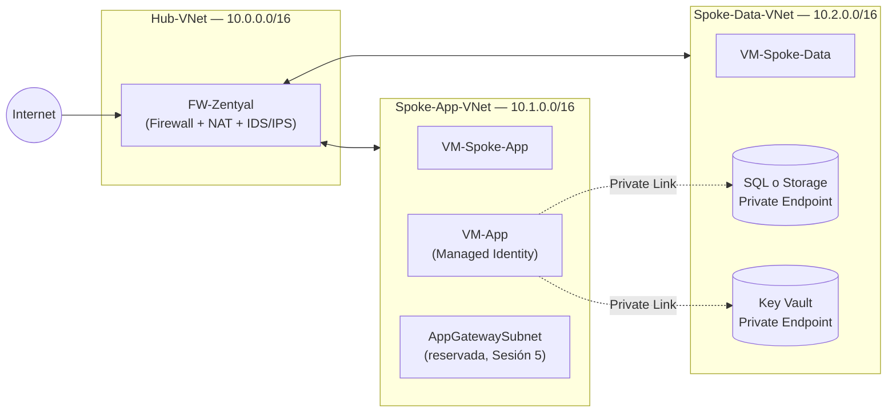

# Laboratorio — Sesión 4: Seguridad de Infraestructura, Redes y Acceso Privado

> **Curso:** Especialización en Ciberseguridad — Seguridad en la Nube
> **Institución:** Ejército Nacional de Colombia · Escuela de Comunicaciones Militares (ESCOM)
> **Docente:** Manuel Alejandro Vargas Rojas — manuelvargasrojas@cedoc.edu.co
> **Plataforma:** Microsoft Azure (cuenta Free Tier / suscripción de prueba)
> **Evaluación:** 20 % de la nota final del módulo

Bienvenido(a) al laboratorio de la Sesión 4. En esta guía vas a **construir, con tus propias manos, una arquitectura de red segura en Azure**: un firewall propio con detección de intrusos, y una aplicación con acceso completamente privado a sus datos. Esta misma arquitectura queda **en pausa (no eliminada)** al terminar, porque la vas a retomar en el laboratorio de la Sesión 5 para agregarle un Web Application Firewall y las capacidades de respuesta a incidentes.

No se asume ningún conocimiento previo de la consola de Azure más allá de lo visto en las Sesiones 1 a 3. Cada paso está descrito en detalle — si en algún punto un botón, un menú o un campo no aparece exactamente donde la guía dice, detente y pregunta en el foro del curso antes de continuar; no adivines ni omitas pasos.

---

## 1. Qué vas a construir

Una arquitectura **Hub-and-Spoke** con dos piezas de defensa trabajando juntas:

1. **Un firewall central con Zentyal Server**: firewall, NAT e **IDS/IPS (Suricata)** sobre una máquina virtual Linux, con dos VMs de prueba (una por spoke) para validar conectividad y confirmar que el IDS/IPS detecta tráfico anómalo.
2. **Una aplicación con acceso privado**: `VM-App`, con identidad administrada del sistema (en vez de App Service, que actualmente tiene restricciones de capacidad), accediendo a una capa de datos (Azure SQL, o Storage Account como alternativa) y a un almacén de secretos que **no existen en Internet**, alcanzables solo mediante *Private Endpoints*.

> 🔜 **Lo que viene en la Sesión 5:** sobre esta misma arquitectura (reactivada desde su estado de mínimo consumo) se despliega un **Web Application Firewall** que detiene en vivo ataques de inyección SQL y de comandos contra una aplicación intencionalmente vulnerable — junto con observabilidad y respuesta a incidentes.

> **Nota sobre el diseño:** en la teoría de la Sesión 4 el hub usa Azure Firewall y el acceso administrativo usa Azure Bastion. Ninguno de los dos tiene nivel gratuito en Azure, así que en **este laboratorio los sustituimos**:
> - Azure Firewall → **Zentyal Server** (firewall + NAT + IDS/IPS) sobre una VM `Standard_B2s`.
> - Azure Bastion → acceso SSH directo, protegido con una regla de NSG temporal que solo permite tu IP pública.
>
> Para la capa de datos de la Parte B se ofrecen además **dos opciones equivalentes** (Azure SQL Database o Azure Storage Account), porque en este momento algunas suscripciones Free Tier presentan limitaciones de cuota para aprovisionar Azure SQL.

---

## 2. Restricciones de la cuenta Free Tier — leer antes de empezar

- Todos los recursos de este laboratorio están dimensionados para no exceder el crédito de una cuenta Azure Free Tier / suscripción de prueba (usualmente USD 200 por 30 días).
- **Zentyal requiere `Standard_B2s`** (mínimo 2 vCPU/2 GB RAM) — no lo cambies por un tamaño menor, la instalación fallará.
- Si `az sql db create` falla por cuota, de registro de proveedor, o SKU no disponible: **no insistas**, usa la alternativa de Storage Account descrita en la Parte B.
- Si en cualquier otro paso Azure responde con un error de **cuota** o de **SKU no disponible**, repórtalo en el foro con el mensaje completo.
- **Al terminar, no elimines el grupo de recursos.** Este laboratorio cierra dejando la arquitectura **en pausa** (VMs desasignadas, red y datos intactos) para que la Sesión 5 la reactive directamente — instrucciones en la [Parte 04](04-Cierre-Validacion-Limpieza.md).

---

## 3. Prerrequisitos

- [ ] Una suscripción de Azure activa (Free Tier / prueba) y acceso al [Azure Portal](https://portal.azure.com).
- [ ] Acceso a **Azure Cloud Shell** (ícono `>_`) en modo **Bash**.
- [ ] Un cliente SSH ([MobaXterm](https://mobaxterm.mobatek.net/download.html) en Windows, o el `ssh` integrado en macOS/Linux/Windows Terminal).
- [ ] Un navegador web moderno — necesitarás acceder al panel de Zentyal por HTTPS en el puerto 8443.
- [ ] Haber completado el laboratorio de la Sesión 3 (Managed Identity y RBAC no se vuelven a explicar desde cero).
- [ ] Un editor de texto simple para ir guardando comandos y valores (IPs, contraseñas, nombres únicos).
- [ ] Conocer tu **IP pública actual** (`https://ifconfig.me` o `curl ifconfig.me`).

> ⚠️ **Sobre tu IP pública:** si trabajas desde una red que cambia de IP, y pierdes conectividad SSH que antes funcionaba, revisa primero si tu IP cambió y actualiza la regla de NSG correspondiente.

---

## 4. Mapa de la guía

| # | Archivo | Contenido |
|---|---|---|
| 1 | [01-Introduccion-y-Arquitectura.md](01-Introduccion-y-Arquitectura.md) | Arquitectura completa, nomenclatura de recursos, diagrama de referencia |
| 2 | [02-Parte-A-Hub-Spoke-NVA.md](02-Parte-A-Hub-Spoke-NVA.md) | VNets, subredes, Zentyal Server (firewall + NAT + IDS/IPS), dos VMs de prueba, peering, UDR, NSG/ASG |
| 3 | [03-Parte-B-Acceso-Privado-PaaS.md](03-Parte-B-Acceso-Privado-PaaS.md) | Key Vault, Azure SQL **o** Storage Account, Private Endpoints, `VM-App` con identidad administrada |
| 4 | [04-Cierre-Validacion-Limpieza.md](04-Cierre-Validacion-Limpieza.md) | Checklist final, troubleshooting, puesta en pausa de mínimo consumo, reactivación para la Sesión 5, preguntas de repaso generales |
| — | [RUBRICA-EVALUACION.md](RUBRICA-EVALUACION.md) | Cómo se califica el laboratorio |

> ℹ️ La antigua "Parte C" (WAF + DVWA) se trasladó por completo al laboratorio de la Sesión 5, que continúa sobre esta misma arquitectura.

Sigue los archivos **en orden**: cada parte da por hechos los recursos creados en la anterior.

---

## 5. Cómo entregar el laboratorio

1. Toma **todas** las capturas de pantalla marcadas con 📸 en cada sección. Guárdalas numeradas en una carpeta local.
2. Responde las **preguntas de repaso** (🧩) al final de cada parte.
3. Consolida **todo en un único documento PDF** (capturas + respuestas + checklist de la Parte 04, incluida la evidencia de que dejaste la arquitectura en pausa) e indica claramente qué opción de datos usaste en la Parte B.
4. Sube ese único PDF a la tarea correspondiente en **Google Classroom**.

> ❗ **No se aceptan otros formatos ni múltiples archivos.** Revisa la [rúbrica de evaluación](RUBRICA-EVALUACION.md) para ver exactamente qué se espera.

---

## 6. Convenciones usadas en esta guía

| Símbolo | Significado |
|---|---|
| 📸 | Toma una captura de pantalla en este punto exacto. |
| 🧪 | Checkpoint de verificación antes de seguir. |
| 🧩 | Pregunta de repaso, al final de cada sección. |
| ⚠️ | Advertencia: error común, riesgo de costo, o punto donde suele fallar el laboratorio. |
| `código` | Comando, nombre de recurso, o valor exacto a escribir tal cual aparece. |

Todos los comandos están escritos para **Azure Cloud Shell en Bash**.

---

**Siguiente paso:** [01-Introduccion-y-Arquitectura.md](01-Introduccion-y-Arquitectura.md)
