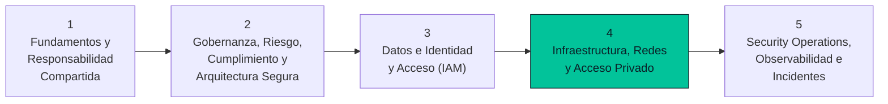

# Sesión 4 · Seguridad de Infraestructura, Redes y Acceso Privado

> **Curso:** Especialización en Ciberseguridad — Seguridad en la Nube
> **Institución:** Ejército Nacional de Colombia · Escuela de Comunicaciones Militares (ESCOM)
> **Instructor:** Manuel Alejandro Vargas Rojas — manuelvargasrojas@cedoc.edu.co
> **Modalidad:** Híbrida — bloque teórico + laboratorio guiado
> **Evaluación del laboratorio:** 20 % de la nota final del módulo

## De qué trata esta sesión

La Sesión 4 baja la especialización de lo conceptual (Sesiones 1-3: fundamentos, gobernanza, IAM) al terreno de la **red**: cómo se segmenta una infraestructura cloud, cómo se restringe el acceso administrativo, y cómo se expone una aplicación al público sin dejar sus datos alcanzables desde Internet.



**Temas centrales:**
- Arquitectura de red segura: topología **Hub-and-Spoke**, firewall central e **IDS/IPS**.
- **Microsegmentación** con NSG y Application Security Groups (ASG), bajo el principio de *deny-by-default*.
- **Acceso privado a servicios PaaS**: Private Endpoints, DNS privado y Managed Identity, sin contraseñas embebidas.
- **TLS** y cifrado en tránsito.
- **Web Application Firewall (WAF)** frente a inyección SQL y de comandos.
- **Azure Bastion** y eliminación de IP públicas de administración.

**Resultado de aprendizaje:** el estudiante diseña e implementa una arquitectura de red segura con segmentación, firewall, acceso privado y WAF.

---

## Estructura de esta carpeta

```
Sesion-4-infraestructura-redes/
├── README.md                              → este archivo
├── Presentacion/
│   └── Sesion4_Infraestructura_Redes.pptx → bloque teórico (39 diapositivas)
└── Laboratorio/
    ├── README.md                          → punto de partida del laboratorio
    ├── 01-Introduccion-y-Arquitectura.md
    ├── 02-Parte-A-Hub-Spoke-NVA.md
    ├── 03-Parte-B-Acceso-Privado-PaaS.md
    ├── 04-Cierre-Validacion-Limpieza.md
    └── RUBRICA-EVALUACION.md
```

### 📊 [`Presentacion/`](Presentacion/)

Contiene el material del bloque teórico: `Sesion4_Infraestructura_Redes.pptx`. Sigue el mismo formato visual y estructural de las Sesiones 1-3 (mapa del curso, repaso de la sesión anterior, objetivos + laboratorio, bloques temáticos, síntesis y puente a la Sesión 5), con contenido desarrollado a partir del syllabus oficial y la bibliografía del módulo.

### 🧪 [`Laboratorio/`](Laboratorio/README.md)

Contiene la guía de laboratorio completa, lista para trabajarse directamente desde GitHub. Empieza siempre por [`Laboratorio/README.md`](Laboratorio/README.md) — ahí están los prerrequisitos, las restricciones de la cuenta Free Tier y las instrucciones de entrega.

El laboratorio construye, paso a paso y con capturas de pantalla obligatorias, la arquitectura de red de esta sesión: un firewall propio con detección de intrusos, y una aplicación con acceso completamente privado a sus datos. Al cierre, la arquitectura **no se elimina**: queda en pausa de mínimo consumo para que la Sesión 5 la reactive y le agregue el WAF.

---

## Ajustes frente a la arquitectura de la teoría (Free Tier)

Varios servicios de la arquitectura de referencia no tienen nivel gratuito en Azure, o presentan restricciones de capacidad frecuentes en cuentas Free Tier/de prueba. El laboratorio los sustituye por alternativas que enseñan los mismos conceptos sin ese costo o esa inestabilidad:

| Componente de la teoría | Sustituto en el laboratorio | Motivo |
|---|---|---|
| Azure Firewall | VM con **Zentyal Server** (firewall + NAT + IDS/IPS) | Azure Firewall no tiene nivel gratuito |
| Azure Bastion | SSH directo + NSG restringido a la IP del estudiante | Azure Bastion no tiene nivel gratuito |
| App Service | VM con identidad administrada del sistema (`VM-App`) | Restricciones de capacidad actuales en varias regiones/suscripciones |
| Azure SQL Database | Alternativa equivalente: Azure Storage Account | Limitaciones de cuota frecuentes en cuentas nuevas |
| Application Gateway + WAF | Se traslada al laboratorio de la **Sesión 5** | Reduce el consumo de crédito mientras la arquitectura queda disponible entre sesiones |

Estos ajustes están documentados con más detalle en la sección 1.2 de [`Laboratorio/01-Introduccion-y-Arquitectura.md`](Laboratorio/01-Introduccion-y-Arquitectura.md).

---

## Prerrequisitos

- Haber cursado las Sesiones 1 a 3 de la especialización (responsabilidad compartida, gobernanza/riesgo, IAM).
- Cuenta de Microsoft Azure (Free Tier o suscripción de prueba) con rol Owner o Contributor.
- Acceso a Azure Cloud Shell y a un cliente SSH.

## Próxima sesión

**Sesión 5 · Cloud Security Operations, Observabilidad y Respuesta a Incidentes** — reactiva la arquitectura construida aquí para agregar el Web Application Firewall, la observabilidad y la simulación de respuesta a un incidente de compromiso de credenciales IAM.
