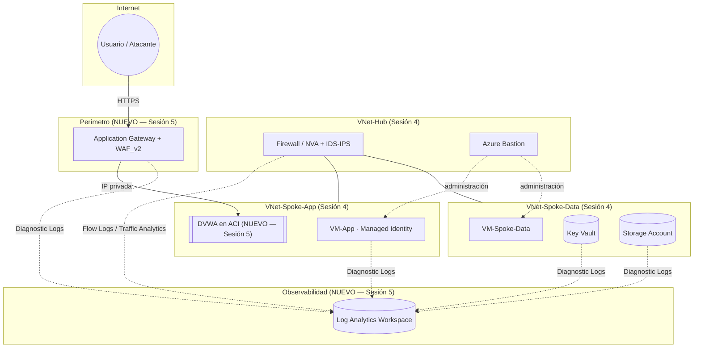

# Laboratorio — Sesión 5: Cloud Security Operations, Observabilidad y Respuesta a Incidentes

**Especialización en Ciberseguridad · Escuela de Comunicaciones Militares (ESCOM)**
**Curso:** Seguridad en la Nube · **Instructor:** Manuel Alejandro Vargas Rojas (`manuelvargasrojas@cedoc.edu.co`)

---

## 1. Bienvenida y propósito

Este es el laboratorio de la **Sesión 5**, la última de la especialización. No es un ejercicio aislado: **reutiliza la arquitectura que ya construiste en la Sesión 4** (Hub-and-Spoke, microsegmentación, Private Endpoints, Bastion) y le añade lo único que faltaba — **visibilidad, detección y respuesta ante un incidente real simulado**.

Al terminar este laboratorio habrás:

1. Reactivado y verificado la arquitectura de la Sesión 4.
2. Configurado un pipeline de visibilidad completo (Log Analytics, Diagnostic Settings, Flow Logs, Sign-in Logs).
3. Desplegado el componente de **WAF + DVWA** que quedó pendiente desde la Sesión 4.
4. Simulado un **compromiso de credenciales IAM** de forma controlada y reproducible.
5. Detectado ese compromiso con consultas KQL, mapeándolo a **MITRE ATT&CK for Cloud**.
6. Contenido y erradicado el incidente.
7. Redactado un **informe ejecutivo del incidente** — la entrega evaluada de esta sesión.

> ⚠️ **Este laboratorio asume cero conocimiento previo de Azure más allá de lo visto en las Sesiones 1 a 4.** Cada paso está descrito de forma literal: qué clic dar, qué menú abrir, qué comando escribir. Si en algún punto una pantalla no coincide exactamente con lo descrito, es casi siempre porque Azure renombró un botón — el objetivo del paso sigue siendo el mismo.

---

## 2. Cómo está organizada esta guía

Cada sección es un archivo Markdown independiente. Sigue el orden exacto — cada archivo asume que el anterior ya se completó.

| # | Archivo | Parte del laboratorio | Qué hace |
|---|---|---|---|
| 1 | [`01-Preparacion-y-Reactivacion.md`](01-Preparacion-y-Reactivacion.md) | Parte A — Visibilidad | Verifica y reactiva la arquitectura de la Sesión 4 |
| 2 | [`02-Habilitar-Visibilidad.md`](02-Habilitar-Visibilidad.md) | Parte A — Visibilidad | Log Analytics, Diagnostic Settings, Flow Logs, trial de Entra ID P1 |
| 3 | [`03-Despliegue-WAF-DVWA.md`](03-Despliegue-WAF-DVWA.md) | Parte B — Detección | Application Gateway + WAF + DVWA en ACI |
| 4 | [`04-Simulacion-Incidente.md`](04-Simulacion-Incidente.md) | Parte B — Detección | Simulación controlada de compromiso de credenciales IAM |
| 5 | [`05-Deteccion-KQL.md`](05-Deteccion-KQL.md) | Parte B — Detección | Consultas KQL y mapeo a MITRE ATT&CK for Cloud |
| 6 | [`06-Contencion-y-Erradicacion.md`](06-Contencion-y-Erradicacion.md) | Parte C — Respuesta | Contención, revocación y erradicación |
| 7 | [`07-RCA-e-Informe-Ejecutivo.md`](07-RCA-e-Informe-Ejecutivo.md) | Parte C — Respuesta | RCA, plantilla del informe ejecutivo y **limpieza final de recursos** |
| — | [`RUBRICA.md`](RUBRICA.md) | — | Rúbrica de evaluación (100 % = 20 % de la nota final del módulo) |

Convenciones que verás en toda la guía:

- **📸 Captura para el informe — N.N** → toma la captura indicada; todas van en el PDF final, en orden.
- **🧪 Checkpoint** → una verificación puntual antes de seguir. Si falla, no avances.
- **🧩 Preguntas de repaso** → cuatro por sección, para el informe ejecutivo (ver plantilla en la Sección 7).
- Los bloques de código son comandos de **Azure CLI**, ejecutados en **Azure Cloud Shell** (Bash) salvo que se indique lo contrario.

---

## 3. Prerrequisitos

Antes de abrir el primer archivo, confirma que tienes:

- [ ] La misma suscripción de **Azure** usada en las Sesiones 1 a 4 (Free Trial / crédito de USD $200), con saldo disponible.
- [ ] Rol de **Owner** (o Contributor + User Access Administrator) sobre la suscripción.
- [ ] Rol de **Global Administrator** sobre el tenant por defecto de Microsoft Entra ID (necesario para activar el trial de Entra ID P1 en la Sección 2).
- [ ] Acceso a **Azure Cloud Shell** (portal.azure.com → ícono `>_` en la barra superior) o Azure CLI instalado localmente (`az --version` ≥ 2.60).
- [ ] Los recursos de la **Sesión 4 siguen existiendo** en tu suscripción: el resource group con la VNet Hub, las VNets Spoke, las 4 VM (deallocadas), el Firewall/NVA, el Key Vault y la Storage Account. Si los eliminaste, avisa al instructor antes de continuar — este laboratorio no funciona sin esa base.

---

## 4. Arquitectura de partida (Sesión 4) y lo que se añade hoy

**Lo que ya existe (Sesión 4):** Hub-and-Spoke, firewall/NVA, microsegmentación, Private Endpoints, Bastion.
**Lo que se añade hoy:** Application Gateway + WAF (perímetro público controlado), DVWA en ACI (el objetivo a proteger), y un Log Analytics Workspace que centraliza la telemetría de toda la arquitectura.

---

## 5. Costos estimados y control del crédito

Este laboratorio usa recursos que **si se dejan corriendo indefinidamente agotan el crédito de USD $200 en pocos días**. Por eso la Sección 7 termina con una lista de limpieza obligatoria.

| Recurso | Costo aproximado mientras existe | Duración esperada en este lab | Acción al cerrar |
|---|---|---|---|
| Log Analytics Workspace | Los primeros 5 GB/mes son gratuitos; este laboratorio genera un volumen muy por debajo de eso | Toda la sesión | Puede conservarse (no cobra si no ingesta más datos) |
| Application Gateway v2 + WAF_v2 | ≈ USD $0,25–0,35 por hora mientras exista (no se puede detener, solo eliminar) | 2–3 horas | **Eliminar (DELETE)** — Sección 7 |
| Azure Container Instances (DVWA) | ≈ USD $0,04–0,05 por hora mientras exista | 2–3 horas | **Eliminar (DELETE)** — Sección 7 |
| Microsoft Entra ID P1 (trial) | Gratuito por 30 días | Duración del laboratorio | No requiere eliminación; expira solo |
| VM de la Sesión 4 | Ya calculado en la Sesión 4 | Se reactivan solo durante el lab | **Deallocate** de nuevo — Sección 7 |

> 💡 Si sigues la guía en una sola sesión de 3-4 horas y ejecutas la limpieza de la Sección 7 al terminar, el costo total de este laboratorio es de **menos de USD $2**.

---

## 6. Entrega

- **Formato:** un único archivo **PDF**.
- **Contenido del PDF:** las 7 secciones con sus capturas numeradas en orden, las respuestas a las 28 preguntas de repaso (4 × 7 secciones), y el informe ejecutivo completo (plantilla en la Sección 7).
- **Canal:** cargado exclusivamente en **Google Classroom**, en la tarea de la Sesión 5.
- **Toda entrega que no sea un único PDF por ese canal se califica con 0**, sin excepción — revisa la [`RUBRICA.md`](RUBRICA.md) para el detalle completo de la evaluación.

Cuando estés listo, continúa con **[`01-Preparacion-y-Reactivacion.md`](01-Preparacion-y-Reactivacion.md)**.
